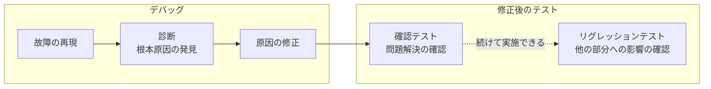

# lesson01: テストとは何か — 品質の評価と故障リスクの低減

## このレッスンで学ぶこと

- ソフトウェアテストの定義と、テスト実行だけにとどまらない活動の広がりを理解する
- 検証（verification）と妥当性確認（validation）の違いを説明できるようになる
- 動的テストと静的テストの区別を理解する
- 典型的なテスト目的を識別できるようになる
- テストとデバッグの違いと、典型的なデバッグの流れを説明できるようになる

## ソフトウェアテストの定義

ソフトウェアは日々の生活に欠かせない存在です。そして誰しも、ソフトウェアが期待通りに動かない場面に出会った経験があるはずです。

ソフトウェアが正しく動作しないと、経済的な損失や時間の浪費、信用の失墜を招きます。極端な場合には、傷害や死亡事故につながることさえあります。

ソフトウェアテストは、こうした事態を防ぐ手助けとなります。テストによってソフトウェアの品質を評価し、運用環境で故障が発生するリスクを低減できます。

::: info テストの定義
テストとは、**欠陥を発見し、ソフトウェアアーティファクトの品質を評価するための一連の活動**です。テストの対象となるソフトウェアアーティファクト（要件、設計、コード、システムなど）を「テスト対象」と呼びます。
:::

「一連の活動」という点が重要です。テストは1回きりの実行作業ではなく、複数の活動の集まりとして捉えます。

## テストに関する2つの誤解

テストの範囲を狭く捉える誤解が2つあります。どちらもシラバスが明確に否定しているものです。

### テスト実行だけという誤解

テスト実行、つまりソフトウェアを実際に動かして結果を確認する作業は、テストの一部にすぎません。テストには、テスト計画・テスト分析・テスト設計・テスト実装・テスト完了など、実行以外の活動も含まれます（[lesson04](/lessons/lesson04/)）。

さらに、これらのテスト活動はソフトウェア開発ライフサイクル（SDLC）と整合させる必要があります（[lesson06](/lessons/lesson06/)）。

### 検証だけという誤解

テストの重点は検証だけではありません。テストでは検証（verification）に加えて、妥当性確認（validation）も必要です。

| 観点 | 検証（verification） | 妥当性確認（validation） |
|------|---------------------|-------------------------|
| 確認する内容 | 指定されている要件をシステムが満たしているか | ユーザーやその他のステークホルダーのニーズを運用環境でシステムが満たしているか |
| 問いかけ | 仕様どおりに作れているか | 本当に求められているものを作れているか |
| 判断のよりどころ | 要件・仕様 | ユーザーとステークホルダーのニーズ |

::: tip 検証と妥当性確認の覚え方
「仕様に合っているか」を確かめるのが検証、「ニーズに合っているか」を運用環境の視点で確かめるのが妥当性確認です。仕様どおりに作れていても、ユーザーの役に立たなければ妥当性確認は通りません。
:::

## 動的テストと静的テスト

テストは、ソフトウェアを実行するかどうかで2つに分けられます。

| 種類 | ソフトウェアの実行 | 主な内容 |
|------|------------------|---------|
| 動的テスト | 伴う | テスト技法やテストアプローチを用いてテストケースを導出し、実行する（[lesson14](/lessons/lesson14/)） |
| 静的テスト | 伴わない | レビューと静的解析を含む（[lesson11](/lessons/lesson11/)） |

「テスト」という言葉から想像しやすいのは動的テストですが、実行を伴わない静的テストもテストに含まれます。

## テストを支える活動とスキル

テストは技術的な活動だけでは成り立ちません。適切な計画・マネジメント・見積り・モニタリング・コントロールも必要です（[lesson22](/lessons/lesson22/)、[lesson26](/lessons/lesson26/)）。

また、テスト担当者はツールを使用しますが（[lesson29](/lessons/lesson29/)）、テストの大部分は知的活動です。テスト担当者には次のスキルが求められます。

- 専門知識
- 分析スキル
- 批判的思考
- システム思考

::: info 関連する標準
ソフトウェアテストの概念については、標準 ISO/IEC/IEEE 29119-1 がさらに詳しい情報を提供しています。
:::

## 典型的なテスト目的

「テストの目的は欠陥を見つけること」と言われがちですが、それは目的の1つにすぎません。シラバスは典型的なテスト目的として次の9つを挙げています。

1. 要件、ユーザーストーリー、設計、コードなどの作業成果物を評価する
2. 故障を引き起こし、欠陥を発見する
3. 求められるテスト対象のカバレッジを確保する
4. ソフトウェア品質が不十分な場合のリスクレベルを下げる
5. 仕様化した要件が満たされているかどうかを検証する
6. テスト対象が契約、法律、規制の要件に適合していることを検証する
7. ステークホルダーが根拠ある判断をするための情報を提供する
8. テスト対象の品質に対する信頼を積み上げる
9. テスト対象が完成し、ステークホルダーの期待通りに動作するかどうかの妥当性確認をする

::: tip テスト目的の押さえ方
このリストは「欠陥の発見」だけでなく、評価・検証・妥当性確認・情報提供・信頼の積み上げまで含む幅広いものです。一方で、欠陥の修正はデバッグの活動であり、テスト目的には含まれません。
:::

### テスト目的とコンテキスト

テスト目的は固定ではなく、コンテキストによって異なることがあります。コンテキストの例は次の通りです。

- テスト対象（コンポーネントかシステムか）
- テストレベル（[lesson08](/lessons/lesson08/)）
- リスク
- 従うソフトウェア開発ライフサイクルモデル（SDLC）
- ビジネスコンテキストに関わる要因（企業構造、競争上の考慮事項、市場投入までの時間など）

## テストとデバッグ

テストとデバッグは**別の活動**です。関心の中心がどこにあるかで区別します。

| 活動 | 関心の中心 |
|------|-----------|
| テスト | 欠陥によって引き起こされる故障を発生させること（動的テスト）や、欠陥を直接発見すること（静的テスト） |
| デバッグ | 故障の原因である欠陥を発見し、解析し、取り除くこと |

### 典型的なデバッグの流れ

動的テストで故障が見つかると、デバッグでは「故障の再現」「診断」「原因の修正」の順に進みます。修正の後は、テスト活動に戻って確認テストで問題の解決を確かめ、続けてリグレッションテストまで実施できます。

修正後のテストについては、次の2点を押さえておきましょう。

- **確認テスト**は、修正によって問題が解決されたかを確認します。最初にテストした人と同じ人が担当するのがよいとされています。
- **リグレッションテスト**は、修正によってテスト対象の他の部分に故障が発生していないかを確認します。

確認テストとリグレッションテストの詳細は [lesson09](/lessons/lesson09/) で扱います。

### 静的テストで見つけた欠陥の扱い

静的テストは欠陥を直接発見するものであり、故障を引き起こしません。そのため故障の再現や診断は不要で、この場合のデバッグは欠陥を取り除く作業を指します。

## 試験のポイント

- テストは「テスト実行だけ」でも「検証だけに重点を置く」ものでもなく、実行を伴わない静的テスト（レビューと静的解析）も含む（2つの誤解の否定が問われやすい）
- 検証は「指定されている要件を満たすか」、妥当性確認は「運用環境でユーザーやステークホルダーのニーズを満たすか」を確認する活動として対応づける
- 典型的なテスト目的はK1（識別）で問われるため、「欠陥を修正する」のようにリストにない活動をテスト目的と混同しない
- テストは故障や欠陥を見つける活動、デバッグは故障の原因である欠陥を発見・解析・除去する活動として区別する
