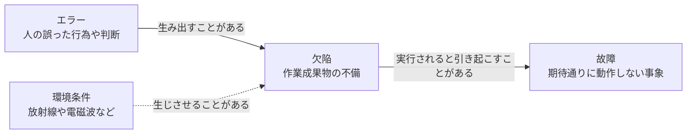

# lesson02: なぜテストが必要か — 品質への貢献とエラー・欠陥・故障の連鎖

## このレッスンで学ぶこと

- テストが品質とプロジェクトの成功にどのように貢献するかを例を挙げて説明できるようになる
- テストと品質保証（QA）を混同せずに区別できるようになる
- エラー・欠陥・故障の違いと、それらのつながりを説明できるようになる
- 根本原因の考え方と、根本原因分析がもたらす効果を理解する

## 品質コントロールとしてのテスト

テストをすることは、品質コントロール（QC）の形式の1つです。範囲・時間・品質・予算という設定された制約の中で、合意されたゴールを達成するために役立ちます。

成功に向けたテストの貢献は、テストチームの活動に限定されるべきではありません。ステークホルダーであれば誰でも、テストスキルを活かしてプロジェクトを成功に近づけることができます。

コンポーネント・システム・関連ドキュメントをテストすることは、ソフトウェアの欠陥を識別するのに役立ちます。

## 成功に対するテストの貢献

シラバスは、テストが成功に貢献する場面として次の4つを挙げています。試験では具体例と対応づけて識別できることが求められます。

### コスト効果の高い欠陥検出

テストは、欠陥を検出するためのコスト効果の高い手段を提供します。検出した欠陥はデバッグによって取り除けるため、テストは**間接的に**テスト対象の品質向上に貢献します。

欠陥を取り除くデバッグ自体は、テスト活動ではありません（[lesson01](/lessons/lesson01/)）。

### 品質の直接評価

テストは、SDLC（ソフトウェア開発ライフサイクル）のさまざまな段階で、品質を**直接**評価する手段を提供します。

この測定結果は、より大きなプロジェクトマネジメント活動の一部として使われます。たとえばリリースの判定など、SDLC の次のステージに移行するための判定に貢献します。

### ユーザー視点の間接的な提供

テストは、開発プロジェクトに「ユーザーが利用した場合の状況」を間接的に提供します。テスト担当者は開発ライフサイクルを通じて、ユーザーのニーズに対する自身の理解が考慮できていることを確認します。

別の方法として、代表的な複数のユーザーに開発プロジェクトへ関与してもらうこともできます。しかしコストが高く、適切なユーザーを確保できないため、通常は実施できません。

### 契約や規制への対応

契約上または法律上の要件を満たすため、あるいは規制基準に準拠するために、テストが必要となる場合があります。

::: tip 間接と直接の対応づけ
ひっかけになりやすいのは「間接」と「直接」の対応です。欠陥検出を通じた品質向上は間接的な貢献、SDLC の各段階での品質評価は直接的な貢献です。
:::

## テストと品質保証の違い

「テスト」と「品質保証（QA）」という用語を同じ意味で使う人は多くいます。しかし、テストと QA は同じではありません。テストが属するのは品質コントロール（QC）です。

| 観点 | 品質コントロール（QC） | 品質保証（QA） |
|------|----------------------|---------------|
| 指向 | プロダクト指向 | プロセス指向 |
| アプローチ | 是正アプローチ | 予防的アプローチ |
| 焦点 | 適切な品質の達成を支援する活動 | プロセスの実装と改善 |
| テストとの関係 | テストは QC の主要な形式 | テストプロセスにも QA を適用する |

QA について、次の2点も押さえておきましょう。

- QA は「よいプロセスが正しく行われれば、よいプロダクトを作ることができる」という考えに基づく
- QA は開発プロセスとテストプロセスの両方に適用し、プロジェクトに参加するすべての人が責任を持つ

::: info QC のその他の形式
テストは QC の主要な形式ですが、唯一の形式ではありません。QC には他にも、形式的手法（モデル検査や定理証明）、シミュレーション、プロトタイピングなどがあります。
:::

### テスト結果の使われ方

テスト結果は QC と QA の両方で使いますが、使い方が異なります。

| 使う場面 | テスト結果の使い方 |
|---------|------------------|
| QC | 欠陥の修正に使う |
| QA | 開発プロセスとテストプロセスがどの程度うまくいっているかのフィードバックに使う |

## エラーから故障への連鎖

人間はエラー（誤り）を起こします。そのエラーが欠陥を生み出し、その欠陥が故障につながることもあります。この3つの用語は指すものが異なるため、厳密に区別します。

| 用語 | 何を指すか | 例 |
|------|-----------|-----|
| エラー（誤り、error） | 人間の誤った行為や判断 | 仕様の読み違い、計算ロジックの勘違い |
| 欠陥（defect、バグ） | 作業成果物に入り込んだ不備 | 仕様書の誤記、コードの誤った条件式 |
| 故障（failure） | 実行時にシステムが期待通りに動作しない事象 | 画面に誤った金額が表示される |

「ことがある」という表現の通り、エラーが必ず欠陥になるわけでも、欠陥が必ず故障になるわけでもありません。

### エラーが起きる理由

人間がエラーを起こす理由はさまざまです。シラバスは次のような例を挙げています。

- 時間的なプレッシャー
- 作業成果物、プロセス、インフラ、相互作用の複雑度
- 疲れている
- 十分なトレーニングを受けていない

### 欠陥が見つかる場所

欠陥は、コードだけに潜むものではありません。次のような場所から発見できます。

- 要件仕様書やテストスクリプトのようなドキュメント
- ソースコード
- ビルドファイルのような補助的なアーティファクト

SDLC の初期に作成されたアーティファクトの欠陥は、検出されなければ、しばしばライフサイクル後半の欠陥のあるアーティファクトにつながります。だからこそ早い段階でのテストに価値があります（テストの原則は [lesson03](/lessons/lesson03/)、実行せずに欠陥を発見する静的テストは [lesson11](/lessons/lesson11/)）。

### 欠陥と故障の関係

コードの欠陥が実行されると、システムがすべきことをしない、またはすべきでないことをしてしまうことがあります。これが故障の原因です。ただし、欠陥と故障は1対1では対応しません。

- 実行すれば必ず故障になる欠陥
- 特定の状況下でしか故障にならない欠陥
- 絶対に故障にならない欠陥

::: warning 故障の原因は欠陥だけではない
故障は、エラーや欠陥がなくても発生することがあります。たとえば放射線や電磁波によってファームウェアに欠陥が生じる場合など、環境条件も故障の原因になります。
:::

## 根本原因と根本原因分析

根本原因とは、問題（たとえばエラーにつながる状況）が発生する根底の理由です。表面に現れた故障や欠陥そのものではなく、それらを引き起こした最も根本的な要因を指します。

根本原因は、根本原因分析によって特定します。根本原因分析は、故障が発生したときや欠陥が確認されたときに行うのが一般的です。

根本原因を取り除くなどの対処をすることで、同様の故障や欠陥を防止したり、その頻度を減らしたりできると考えられています。

::: info 根本原因までさかのぼる例
「画面に誤った金額が表示される」という故障が起きたとします。調べると、コードの計算式が誤っていました（欠陥）。開発担当者が仕様を読み違えていたのです（エラー）。さらにさかのぼると、仕様書の記述があいまいで読み違いを招いていました（根本原因）。欠陥の修正だけで終えると同種の問題が再発しかねませんが、仕様書の書き方を改善すれば同様の欠陥を防げます。
:::

## キーワード

| 用語 | 説明 |
|------|------|
| 品質コントロール（QC、quality control） | 適切な品質の達成を支援する活動に焦点を当てた、プロダクト指向の是正アプローチ。テストは QC の主要な形式 |
| 品質保証（QA、quality assurance） | プロセスの実装と改善に焦点を当てた、プロセス指向の予防的アプローチ。プロジェクトに参加する全員が責任を持つ |
| エラー（誤り、error） | 人間の誤った行為や判断。欠陥を生み出すことがある |
| 欠陥（defect、バグ） | 作業成果物に含まれる不備。実行されると故障を引き起こすことがある |
| 故障（failure） | コンポーネントやシステムが期待通りに動作しない事象。環境条件によって発生することもある |
| 根本原因（root cause） | 問題が発生する根底の理由。根本原因分析で特定し、取り除くことで同様の故障や欠陥の防止や頻度低減につながる |

## 試験のポイント

- テストは品質保証（QA）ではなく品質コントロール（QC）の形式の1つであり、QC はプロダクト指向の是正アプローチ、QA はプロセス指向の予防的アプローチとして対応づける
- テスト結果は QC では欠陥の修正に、QA ではプロセスがどの程度うまくいっているかのフィードバックに使う
- 成功への貢献では、欠陥検出を通じた品質向上は間接的、SDLC 各段階での品質評価は直接的と区別する
- エラーは人の行為、欠陥は作業成果物の不備、故障は実行時に現れる事象として厳密に区別する（「不具合」ではなく「欠陥」と呼ぶ）
- 欠陥が必ず故障になるわけではなく、故障はエラーや欠陥がなくても環境条件（放射線や電磁波など）で発生することがある
- 根本原因は表面に現れた欠陥や故障そのものではなく、それらを引き起こした根底の理由（欠陥と根本原因の混同を突く選択肢に注意）
