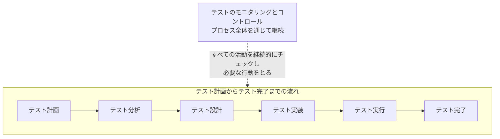

# lesson04: テストプロセス — 7つのテスト活動とテストウェア・トレーサビリティ・役割

## このレッスンで学ぶこと

- テストプロセスを構成する7つのテスト活動を要約できるようになる
- テストプロセスがコンテキストに応じた要因に依存することを説明できるようになる
- 各テスト活動がどのテストウェア（作業成果物）を生み出すかを対応づけられるようになる
- テストベースとテストウェアの間のトレーサビリティを維持する価値を説明できるようになる
- テストマネジメントをする役割とテストをする役割の責務を区別できるようになる

## テストプロセスの全体像

テストはコンテキスト次第です（テストの原則は [lesson03](/lessons/lesson03/)）。それでもハイレベルで見れば、テスト目的を達成する確率を高める汎用的なテスト活動のセットがあります。この活動のセットが**テストプロセス**を構成します。

テストプロセスは固定の手順書ではありません。多くの要因を考慮して、特定の状況に合わせて調整できます。どのテスト活動を、どのように、いつ実施するかは、通常その状況に対するテスト計画の一部として決定します（[lesson22](/lessons/lesson22/)）。

テストプロセスは多くの場合、次の7つの主な活動グループから構成されます。

図では活動が一直線に並んでいますが、これは論理的な見え方にすぎません。実際には、これらの活動は**イテレーティブに、または並行して**実施されることが多くあります。また、システムやプロジェクトに合わせた調整が通常必要です。

::: info 関連する標準
テストプロセスのより詳細な情報は、標準 ISO/IEC/IEEE 29119-2 に記載されています。
:::

## 7つのテスト活動

各活動が「何をする活動か」を要約できることが、この節の中心です。1つずつ見ます。

### テスト計画

テスト目的を定義し、全体のコンテキストにより課せられた制約の中で、目的を最も効果的に達成するアプローチを選択する活動です。テスト計画の詳細は [lesson22](/lessons/lesson22/) で扱います。

### テストのモニタリングとコントロール

2つの側面をセットで押さえます。

| 側面 | 内容 |
|------|------|
| テストモニタリング | すべてのテスト活動を継続的にチェックし、実際の進捗をテスト計画と比較する |
| テストコントロール | テストの目的を達成するために必要な行動をとる |

他の活動と違い、テストプロセス全体を通じて継続する点が特徴です。メトリクスやレポートの詳細は [lesson26](/lessons/lesson26/) で扱います。

### テスト分析

「**何をテストするか**」という問いに、計測可能なカバレッジ基準から見て答える活動です。主なタスクは次の通りです。

- テストベースを分析して、テスト可能なフィーチャーを識別する
- 関連するテスト条件を定義して、優先順位を付ける
- 関連するリスクとリスクレベルを分析する（[lesson25](/lessons/lesson25/)）
- テストベースとテスト対象を評価して欠陥を識別したり、試験性（テストのしやすさ）のアセスメントをしたりする

テスト分析では、多くの場合テスト技法を使ってこの活動を支援します（[lesson14](/lessons/lesson14/)）。

### テスト設計

「**どのようにテストするか**」という問いに答える活動です。主なタスクは次の通りです。

- テスト条件を、テストケースやその他のテストウェア（テストチャーターなど）に落とし込む
- テストケースの入力を指定するガイドとして機能する、カバレッジアイテムを識別する
- テストデータ要件を定義し、テスト環境を設計し、必要なインフラストラクチャとツールを識別する

テスト設計でも、テスト技法が活動を支援します（[lesson14](/lessons/lesson14/)）。

### テスト実装

テスト実行に必要なテストウェアをそろえる活動です。主なタスクは次の通りです。

- テスト実行に必要なテストウェア（テストデータなど）を作成または取得する
- テストケースをテストプロシジャーに編成し、多くの場合テストスイートにまとめる
- 手動および自動のテストスクリプトを作成する
- 効率的なテスト実行のため、テストプロシジャーに優先順位を付けてテスト実行スケジュール内に配置する
- テスト環境を構築し、正しく設定されていることを検証する

### テスト実行

テスト実行スケジュールに従ってテストを走らせる（テストラン）活動です。手動でも自動でもかまいません。継続的テストやペアテストセッションなど、さまざまな形式があります。

- 実際のテスト結果を期待結果と比較する
- テスト結果を記録する
- 不正（期待結果とのずれなど）を分析して、考えられる原因を識別する
- この分析により、観察された故障に基づいて不正を報告できる（欠陥レポートは [lesson28](/lessons/lesson28/)）

### テスト完了

通常、リリース・イテレーションの終了・テストレベルの完了といったプロジェクトのマイルストーンで行う活動です（テストレベルは [lesson08](/lessons/lesson08/)）。主なタスクは次の通りです。

- 未解決の欠陥に対して、変更要求やプロダクトバックログアイテムを作成する
- 将来役立つ可能性のあるテストウェアをすべて識別し、保管するか適切なチームへ引き渡す
- テスト環境を合意した状態でシャットダウンする
- 将来のイテレーション・リリース・プロジェクトに向けて、テスト活動を分析して教訓と改善点を識別する（ふりかえりは [lesson07](/lessons/lesson07/)）
- テスト完了レポートを作成して、ステークホルダーへ伝える

::: tip 分析と設計の問いの対応
テスト分析は「何をテストするか」、テスト設計は「どのようにテストするか」という問いに答えます。この対応づけは選択肢の入れ替えで問われやすいポイントです。
:::

## コンテキストに応じたテストプロセス

テストは、単独で行うことはありません。テスト活動は、組織内で行われる開発プロセスに不可欠な要素です。また、テストはステークホルダーが資金を提供するものであり、その最終ゴールはステークホルダーのビジネスニーズの充足を支援することです。

したがって、テストを行う方法は次のようなコンテキストに応じた要因に依存します。

| 要因 | 例 |
|------|-----|
| ステークホルダー | ニーズ・期待・要件・協力の意思など |
| チームメンバー | スキル・知識・経験レベル・空き状況・トレーニングの必要性など |
| ビジネスドメイン | テスト対象の重要性・識別したリスク・市場ニーズ・特定の法的規制など |
| 技術的要因 | ソフトウェアの種類・プロダクトのアーキテクチャー・利用技術など |
| プロジェクトの制約 | スコープ・時間・予算・リソースなど |
| 組織的要因 | 組織構造・現行のポリシー・使用する実践例など |
| ソフトウェア開発ライフサイクル | エンジニアリングの実践例・開発手法など |
| ツール | 利用可能な状況・使用性・標準適合性など |

これらの要因は、テストに関する多くの事柄に影響を与えます。たとえば、利用するテスト戦略、テスト技法、テスト自動化の度合い、求められるカバレッジの度合い、テストドキュメントの詳細度合い、レポート作業などです。

## テスト活動が生み出すテストウェア

**テストウェア**は、テスト活動の出力となる作業成果物として作成されます。作業成果物の作成方法・形式・名称・整理方法・管理方法は、組織によって大きく異なります。適切な構成管理により、作業成果物の一貫性と整合性を確保します（[lesson27](/lessons/lesson27/)）。

どの活動がどのテストウェアを生むかを対応づけて押さえましょう（このリストはすべてを網羅するものではありません）。

| テスト活動 | 主な作業成果物 |
|------|------|
| テスト計画 | テスト計画書、テストスケジュール、リスクレジスター、開始基準と終了基準 |
| テストのモニタリングとコントロール | テスト進捗レポート、コントロールのための指示の文書、リスク情報 |
| テスト分析 | 優先順位を付けたテスト条件（受け入れ基準など）、テストベース内の欠陥についての欠陥レポート |
| テスト設計 | 優先順位を付けたテストケース、テストチャーター、カバレッジアイテム、テストデータ要件、テスト環境要件 |
| テスト実装 | テストプロシジャー、自動テストスクリプト、テストスイート、テストデータ、テスト実行スケジュール、テスト環境 |
| テスト実行 | テスト結果記録、欠陥レポート |
| テスト完了 | テスト完了レポート、後続の改善のためのアクションアイテム、教訓のドキュメント、変更要求 |

補足として次の点も押さえておきましょう。

- リスクレジスターは、リスクの可能性・リスクの影響・リスク軽減に関する情報とともにリスクを列挙したものです
- テストスケジュール・リスクレジスター・開始基準・終了基準は、多くの場合テスト計画書の一部です
- テスト環境に含むものの例として、スタブ・ドライバー・シミュレーター・サービス仮想化があります

::: tip まぎらわしい対応の整理
欠陥レポートは、テスト分析（テストベース内の欠陥）とテスト実行（テスト対象の欠陥）の両方から生まれます。また「テストデータ要件」はテスト設計、「テストデータ」そのものとテスト実行スケジュールはテスト実装の作業成果物です。要件を決めるのが設計、実物をそろえるのが実装、と整理すると覚えやすくなります。
:::

## テストベースとテストウェアのトレーサビリティ

**トレーサビリティ**とは、テストベースの各要素と、関連するテストウェア（テスト条件・リスク・テストケースなど）、テスト結果、検出した欠陥との間のつながりを追跡できることです。効果的なテストのモニタリングとコントロールを実装するには、このトレーサビリティをテストプロセス全体を通して確立し、維持することが重要です。

### カバレッジ評価の支援

正確なトレーサビリティは、カバレッジの評価を支援します。測定可能なカバレッジ基準がテストベースに定義してある場合、非常に有用です。カバレッジ基準は、テスト目的の達成度合いを示す KPI として機能します。

| トレーサビリティの例 | 可能になること |
|------|------|
| テストケースと要件の間 | 要件がテストケースでカバーされていることを検証できる |
| テスト結果とリスクの間 | テスト対象にある残存リスクのレベルを評価できる |

### カバレッジ評価以外の価値

優れたトレーサビリティには、カバレッジの評価以外にも次の価値があります。

- 変更の影響を判断できる（影響分析）
- テストの監査を容易にする
- IT ガバナンスの基準を満たすのに役立つ
- テストベースの各要素の状況を含めることで、テスト進捗レポートやテスト完了レポートをわかりやすくする
- テストの技術的な側面をステークホルダーにわかりやすく伝える
- プロダクト品質・プロセス能力・ビジネスゴールに対するプロジェクトの進捗を評価するための情報を提供する

## テストの役割

シラバスは、テストにおける2つの主要な役割を取り上げています。**テストマネジメントをする役割**と**テストをする役割**です。それぞれに割り当てる活動やタスクは、プロジェクトやプロダクトのコンテキスト、役割を担う人のスキル、組織などの要因に依存します。

| 役割 | 全体的な責任 | 重点を置く活動 |
|------|------|------|
| テストマネジメントをする役割 | テストプロセス、テストチーム、テスト活動のリーダーシップ | テスト計画、テストのモニタリングとコントロール、テスト完了 |
| テストをする役割 | テストのエンジニアリング面（技術的側面） | テスト分析、テスト設計、テスト実装、テスト実行 |

::: tip 7つの活動との対応
テストマネジメントをする役割が重点を置く3つの活動と、テストをする役割が重点を置く4つの活動を合わせると、ちょうど7つのテスト活動になります。プロセス全体の舵取りがマネジメント、個々のテストを作って動かすのがテストをする役割、という分担です。
:::

役割の実施方法は、状況によって異なります。

- アジャイルソフトウェア開発では、テストマネジメントのタスクの一部をアジャイルチームが担当することがあります
- 複数のチームや組織全体にまたがるタスクは、開発チーム外のテストマネージャーが行うことがあります

また、役割と人は1対1ではありません。テストマネジメントをする役割は、チームリーダー・テストマネージャー・開発マネージャーなどが担う場合があります。1人がテストをする役割とテストマネジメントをする役割を同時に担うことも可能です。

## キーワード

| 用語 | 説明 |
|------|------|
| テストプロセス（test process） | テスト目的を達成する確率を高める、汎用的なテスト活動のセット。コンテキストに合わせて調整できる |
| テスト計画（test planning） | テスト目的を定義し、制約の中で目的を最も効果的に達成するアプローチを選択する活動 |
| テストのモニタリング（test monitoring） | すべてのテスト活動を継続的にチェックし、実際の進捗をテスト計画と比較する活動 |
| テストコントロール（test control） | テストの目的を達成するために必要な行動をとる活動 |
| テスト分析（test analysis） | テストベースを分析してテスト可能なフィーチャーを識別し、テスト条件を定義して優先順位を付ける活動。「何をテストするか」に答える |
| テスト設計（test design） | テスト条件をテストケースなどのテストウェアに落とし込む活動。「どのようにテストするか」に答える |
| テスト実装（test implementation） | テスト実行に必要なテストウェアを作成または取得し、テスト環境を構築する活動 |
| テスト実行（test execution） | テスト実行スケジュールに従ってテストを走らせ、実際の結果と期待結果を比較する活動 |
| テスト完了（test completion） | プロジェクトのマイルストーンでテストウェアの引き渡しや教訓の識別を行い、テスト完了レポートを伝える活動 |
| テストベース（test basis） | テスト条件やテストケースを導出するもとになる情報（要件、設計、コードなど） |
| テスト条件（test condition） | テスト分析で識別する、テストで確認すべきテスト対象の側面 |
| テストケース（test case） | テスト条件に基づいて作成する、入力・事前条件・期待結果などのセット |
| カバレッジアイテム（coverage item） | テスト技法を使ってテスト条件から導出する属性。テストケースの入力を指定するガイドとして機能する |
| テストプロシジャー（test procedure） | テストケースを実行の観点で編成したもの。多くの場合テストスイートにまとめる |
| テストウェア（testware） | テスト活動の出力となる作業成果物（テスト計画書、テストケース、テストデータ、テスト結果記録、テストレポートなど） |
| トレーサビリティ（traceability） | テストベースの各要素とテストウェア・テスト結果・検出した欠陥との間のつながりを追跡できること |
| リスクレジスター（risk register） | リスクの可能性・リスクの影響・リスク軽減に関する情報とともに、リスクを列挙したもの |

## 試験のポイント

- 7つのテスト活動（テスト計画・テストのモニタリングとコントロール・テスト分析・テスト設計・テスト実装・テスト実行・テスト完了）を要約できるようにする（K2）
- テスト活動は論理的にはシーケンシャルに見えるが、イテレーティブにまたは並行して実施されることが多い
- テストのモニタリングとコントロールは、他の活動と違いテストプロセス全体を通じて継続する
- テスト分析は「何をテストするか」、テスト設計は「どのようにテストするか」という問いに答える活動として対応づける
- テストプロセスはコンテキスト要因（ステークホルダー・チームメンバー・ビジネスドメイン・技術的要因・プロジェクトの制約・組織的要因・SDLC・ツール）に依存する
- どの活動がどのテストウェアを生むかが問われる（テストデータ要件は設計、テストデータとテスト実行スケジュールは実装、テスト完了レポートは完了など）
- トレーサビリティの価値（カバレッジの評価・変更の影響判断・監査の容易化・レポートのわかりやすさ・ステークホルダーへの伝達）を挙げられるようにする
- テストマネジメントをする役割は計画・モニタリングとコントロール・完了に、テストをする役割は分析・設計・実装・実行に重点を置く
- 1人がテストをする役割とテストマネジメントをする役割を同時に担うことも可能
