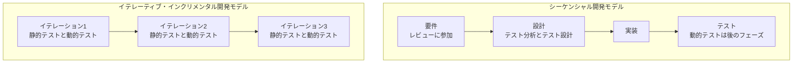
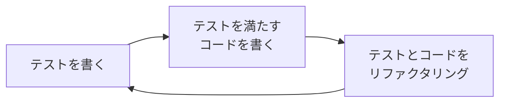

# lesson06: 開発ライフサイクルとテスト — SDLCへの適応とテストファーストアプローチ

## このレッスンで学ぶこと

- SDLC（ソフトウェア開発ライフサイクル）モデルの種類と、テストをSDLCに適応させる必要性を理解する
- 選択したSDLCがテストに与える影響を説明できるようになる
- シーケンシャル開発モデルとイテレーティブ・インクリメンタル開発モデルでのテストの進め方の違いを理解する
- どのSDLCモデルにも通用するよいテストの実践例を想起できるようになる
- テストファーストアプローチの事例としてTDD・ATDD・BDDを想起できるようになる

## SDLCモデルとテストの関係

**SDLC（ソフトウェア開発ライフサイクル）モデル**とは、ソフトウェア開発プロセスを抽象的かつハイレベルに表現したものです。開発フェーズや活動の種類が、論理的・時系列的にどのように互いに関連するかを定義します。

SDLCモデルには次のような種類があります。

| タイプ | 例 |
|------|-----|
| シーケンシャル開発モデル | ウォーターフォールモデル、V字モデル |
| イテレーティブ開発モデル | スパイラルモデル、プロトタイピング |
| インクリメンタル開発モデル | 統一プロセス |

また、ソフトウェア開発プロセスの中には、より詳細なソフトウェア開発手法やアジャイルプラクティスで説明できる活動もあります。例は次の通りです。

- スクラム、カンバン、リーンIT
- エクストリームプログラミング（XP）、フィーチャー駆動開発（FDD）
- テスト駆動開発（TDD）、受け入れテスト駆動開発（ATDD）、振る舞い駆動開発（BDD）
- ドメイン駆動設計（DDD）

テストが成功するためには、テストを選択したSDLCに適応させる必要があります。同じテストのやり方がどのモデルでも通用するわけではありません。

## SDLCの選択がテストに与える影響

SDLCの選択は、テストに関する次の事柄に影響します。

- テスト活動の範囲とタイミング（テストレベルは [lesson08](/lessons/lesson08/)、テストタイプは [lesson09](/lessons/lesson09/)）
- テストドキュメントの詳細レベル
- テスト技法とテストアプローチの選択
- テスト自動化の範囲
- テスト担当者の役割と責任

モデルのタイプによって、テストの進め方は次のように変わります。

### シーケンシャル開発モデルでのテスト

初期段階では、テスト担当者は通常、要件レビュー・テスト分析・テスト設計に参加します。実行可能なコードは後のフェーズで作成されるのが通常です。そのため、動的テストはSDLCの初期には実施できません。

### イテレーティブ・インクリメンタル開発モデルでのテスト

イテレーティブ開発モデルやインクリメンタル開発モデルには、各イテレーションで作業成果物であるプロトタイプやプロダクトインクリメントを提供することを前提とするものがあります。

この前提から、テストの進め方は次のようになります。

- 各イテレーションにおいて、静的テストと動的テストの両方をすべてのテストレベルで実行する可能性がある
- インクリメントを頻繁に提供するためには、迅速なフィードバックと広範なリグレッションテストが必要になる

### アジャイルソフトウェア開発でのテスト

アジャイルソフトウェア開発では、プロジェクトを通じて変更が生じる可能性を想定しています。この想定から、アジャイルプロジェクトでは次の実践が好まれます。

- 作業成果物の文書化を軽量にする
- リグレッションテストを容易にするため、テスト自動化を充実させる
- 手動テストの多くは、事前の大規模なテスト分析やテスト設計を必要としない経験ベースのテスト技法で行う（[lesson20](/lessons/lesson20/)）

## どのSDLCにも通用するよいテストの実践例

選択したSDLCモデルに関係なく通用する、よいテストの実践例が4つあります。実践とその効果をセットで押さえましょう。

| よいテストの実践 | 得られる効果 |
|------|------|
| 各開発活動に対応するテスト活動がある | すべての開発活動が品質コントロールの対象になる |
| 各テストレベルには、そのレベル特有の異なるテスト目的がある | 冗長性を避けつつ、適切に包括したテストができる |
| 各テストレベルのテスト分析とテスト設計は、対応するSDLCの開発フェーズの間に開始する | 早期テストの原則（[lesson03](/lessons/lesson03/)）に従える |
| テスト担当者は、作業成果物のドラフトができたらすぐにレビューに関与する | 早期テストと欠陥検出がシフトレフト戦略（[lesson07](/lessons/lesson07/)）を支援する |

テスト分析やテスト設計がどのような活動かは、[lesson04](/lessons/lesson04/) で扱ったテストプロセスの内容と対応づけて確認してください。

::: tip 4つの実践に共通する考え方
どの実践も「開発活動とテスト活動を対応させ、テストをできるだけ早く始める」という方向でそろっています。テストレベルの詳細は [lesson08](/lessons/lesson08/) で扱います。
:::

## テストが主導するソフトウェア開発

TDD（テスト駆動開発）、ATDD（受け入れテスト駆動開発）、BDD（振る舞い駆動開発）は、いずれもテストが開発を導く手段であると定義する、類似の開発アプローチです。コードを書く前にテストケースを定義することから、**テストファーストアプローチ**と呼ばれます。

3つのアプローチには次の共通点があります。

- コードを書く前にテストケースを定義する
- 早期テストの原則（[lesson03](/lessons/lesson03/)）を実装し、シフトレフトアプローチ（[lesson07](/lessons/lesson07/)）を採用している
- イテレーティブ開発モデルをサポートする

### 各アプローチの特徴

| アプローチ | 特徴 |
|------|------|
| TDD（テスト駆動開発） | 広範なソフトウェア設計の代わりに、テストケースを通じてコーディングを導く。テストを最初に書き、次にテストを満たすようにコードを書き、そしてテストとコードをリファクタリングする |
| ATDD（受け入れテスト駆動開発） | システム設計プロセスの一環として、受け入れ基準からテストを導き出す。アプリケーションの該当部分がテストを満たすよう開発するために、テストを開発前に書く |
| BDD（振る舞い駆動開発） | アプリケーションの望ましい振る舞いを、ステークホルダーが理解しやすい簡潔な自然言語のテストケースで表現する。通常はGiven/When/Then形式を使い、テストケースは実行可能なテストへ自動的に変換する |

TDDの進め方はサイクルとして表せます。

ATDDの具体的な手順（ユーザーストーリーや受け入れ基準からのテスト作成）は [lesson21](/lessons/lesson21/) で扱います。

::: info Given/When/Then形式
Given（前提となる状況）、When（操作）、Then（期待する結果）の順で振る舞いを記述する形式です。自然言語に近い形で書くため、開発の専門家でないステークホルダーにも読みやすいという特徴があります。
:::

いずれのアプローチでも、テストケースを自動テストとして持続させることがあります。将来の適応やリファクタリングの際にも、自動テストによってコード品質を確実にするためです。

## 試験のポイント

- シーケンシャル開発モデルでは実行可能なコードが後のフェーズで作成されるため、動的テストをSDLCの初期には実施できない（初期段階でテスト担当者が参加するのは要件レビュー・テスト分析・テスト設計）
- よいテストの実践例4つ（開発活動に対応するテスト活動・テストレベル特有の目的・分析と設計の早期開始・ドラフトへの早期レビュー関与）を想起できるようにする
- TDD・ATDD・BDDはいずれもコードを書く前にテストケースを定義し、早期テストとシフトレフトを実現するテストファーストアプローチ
- TDDはテストケースでコーディングを導き、ATDDは受け入れ基準からテストを導き、BDDは自然言語（通常Given/When/Then形式）で振る舞いを表現する
