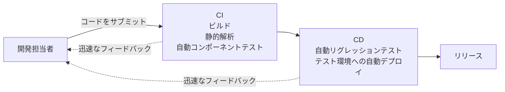

# lesson07: DevOps・シフトレフト・ふりかえり — 迅速なフィードバックと継続的なプロセス改善

## このレッスンで学ぶこと

- DevOps の考え方と、テストの観点から見た利点・リスクを要約できるようになる
- CI/CD パイプラインに組み込まれた自動テストが迅速なフィードバックをもたらす仕組みを理解する
- シフトレフトアプローチが早期テストの原則の実践であることを説明できるようになる
- シフトレフトを実現するよい実践例を挙げられるようになる
- プロセス改善の仕組みとして、ふりかえりをどのように利用できるかを説明できるようになる

## DevOps とテスト

**DevOps** は、開発（テストを含む）と運用が協力して共通のゴールを達成し、相乗効果を生み出すことを目指す組織的アプローチです。開発（Development）と運用（Operations）を組み合わせた名前が示す通り、両者の間のギャップを埋めることに重点を置きます。

DevOps では、開発と運用の機能を同等の価値として扱うために、組織内の文化の転換が求められます。そのうえで、次のようなものを促進します。

- チームの自律性
- 迅速なフィードバック
- 統合ツールチェーン
- CI（継続的インテグレーション）や CD（継続的デリバリー）のような技術的な実践

これらにより、チームは DevOps のデリバリーパイプラインを通じて、高品質なコードをより速くビルド・テスト・リリースできます。

ソフトウェア開発ライフサイクル（SDLC）とテストの関係全般は [lesson06](/lessons/lesson06/) で扱います。DevOps はその中でも、開発と運用の協働とパイプラインの自動化に焦点を当てたアプローチです。

### CI/CD パイプラインと自動テスト

DevOps のテストを特徴づけるのが、デリバリーパイプラインに組み込まれた自動テストです。

- CI では、開発担当者がソースコードをコードリポジトリへサブミットするたびに、ビルドとあわせて静的解析や自動コンポーネントテストを実行します
- パイプラインの後続の段階では、自動リグレッションテストやテスト環境への自動デプロイを行い、変更をリリースへ近づけていきます

ポイントは、テストがパイプラインの一部として自動で繰り返される点です。サブミットのたびにテストが走るため、変更の影響をすぐに知ることができ、手動テストを繰り返す必要性も減ります。

### テストから見た DevOps の利点

テストをする観点から、DevOps には次のような利点があります。

- コード品質について、また変更が既存のコードに悪影響を及ぼしていないかについて、迅速なフィードバックを得られる
- CI が、静的解析やコンポーネントテストを通した高品質なコードのサブミットを開発担当者に促し、シフトレフトアプローチを促進する
- CI/CD のような自動化プロセスにより、安定したテスト環境を構築しやすくなる
- 性能や信頼性のような非機能品質特性に対する観点が増える
- デリバリーパイプラインによる自動化が、手動テストを繰り返す必要性を減らす
- 規模と範囲の大きい自動リグレッションテストにより、リグレッションのリスクを最小化できる

### DevOps のリスクと課題

一方で、DevOps には次のようなリスクや課題もあります。

- DevOps のデリバリーパイプラインを定義し、確立しなければならない
- CI/CD ツールを導入し、保守しなければならない
- テスト自動化には追加のリソースが必要で、確立や保守が難しい場合がある

::: warning 手動テストは依然として必要
DevOps はレベルの高い自動テストを前提としますが、手動テスト、特にユーザーの視点からのテストは依然として必要です。「DevOps を導入すれば手動テストがなくなる」という理解は誤りです。
:::

テストを支援するツールの種類は [lesson29](/lessons/lesson29/)、テスト自動化の利点とリスクの詳細は [lesson30](/lessons/lesson30/) で扱います。

## シフトレフトアプローチ

早期テストの原則（[lesson03](/lessons/lesson03/) の原則3）を、**シフトレフト**と呼ぶことがあります。SDLC を左から右への流れとして図示したとき、テストを図の左側、つまり早い段階で実行するアプローチだからです。

シフトレフトの提言は次の2点で押さえます。

- テストは、より早い段階で行われるべきである（コードが実装されるのを待たない、コンポーネントが統合されるのを待たない）
- ただし、SDLC の後半でのテストを軽視するべきだという意味ではない

::: info 早期テストの原則との関係
シフトレフトは、テストの7原則の1つである「早期テストで時間とコストを節約」を SDLC の中で具体化したものです。原則そのものは [lesson03](/lessons/lesson03/) で確認してください。
:::

### シフトレフトを実現するよい実践例

シラバスは、テストにおけるシフトレフトを実現するよい実践例として次を挙げています。

| 実践例 | ねらい |
|------|------|
| テストをする観点から仕様書をレビューする | 曖昧さ・不完全さ・矛盾のような潜在的な欠陥を早期に発見できる（静的テストは [lesson11](/lessons/lesson11/)） |
| コードを書く前にテストケースを書く | コードの実装時に、テストハーネスでそのコードを実行できる（テストファーストアプローチは [lesson06](/lessons/lesson06/)） |
| CI や CD を用いる | ソースコードのサブミットに自動コンポーネントテストと高速フィードバックが伴うようにする |
| ソースコードの静的解析を早期に完了する | 動的テストの前に、または自動化したプロセスの一部として実施する |
| 非機能テストをコンポーネントテストレベルで始める | SDLC の後半に実施される傾向がある非機能テストを、実施可能な範囲で早期に行う |

いずれも「コードやシステムの完成を待たずにテスト活動を始める」という共通点があります。特に仕様書のレビューや静的解析のように、静的テストを早い段階で実施することはシフトレフトの代表的な形です。

### 導入時の留意点

シフトレフトアプローチには、プロセスの初期に追加のトレーニングや労力、コストがかかる場合があります。その代わり、プロセスの後期には労力やコストの削減が期待できます。

先行投資が必要になるため、ステークホルダーがこの考え方に納得し、受け入れることが重要です。

## ふりかえりとプロセス改善

**ふりかえり**は、仕事の進め方をチームで見直し、プロセスの継続的改善につなげるためのミーティングです。「プロジェクト後ミーティング」や「プロジェクトふりかえり」、レトロスペクティブとも呼ばれます。

### 開催のタイミングと参加者

- プロジェクトやイテレーションの終了時、リリースのマイルストーンで開催されることが多い
- 必要なときに開催されることもある
- ふりかえりのタイミングと構成は、それぞれの SDLC モデルに従う

参加者はテスト担当者に限りません。開発担当者・アーキテクト・プロダクトオーナー・ビジネスアナリストなど、さまざまな役割のメンバーが参加して議論します。

### 議論する内容と結果の扱い

ふりかえりでは、参加者が次のような問いを議論します。

| 問い | ねらい |
|------|------|
| 何が成功したのか、何を残すべきなのか | うまくいった実践を今後も続ける |
| 成功しなかったこと、改善できることは何か | 問題点と改善の機会を洗い出す |
| 改善点をどう取り入れ、成功例を今後どう残していくか | 議論を次の行動につなげる |

議論の結果は記録すべきであり、通常はテスト完了レポートの一部となります。テスト完了の活動とテスト完了レポートは [lesson04](/lessons/lesson04/) で扱います。

::: warning フォローアップまでがふりかえり
ふりかえりは継続的改善を成功させるために重大な活動です。話し合った内容を記録し、推奨された改善点をフォローアップすることが重要です。議論だけで終わらせると、プロセス改善にはつながりません。
:::

### テストにとっての典型的な利点

ふりかえりがテストにもたらす典型的な利点として、シラバスは次を挙げています。

| 利点 | 例 |
|------|-----|
| テストの有効性・効率性の向上 | プロセス改善の提案を実装する |
| テストウェアの品質向上 | テストプロセスをチームで一緒にレビューする |
| チームの絆と学び | 問題提起や改善点の提案をする場ができる |
| テストベースの品質向上 | 要件の品質や不備の度合いを示し、解決する |
| 開発とテストの連携の向上 | コラボレーションを定期的に見直し、最適化する |

## キーワード

| 用語 | 説明 |
|------|------|
| DevOps | 開発（テストを含む）と運用が共通のゴールの達成に向けて協力し、相乗効果を生み出すことを目指す組織的アプローチ |
| 継続的インテグレーション（CI） | コードのサブミットのたびに、ビルド・静的解析・自動コンポーネントテストなどを自動で実行する技術的な実践 |
| 継続的デリバリー（CD） | ビルドからリリースまでの流れを自動化し、ソフトウェアをいつでもリリースできる状態に保つ技術的な実践 |
| デリバリーパイプライン | ビルド・テスト・リリースの流れを自動化した一連の仕組み。DevOps で高品質なコードを速く届ける土台となる |
| シフトレフト（shift left） | 早期テストの原則にもとづき、テストを SDLC のより早い段階で行うアプローチ |
| ふりかえり（retrospective） | 何が成功したか・何を改善できるかをチームで話し合い、プロセスの継続的改善につなげるミーティング |

## 試験のポイント

- DevOps は開発（テストを含む）と運用が協力する組織的アプローチで、組織内の文化の転換を求める
- テストから見た DevOps の利点（迅速なフィードバック・シフトレフトの促進・安定したテスト環境・非機能品質特性への観点・手動テストの繰り返しの削減・リグレッションのリスクの最小化）を要約できるようにする（K2）
- DevOps のリスクと課題（パイプラインの定義と確立・CI/CD ツールの導入と保守・テスト自動化に必要な追加リソース）も利点と対で押さえる
- DevOps でも手動テスト、特にユーザーの視点からのテストは依然として必要
- シフトレフトは早期テストの原則の実践であり、SDLC の後半でのテストを軽視する意味ではない
- シフトレフトのよい実践例（仕様書のレビュー・コード実装前のテストケース作成・CI/CD の活用・静的解析の早期完了・非機能テストの早期開始）を挙げられるようにする
- シフトレフトはプロセスの初期に追加のコストがかかる場合があるが、後期の労力やコストの削減が期待できる
- ふりかえりの議論の結果は記録され、通常はテスト完了レポートの一部となる
- ふりかえりでは推奨された改善点のフォローアップが重要
- ふりかえりの典型的な利点（テストの有効性/効率性・テストウェアの品質・チームの絆と学び・テストベースの品質・開発とテストの連携）を説明できるようにする（K2）
