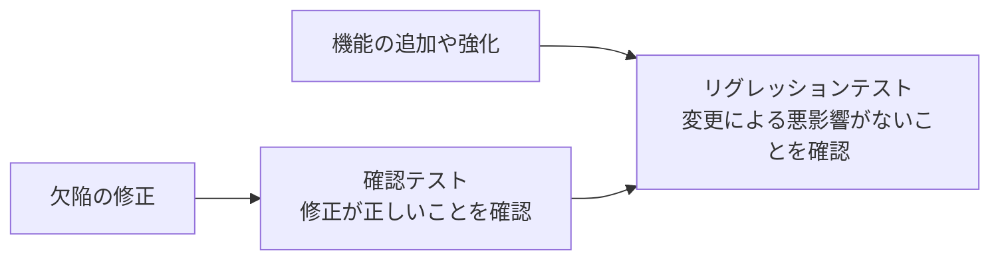

# lesson09: テストタイプと確認・リグレッションテスト — 4つのテストタイプと変更後のテスト

## このレッスンで学ぶこと

- 機能テストと非機能テストの違いを説明できるようになる
- ブラックボックステストとホワイトボックステストの違いを説明できるようになる
- テストタイプがすべてのテストレベルに適用できることを理解する
- 確認テストとリグレッションテストの目的を区別できるようになる
- リグレッションテストが自動化に適している理由を説明できるようになる

## テストタイプの全体像

テストレベル（[lesson08](/lessons/lesson08/)）が「開発のどの段階で、何を対象にテストするか」というまとまりであるのに対し、**テストタイプ**は「どのような観点や品質特性に着目してテストするか」によるまとまりです。

テストタイプには多くのものがあり、プロジェクトに合わせて適用できます。シラバスは次の4つのテストタイプを取り上げています。

| テストタイプ | 着目点 | 主な目的 |
|------|------|------|
| 機能テスト | テスト対象が「何」をすべきか | 機能完全性・機能正確性・機能適切性のチェック |
| 非機能テスト | システムが「どのようにうまく振る舞うか」 | 非機能的なソフトウェア品質特性のチェック |
| ブラックボックステスト | 仕様（テスト対象の外から見える振る舞い） | 仕様に照らしたシステムの動作のチェック |
| ホワイトボックステスト | 実装や内部構造 | 基本的な構造を受け入れ可能なレベルまでカバー |

### 機能テスト

機能テストでは、コンポーネントやシステムが実行する機能を評価します。機能とは、テスト対象が「何」をすべきかを指します。

主な目的は、機能完全性・機能正確性・機能適切性をチェックすることです。

### 非機能テスト

非機能テストでは、コンポーネントやシステムの機能以外の属性、つまりシステムが「どのようにうまく振る舞うか」を評価します。主な目的は、非機能的なソフトウェア品質特性をチェックすることです。

ISO/IEC 25010 標準は、非機能ソフトウェア品質特性を次のように分類しています。

- 性能効率性
- 互換性
- 使用性
- 信頼性
- セキュリティ
- 保守性
- 移植性

非機能テストについては、次の点も押さえておきましょう。

- ライフサイクルの早期（レビュー、コンポーネントテストやシステムテストの一部など）に開始するのが適切な場合がある
- テストケースの多くは機能テストと同じテストケースを使い、機能が動いている際に非機能の制約（指定時間内に動くか、新しいプラットフォームに移植できるかなど）が満たされることをチェックする
- 非機能の欠陥の発見が遅れると、プロジェクトの成功に重大な脅威をもたらす可能性がある
- 使用性テスト用のユーザビリティラボのように、特殊なテスト環境が必要な場合がある

### ブラックボックステスト

ブラックボックステストは仕様に基づくテストで、テスト対象の外から見える振る舞いを示すドキュメントからテストを導出します。内部構造は参照せず、入力と出力の関係に着目します。

主な目的は、システムの動作をその仕様と照らし合わせてチェックすることです。同値分割法や境界値分析といった具体的なブラックボックステスト技法は [lesson14](/lessons/lesson14/) から扱います。

### ホワイトボックステスト

ホワイトボックステストは構造に基づくテストで、コード・アーキテクチャー・ワークフロー・データフローといったシステムの実装や内部構造からテストを導出します。

主な目的は、テストによって基本的な構造を受け入れ可能なレベルまでカバーすることです。詳細は [lesson19](/lessons/lesson19/) で扱います。

::: tip 4つのタイプの整理のしかた
機能テストと非機能テストは「どの属性を評価するか」で対になり、ブラックボックステストとホワイトボックステストは「何を根拠にテストを導出するか（仕様か構造か）」で対になります。この2組の軸で整理すると混同しにくくなります。
:::

## テストレベルとテストタイプの関係

4つのテストタイプは、特定のテストレベル専用のものではありません。テストレベルごとに焦点は異なりますが、すべてのテストレベルに適用できます。つまり、テストレベルとテストタイプは直交する分類です。

| 例 | テストレベル | テストタイプ |
|------|------|------|
| 関数が計算結果を正しく返すかを確認する | コンポーネントテスト | 機能テスト |
| 関数の実行時間を計測する | コンポーネントテスト | 非機能テスト |
| 業務シナリオを最後まで完了できるかを確認する | システムテスト | 機能テスト |
| 想定ユーザー数の同時アクセスに耐えるかを確認する | システムテスト | 非機能テスト |

また、さまざまなテスト技法（[lesson14](/lessons/lesson14/)）を用いて、4つすべてのテストタイプのテスト条件とテストケースを導出できます。

::: warning テストレベルとテストタイプを混同しない
テストレベル（[lesson08](/lessons/lesson08/)）は「いつ・何を対象に」、テストタイプは「どの観点で」というまとまりです。「非機能テストはシステムテストでしか行わない」のように、タイプを特定のレベルに固定する選択肢は誤りです。
:::

## 確認テストとリグレッションテスト

コンポーネントやシステムへの変更は、典型的には新しい機能を追加して強化するため、または欠陥（[lesson02](/lessons/lesson02/)）を除去して修正するために行われます。変更した場合のテストには、確認テストとリグレッションテストも含めるべきです。

### 確認テスト

確認テストでは、元の欠陥が正常に修正されたことを確認します。リスクに応じて、修正版のソフトウェアを次のような方法でテストできます。

- 欠陥が原因で不合格になったテストケースをすべて実行する
- 欠陥の修正に必要だった変更をカバーする新しいテストケースを追加する

ただし、欠陥の修正にかけられる時間や費用が限られている場合もあります。その場合の確認テストは、欠陥が引き起こす故障を再現する手順を実行し、故障が発生しないことを確認するだけに限定することがあります。

### リグレッションテスト

リグレッションテストでは、すでに確認テスト済みの修正も含めて、変更が悪影響を引き起こしていないことを確認します。この悪影響は、いわゆるデグレードとして知られているものです。

悪影響が及ぶ可能性がある範囲は、変更した箇所だけにとどまりません。

- 変更を加えたコンポーネントそのもの
- 同じシステム内の他のコンポーネント
- 接続されている他のシステム

さらに、リグレッションテストはテスト対象そのものに限らず、環境に関連する場合もあります。

リグレッションテストの範囲を最適化するには、まず影響度分析をするのが望ましいとされています。影響度分析は、ソフトウェアのどの部分が変更の影響を受けるかを示します。

### 確認テストとリグレッションテストの違い

両者はどちらも変更後に行うテストですが、目的と見ている場所が異なります。

| 観点 | 確認テスト | リグレッションテスト |
|------|------|------|
| 目的 | 元の欠陥が正常に修正されたことを確認する | 変更が悪影響を引き起こしていないことを確認する |
| 見ている場所 | 修正した箇所そのもの | 変更していない部分を含む広い範囲（他のコンポーネント・接続されている他システム・環境） |
| 問いかけ | 直したところは本当に直ったか | 直したことで別の場所が壊れていないか |

::: tip 2つのテストの覚え方
確認テストは「修正の答え合わせ」、リグレッションテストは「副作用の点検」とイメージすると区別しやすくなります。[lesson01](/lessons/lesson01/) で見たデバッグ後の流れでも、確認テストの後に続けてリグレッションテストを実施できました。
:::

### リグレッションテストと自動化

リグレッションテストスイートは何度も繰り返し実行します。また、リグレッションテストケースの数は、一般的にイテレーションやリリースを重ねるごとに増えていきます。

このため、リグレッションテストは自動化の有力な候補です（テスト自動化の利点とリスクは [lesson30](/lessons/lesson30/)）。自動化はプロジェクトの早期に開始すべきとされています。

DevOps（[lesson07](/lessons/lesson07/)）のように CI（継続的インテグレーション）を使用する場合は、自動化されたリグレッションテストを CI に含めることがよい実践です。状況によっては、異なるテストレベルのリグレッションテストを CI に含めることもできます。

### すべてのテストレベルでの実施

あるテストレベルで欠陥の修正や変更があった場合、テスト対象の確認テストとリグレッションテストは、すべてのテストレベルで必要になります。

## キーワード

| 用語 | 説明 |
|------|------|
| テストタイプ（test type） | 特定の観点や品質特性に着目したテスト活動のまとまり。すべてのテストレベルに適用できる |
| 機能テスト（functional testing） | テスト対象が「何」をすべきかを評価するテスト。機能完全性・機能正確性・機能適切性をチェックする |
| 非機能テスト（non-functional testing） | システムが「どのようにうまく振る舞うか」を評価するテスト。性能効率性・使用性・信頼性・セキュリティなどの品質特性をチェックする |
| ブラックボックステスト（black-box testing） | 仕様に基づき、テスト対象の外から見える振る舞いを示すドキュメントからテストを導出するテスト |
| ホワイトボックステスト（white-box testing） | 構造に基づき、コードやアーキテクチャーなどの実装・内部構造からテストを導出するテスト |
| 確認テスト（confirmation testing） | 元の欠陥が正常に修正されたことを確認するテスト |
| リグレッションテスト（regression testing） | すでに確認テスト済みの修正を含め、変更が悪影響（デグレード）を引き起こしていないことを確認するテスト |

## 試験のポイント

- 機能テストは「何をするか」、非機能テストは「どのようにうまく振る舞うか（ISO/IEC 25010 の非機能品質特性）」を評価する対応づけで区別する（K2）
- 非機能テストのテストケースの多くは機能テストのテストケースから導出し、ライフサイクルの早期に開始するのが適切な場合もある
- ブラックボックステストは仕様に基づき、ホワイトボックステストは実装や内部構造に基づいてテストを導出する
- 4つのテストタイプは、焦点は異なるもののすべてのテストレベルに適用できる（タイプを特定のレベルに固定する選択肢は誤り）
- 確認テストは「元の欠陥が正常に修正されたこと」、リグレッションテストは「変更による悪影響がないこと」を確認する活動として区別する（修正や変更があれば、両者はすべてのテストレベルで必要になる）
- リグレッションテストスイートは何度も実行し拡充されるため自動化の有力な候補であり、自動化は早期に開始すべきとされる
