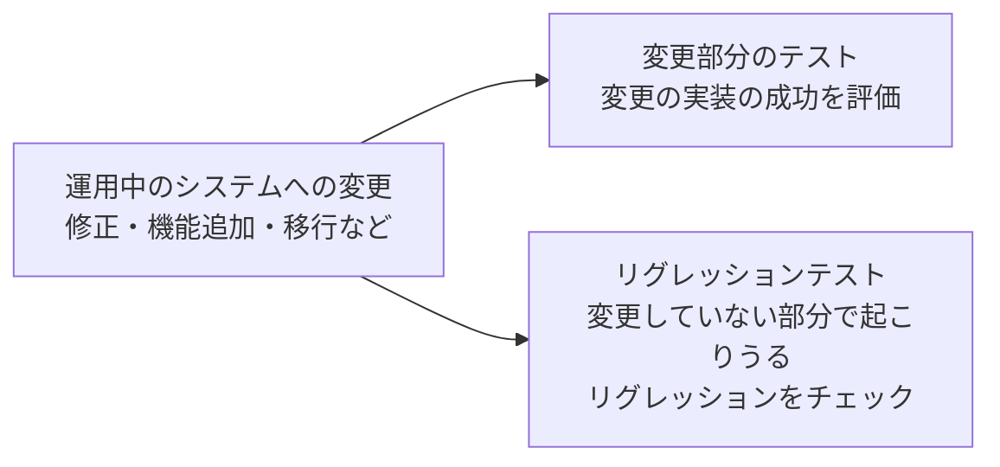

# lesson10: メンテナンステスト — 運用中のシステムに加える変更のテスト

## このレッスンで学ぶこと

- メンテナンステストが何を対象とするテストかを説明できるようになる
- メンテナンスのカテゴリーを区別できるようになる
- メンテナンステストの範囲に影響する3つの要因を挙げられるようになる
- メンテナンステストのきっかけを要約できるようになる（改良、運用環境の更新や移行、廃棄）

## メンテナンステストとは

ソフトウェアはリリースして終わりではありません。運用が始まった後も、欠陥の修正や機能の追加、環境の変化への対応など、さまざまな変更が続きます。

こうした運用中のシステムへの変更に対して行うテストが**メンテナンステスト**です。シラバスでは「メンテナンス（保守）テスト」と表記されます。ソフトウェア開発ライフサイクル（SDLC）の中では、リリース後の運用の段階に関わるテストです（SDLC とテストの関係は [lesson06](/lessons/lesson06/)）。

### メンテナンスのカテゴリー

メンテナンスにはさまざまなカテゴリーがあります。詳細は標準 ISO/IEC 14764 で定義されており、シラバスはその代表例を挙げています。

| カテゴリー | 内容 | 例 |
|------|------|-----|
| 是正（修正を伴うメンテナンス） | 運用中に見つかった欠陥を修正する | 故障の原因となった欠陥の修正、ホットフィックス |
| 適応（環境の変化への対応） | OS やプラットフォームなど、環境の変化にシステムを合わせる | 新しい OS バージョンへの対応、別のプラットフォームへの移行 |
| 改良（完全化） | パフォーマンスや保守性を改善する | 機能の改善、応答速度の向上、コードの整理 |
| 予防 | 将来の問題を未然に防ぐための変更をする | 潜在的な欠陥の事前修正 |

### 計画的な変更とホットフィックス

メンテナンステストには、次の両方が含まれます。

- 計画的なリリース/デプロイに対するテスト
- 計画外のリリース/デプロイ（ホットフィックス）に対するテスト

また、変更をする前に**影響度分析**をすることがあります。システムの他の領域への潜在的な影響に基づいて、その変更を採用するべきかどうかを判断するためです。

## メンテナンステストの2つの側面

本番稼働中のシステムに対する変更のテストには、次の両方が含まれます。

- 変更の実装が成功したことを評価する（修正に対しては確認テストが該当します）
- 変更していないシステムの部分で起こりうるリグレッションをチェックする

変更していない部分は、通常はシステムの大部分を占めます。そのため、変更後のテストでは確認テストとリグレッションテストが中心になります（2つのテストの詳細は [lesson09](/lessons/lesson09/)）。

## メンテナンステストの範囲を決める要因

変更のたびにシステム全体を全力でテストし直すのは現実的ではありません。メンテナンステストの範囲は、典型的には次の3つに依存します。

| 要因 | 考え方 |
|------|------|
| 変更のリスクの度合い | リスクが高い変更ほど広くテストする。たとえば他の多くの機能と連携する部分の変更は影響が大きい（リスクの考え方は [lesson25](/lessons/lesson25/)） |
| 既存システムの大きさ | システムが大きいほど、変更の影響が及びうる範囲も広がる |
| 変更の大きさ | 小さな修正か大規模な機能追加かで、必要なテストの量が変わる |

## メンテナンステストのきっかけ

メンテナンスのきっかけ、つまりメンテナンステストのきっかけは、次のように分類されます。

| きっかけ | 内容 | テストで考慮すること |
|------|------|------|
| 改良 | 計画的な機能拡張（リリースベース）、修正を伴う変更、ホットフィックス | 変更部分のテストに加えて、確認テストとリグレッションテストを行う |
| 運用環境の更新・移行 | あるプラットフォームから別のプラットフォームへの移行など | 新しい環境や変更されたソフトウェアに関連するテストが必要となる場合がある。別のアプリケーションのデータを保守するシステムに移行する場合は、データ変換のテストも必要となる |
| 廃棄 | アプリケーションの寿命などによるシステムの廃棄 | 長期間のデータ保持が要件となる場合は、データアーカイブのテストが必要となることがある。アーカイブ期間中にデータの取得が必要な場合は、復元や取得手順のテストも必要になることがある |

::: tip 廃棄にもテストがある
「システムをやめるときのテスト」は見落としやすいポイントです。廃棄はテストの終わりではなく、データアーカイブや復元・取得手順といったテストのきっかけになります。
:::

## キーワード

| 用語 | 説明 |
|------|------|
| メンテナンステスト（maintenance testing） | 運用中のシステムやその環境への変更に対して行うテスト。計画的なリリース/デプロイと計画外のリリース/デプロイの両方を含む |
| メンテナンス（maintenance、保守） | リリース後のシステムに変更を加える活動。修正を伴うもの、環境の変化に適応するもの、パフォーマンスや保守性を改善するものなどがある |
| ホットフィックス（hotfix） | 計画外のリリース/デプロイによる緊急の修正 |
| 影響度分析（impact analysis） | 変更がシステムの他の領域へ及ぼしうる潜在的な影響を評価すること。変更を採用するべきかどうかの判断に使う |

## 試験のポイント

- メンテナンステストは運用中のシステムへの変更に対して行うテストで、計画的なリリース/デプロイと計画外のホットフィックスの両方を含む
- 本番稼働中のシステムに対する変更のテストは「変更の実装の成功の評価」と「変更していない部分のリグレッションのチェック」の両方を含む（変更していない部分は通常大部分を占めるため、確認テストとリグレッションテストが中心になる）
- メンテナンステストの範囲は「変更のリスクの度合い」「既存システムの大きさ」「変更の大きさ」に依存する
- メンテナンステストのきっかけは「改良」「運用環境の更新・移行」「廃棄」に分類される（K2 で要約できるようにする）
- メンテナンスのカテゴリー（是正・適応・改良・予防、ISO/IEC 14764 で定義）と、メンテナンステストのきっかけ（「改良」「運用環境の更新・移行」「廃棄」）は別の分類なので混同しない
- 移行ではデータ変換のテスト、廃棄ではデータアーカイブや復元・取得手順のテストが必要になることがある

