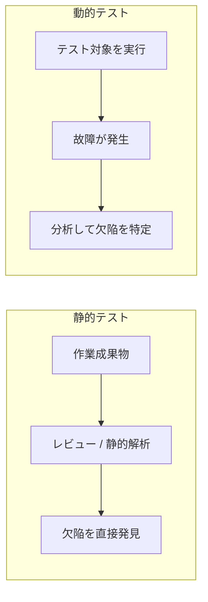

# lesson11: 静的テストの基礎 — 実行せずに欠陥を直接見つける

## このレッスンで学ぶこと

- 静的テストの特徴と、レビューおよび静的解析という2つの進め方を理解する
- 静的テストで確認できる作業成果物の種類を認識できるようになる
- 早期の欠陥検出やコスト削減など、静的テストの価値を説明できるようになる
- 静的テストと動的テストの違いを比較できるようになる

## 静的テストの特徴

静的テストは、テスト対象のソフトウェアを実行せずに作業成果物を評価するテストです（[lesson01](/lessons/lesson01/)）。評価の進め方には、人手による確認とツールによる確認の2通りがあります。

| 進め方 | 呼び方 | 例 |
|------|------|------|
| 人手による確認 | レビュー | 要件仕様書を読んで、曖昧な記述や矛盾を指摘する |
| ツールの力を借りた確認 | 静的解析 | ツールでソースコードを解析し、未使用の変数を検出する |

レビューの進め方は [lesson12](/lessons/lesson12/) で、レビューの種別は [lesson13](/lessons/lesson13/) で扱います。

静的テストのテスト目的には、品質向上と欠陥検出に加えて、可読性・完全性・正確性・試験性・一貫性といった特性の評価も含まれます。また、静的テストは検証と妥当性確認（[lesson01](/lessons/lesson01/)）の両方に適用できます。

### 協働による作業成果物の確認

静的テストは、1人で成果物を読み込む活動だけではありません。テスト担当者・ビジネス側の代表者・開発担当者が協力する場面もあります。

- 実例マッピング（[lesson21](/lessons/lesson21/)）に一緒に取り組む
- ユーザーストーリーを共同で書く
- バックログリファインメントセッションで協力し、ユーザーストーリーと関連する作業成果物が「準備完了（Ready）の定義」などの基準（[lesson23](/lessons/lesson23/)）を満たすことを確認する

レビューの技法は、ユーザーストーリーが完全で理解しやすく、テスト可能な受け入れ基準を含むことの確認に適用できます。テスト担当者は、適切な質問を投げかけて提案されたユーザーストーリーを探索し、課題を挙げて改善を支援します。

### 静的解析の特徴

静的解析については、次の点を押さえておきましょう。

- テストケースが不要で、典型的にはツール（[lesson29](/lessons/lesson29/)）を使用する
- 動的テストの前に問題を識別できるため、より少ない労力で済む場合が多い
- CI（継続的インテグレーション）のフレームワークに組み込むことが多い（[lesson07](/lessons/lesson07/)）
- 主にコードの特定の欠陥を検出するために使用するが、保守性やセキュリティの評価にも使用する
- スペルチェッカーや可読性を上げるツールも静的解析ツールの一例

## 静的テストで確認できる作業成果物

ほとんどの作業成果物は、静的テストを使用して確認できます。シラバスは次のような例を挙げています。

- 要件仕様書
- ソースコード
- テスト計画書
- テストケース
- プロダクトバックログアイテム
- テストチャーター
- プロジェクトドキュメント
- 契約書
- モデル

::: tip 実行できない成果物も確認できる
契約書や要件仕様書のように「実行できない」成果物でも、レビューの対象になります。ソフトウェアを実行しないという静的テストの特徴が、確認できる成果物の幅広さにつながっています。
:::

### レビューと静的解析の対象の違い

同じ静的テストでも、レビューと静的解析では対象にできる成果物の条件が異なります。

| 手段 | 対象にできる作業成果物 |
|------|------|
| レビュー | 読んで理解できるあらゆる作業成果物 |
| 静的解析 | チェックするための構造を持つ作業成果物（モデル、コード、正式な構文を持つテキストなど） |

### 静的テストに適さない作業成果物

一部の作業成果物は静的テストに適しません。次のようなものが該当します。

- 人間による解釈が困難なもの
- ツールで解析してはいけないもの（例: 法規制がある第三者の実行可能コード）

## 静的テストの価値

### 早期の欠陥検出

静的テストは SDLC（ソフトウェア開発ライフサイクル）の初期段階で欠陥を検出できます。これはテストの7原則の1つである早期テストの原則（[lesson03](/lessons/lesson03/)）を満たすものであり、シフトレフト（[lesson07](/lessons/lesson07/)）の考え方とも整合します。

### 動的テストでは検出できない欠陥の発見

静的テストは、動的テストでは検出できない欠陥も検出できます。シラバスは次の例を挙げています。

- 到達できないコード
- 狙い通りに実装されていないデザインパターン
- 実行不可能な作業成果物に内在する欠陥

到達できないコードは実行されないため、実行を前提とする動的テストでは故障として現れません。実行不可能な成果物（要件仕様書や契約書など）に潜む欠陥も同様です。

### 品質の評価と共通理解の促進

静的テストには、欠陥検出以外の価値もあります。

- 作業成果物の品質を評価し、成果物に対する信頼性を高められる
- 文書化した要件を検証することで、ステークホルダーは要件が実際のニーズを表していることを確認できる
- SDLC の早期に実施できるため、ステークホルダーの間で共通の理解を得られる
- ステークホルダー間のコミュニケーションを改善できる

このため、静的テストにはさまざまなステークホルダーが参加することが推奨されています。

### プロジェクト全体のコスト削減

レビューの実装にはコストがかかります。しかし、プロジェクトの後半で欠陥の修正に費やす時間と労力が少なくて済むため、プロジェクト全体のコストは通常、レビューを実施しない場合よりもはるかに安価になります。

また、静的解析は動的テストよりも効率的にコードの欠陥を検出でき、通常はコードの欠陥の減少と開発工数の削減の両方を実現できます。

## 静的テストと動的テストの違い

静的テストと動的テストは、互いに補完し合う関係です。どちらも作業成果物の欠陥検出を支援するという似た目的を持ちますが、アプローチには明確な違いがあります。

| 観点 | 静的テスト | 動的テスト |
|------|------|------|
| ソフトウェアの実行 | 伴わない | 伴う |
| 欠陥の見つけ方 | 欠陥を直接発見する | 故障を引き起こし、その後の分析によって関連する欠陥を特定する |
| 適用できる作業成果物 | 実行不可能な作業成果物にも適用できる | 実行可能な作業成果物にしか適用できない |
| 測定できる品質特性 | コードの実行に依存しない特性（例: 保守性） | コードの実行に依存する特性（例: 性能効率性） |
| 到達しにくいコードパス | パスに潜む欠陥をより簡単に検出できることがある | ほとんど実行されない、あるいは到達しにくい |

さらに、欠陥の種類によっては、静的テストと動的テストのどちらか一方でしか発見できないものがあります。両者は競合するものではなく、組み合わせて使う関係だと理解しておきましょう。動的テストの詳細なタイプ分けは [lesson09](/lessons/lesson09/) で扱っています。

### 静的テストが早期に検出できる欠陥

静的テストは、次のような欠陥を早期かつ安価に検出できます。

| 欠陥の種類 | 例 |
|------|------|
| 要件の欠陥 | 一貫していない、曖昧、矛盾、欠落、不正確、重複 |
| 設計の欠陥 | 非効率なデータベース構造、不十分なモジュール化 |
| ある種のコードの欠陥 | 値が定義されていない変数、宣言されていない変数、到達不能コード、重複したコード、過剰なコード複雑度 |
| 標準からの逸脱 | コーディング標準の命名規則を遵守していない |
| 正しくないインターフェース仕様 | パラメーターの数・種類・順序の不一致 |
| 特定の種類のセキュリティ脆弱性 | バッファオーバーフロー |
| テストベースに対するカバレッジの不足や不正確さ | 受け入れ基準に対するテストケースの欠落 |

::: warning 要件の欠陥は動的テストでは見つけにくい
要件の矛盾や曖昧さは、コードになる前の段階に存在する欠陥です。動的テストはコードを実行して故障を観察する活動なので、こうした欠陥の発見には向きません。要件レビューのような静的テストが効果を発揮する典型的な場面です。
:::

## キーワード

| 用語 | 説明 |
|------|------|
| 静的テスト（static testing） | ソフトウェアを実行せずに作業成果物を評価するテスト。レビューと静的解析を含む |
| 動的テスト（dynamic testing） | ソフトウェアの実行を伴うテスト。故障を引き起こし、その後の分析によって欠陥を特定する |
| レビュー（review） | 人手による作業成果物の確認。読んで理解できるあらゆる作業成果物が対象になりうる（詳細は [lesson12](/lessons/lesson12/)・[lesson13](/lessons/lesson13/)） |
| 静的解析（static analysis） | ツールを用いた作業成果物の評価。テストケースが不要で、対象には構造（モデル、コード、正式な構文を持つテキストなど）が必要 |

## 試験のポイント

- 静的テストで確認できる作業成果物の種類はK1（認識する）で問われる（要件仕様書・ソースコード・テスト計画書・契約書・モデルなど、ほとんどの成果物が対象）
- レビューは読んで理解できるあらゆる成果物を対象にできるが、静的解析にはチェックするための構造を持つ成果物が必要という違いがひっかけになりやすい
- 静的解析はテストケースが不要で、典型的にはツールを使用する
- 人間による解釈が困難なものや、法規制がある第三者の実行可能コードのようにツールで解析してはいけないものは、静的テストに適さない例外として押さえる
- 静的テストの価値はK2（説明する）で問われる（SDLC初期の欠陥検出・動的テストでは検出できない欠陥の発見・ステークホルダー間の共通理解・コミュニケーションの改善）
- 到達できないコードや実行不可能な作業成果物に内在する欠陥は、動的テストでは検出できない（静的テストだけが見つけられる欠陥の代表例）
- レビューの実装にはコストがかかるが、後半の欠陥修正が減るため通常はプロジェクト全体のコストを下げる（「レビューはコストを増やす」と言い切る選択肢に注意）
- 静的テストと動的テストの比較・対比はK2の頻出テーマで、「欠陥を直接発見する」のが静的テスト、「故障を引き起こして分析で欠陥を特定する」のが動的テストという対比が軸
- 適用範囲の対比も問われる（静的テストは実行不可能な成果物にも適用でき、動的テストは実行可能な成果物にしか適用できない）
- 品質特性との対応はひっかけどころ（保守性のような実行に依存しない特性は静的テスト、性能効率性のような実行に依存する特性は動的テストで測定する）
- 静的テストが早期かつ安価に検出できる欠陥の種類（要件の欠陥・設計の欠陥・ある種のコードの欠陥・標準からの逸脱・正しくないインターフェース仕様・特定のセキュリティ脆弱性・カバレッジの不足や不正確さ）は例と対応づけて押さえる
