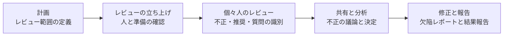

# lesson12: レビュープロセス — 早期フィードバックの利点と5つの活動・6つの役割

## このレッスンで学ぶこと

- 早期かつ頻繁なステークホルダーからのフィードバックの利点を識別できるようになる
- ISO/IEC 20246 に基づくレビュープロセスの5つの活動と流れを要約できるようになる
- レビューにおける6つの主要な役割とその責務を想起できるようになる
- まぎらわしい役割どうしの違いを区別できるようになる

## 早期かつ頻繁なステークホルダーからのフィードバックの利点

レビューは、作業成果物に対してステークホルダーからフィードバックを得るための代表的な手段です（静的テストの基礎は [lesson11](/lessons/lesson11/)）。

早期かつ頻繁なフィードバックには、潜在的な品質問題を早い段階で伝えられるという利点があります。開発の早い段階で問題に気づくという考え方は、シフトレフト（[lesson07](/lessons/lesson07/)）とも深く関係します。

### フィードバックが少ない場合のリスク

SDLC（ソフトウェア開発ライフサイクル）の中でステークホルダーの関与が少ないと、開発中のプロダクトがステークホルダーの当初のビジョンや現在のビジョンを満たせないおそれがあります。ステークホルダーが望むものを提供できない場合、次のような事態につながります。

- コストのかかる手直し
- 納期の遅れ
- 責任のなすり合い
- プロジェクトの完全な失敗

### 頻繁なフィードバックがもたらす利点

SDLC を通じてステークホルダーからのフィードバックを頻繁に得ると、次の利点があります。

- 要件に関する誤解を防げる
- 要件の変更をより早く理解し、実装できる
- 開発チームが、自分たちの構築しているものへの理解を深められる
- ステークホルダーに最大の価値を与えるフィーチャーに焦点を当てられる
- 識別したリスクに最もよい影響を与えるフィーチャーに焦点を当てられる

::: tip 利点の押さえ方
この利点はK1（識別する）で問われます。「品質問題の早期伝達」「誤解の防止」「変更の早期理解」「チームの理解向上」「価値とリスクに効くフィーチャーへの集中」というキーワードで押さえておきましょう。
:::

## レビュープロセスの活動

ISO/IEC 20246 標準は、汎用的なレビュープロセスを定義しています。このプロセスは構造化されていますが柔軟でもあり、特定の状況に応じて具体的なレビュープロセスを調整できます。より形式的なレビューが必要な場合は、各活動に対して標準に記載のあるより多くのタスクが必要になります。

また、多くの作業成果物はサイズが大きく、1回のレビューではカバーしきれません。作業成果物全体のレビューを完了させるために、レビュープロセスを2〜3回行うことがあります。

レビュープロセスは次の5つの活動で構成されます。

### 計画

レビューの範囲を定義する活動です。範囲には次の要素が含まれます。

- 目的
- レビュー対象となる作業成果物
- 評価対象の品質特性
- 重点を置く領域
- 終了基準
- 標準などの裏付け情報
- レビューの工数と時間枠

### レビューの立ち上げ

レビューを開始できる状態を整える活動です。レビュー開始までに、関係者や物事の準備ができたことを明確にするのがゴールです。具体的には次の点を確認します。

- すべての参加者が、レビュー対象の作業成果物にアクセスできる
- 参加者が自分の役割と責務を理解している
- 参加者がレビューの実行に必要なすべてのものを受け取っている

### 個々人のレビュー

すべてのレビューアが、それぞれ個人でレビューを実施する活動です。レビューアは作業成果物の品質を精査し、1つ以上のレビュー技法を適用して、不正・推奨・質問を識別します。レビュー技法の例として、チェックリストベースドレビューやシナリオベースドレビューがあります。

識別したすべての不正・推奨・質問は、レビューアが記録します。

::: info 不正とは
不正は、期待から逸脱していると識別された事項です。レビューで見つけた不正が、必ずしも欠陥であるとは限りません。欠陥かどうかは、続く共有と分析の活動で議論して判断します。
:::

### 共有と分析

識別した不正を共有し、分析して議論する活動です。不正は必ずしも欠陥とは限らないため、すべての不正について分析と議論が必要です。これは通常、レビューミーティングで行います。

この活動では次のことを決めます。

- すべての不正のステータス・オーナー・必要なアクション
- レビューした作業成果物の品質レベル
- 必要なフォローアップのアクション

アクションを完了するために、フォローアップのレビューが必要になる場合もあります。

### 修正と報告

発見した欠陥を修正につなげ、レビューの結果を報告する活動です。

- 是正処置をフォローアップできるように、すべての欠陥に対して欠陥レポートを作成する（欠陥レポートの詳細は [lesson28](/lessons/lesson28/)）
- 終了基準に達したら、作業成果物を受け入れる
- レビュー結果をレポートする

## レビューでの役割と責務

レビューにはさまざまなステークホルダーが関与し、1人がいくつかの役割を担う可能性もあります。主要な役割と責務は次の6つです。

| 役割 | 主な責務 |
|------|------|
| マネージャー | 何をレビューするかを決定し、レビューのための人員や時間などのリソースを提供する |
| 作成者 | レビュー対象の作業成果物を作成し、修正する |
| モデレーター | レビューミーティングを効果的に運営する。調整・時間のマネジメント・誰もが自由に発言できる安全なレビュー環境づくりを担う。ファシリテーターとも呼ばれる |
| 書記 | レビューアからの不正を取りまとめ、決定事項やミーティング中に発見された新たな不正などのレビュー情報を記録する。記録係とも呼ばれる |
| レビューア | レビューを実施する。プロジェクトに携わっている人・特定分野の専門家・その他のステークホルダーが担うことがある |
| レビューリーダー | レビューの全体的な責任を負う。誰が参加するか、いつどこでレビューを行うかを決める |

これらの役割は、ISO/IEC 20246 標準に記載されているように、さらに細かく分割できます。

::: tip まぎらわしい役割の区別
マネージャーは「何をレビューするか」を決めてリソースを提供し、レビューリーダーは「誰が・いつ・どこで」を決めてレビュー全体の責任を負います。また、ミーティングを運営するのがモデレーター、内容を記録するのが書記です。責務の入れ替えで問われやすいポイントです。
:::

レビュー種別（非形式的レビュー・ウォークスルー・テクニカルレビュー・インスペクション）と、レビューを成功させる要因は [lesson13](/lessons/lesson13/) で扱います。

## 試験のポイント

- 早期かつ頻繁なフィードバックの利点はK1（識別する）で問われるため、本文の5つの利点を漏れなく言えるようにする
- レビュープロセスの5つの活動の要約はK2で、順序（計画 → レビューの立ち上げ → 個々人のレビュー → 共有と分析 → 修正と報告）と「どのタスクがどの活動か」の対応づけが問われる
- 終了基準の取り違えに注意（終了基準の定義は計画で行い、終了基準に達したかの確認と作業成果物の受け入れは修正と報告で行う）
- 6つの役割と責務の対応はK1（想起する）で問われ、マネージャー（何をレビューするかの決定とリソースの提供）とレビューリーダー（参加者と日時・場所の決定、全体的な責任）の取り違えが定番のひっかけ
