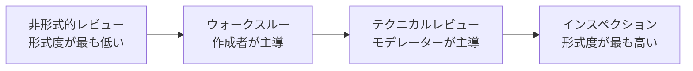

# lesson13: レビュー種別と成功要因 — 4つのレビュー種別の対比と成功に導く要因

## このレッスンで学ぶこと

- 非形式的レビュー・ウォークスルー・テクニカルレビュー・インスペクションの4つのレビュー種別を比較・対比できるようになる
- 各レビュー種別の形式度・主導する役割・主な目的の違いを整理する
- レビューの形式度と種別の選択に影響する要因を理解する
- レビューの成功に貢献する要因を想起できるようになる

## レビューの形式度

レビュー（[lesson11](/lessons/lesson11/)）には、非形式的なものから形式的なものまでさまざまな種別があります。形式的なレビューほど実施するタスクが多くなり、結果のドキュメント化も正式なものになります。

どの程度の形式度が必要かは、次のような要因に依存します。

- 従う SDLC（ソフトウェア開発ライフサイクル）
- 開発プロセスの成熟度
- レビュー対象の作業成果物の重要性と複雑度
- 法的または規制上の要件
- 監査証跡の必要性

::: info 同じ成果物に異なる種別を適用できる
同じ作業成果物を、異なるレビュー種別でレビューできます。たとえば最初に非形式的なレビューで方向性を確かめ、後に形式的なレビューで念入りに確認する、という進め方です。
:::

## 4つのレビュー種別

よく使われるレビュー種別は4つあります。形式度の低い順に並べると次のようになります。

| 種別 | 形式度 | 主導する人 | 特徴・主な目的 |
|------|------|------|------|
| 非形式的レビュー | 最も低い | 規定なし | 定義されたプロセスに従わず、正式なドキュメント化も不要。主な目的は不正の検出 |
| ウォークスルー | 低い | 作成者 | 教育・合意形成・アイデア創出など、幅広い目的を達成できる |
| テクニカルレビュー | 高い | モデレーター | 技術的に適格なレビューアが実施し、技術的な問題に関する合意と判断をめざす |
| インスペクション | 最も高い | 作成者以外 | 汎用のレビュープロセスに完全に従う。主な目的は不正の最大数の発見 |

::: info 不正とは
不正（anomaly）は、レビューや静的解析で識別される、欠陥の可能性がある問題です。不正が必ずしも欠陥であるとは限らないため、分析と議論を経てステータスや必要なアクションを決めます（[lesson12](/lessons/lesson12/)）。
:::

### 非形式的レビュー

非形式的レビューは、定義されたプロセスに従わず、正式にドキュメント化されたアウトプットも必要としないレビューです。主な目的は不正の検出です。

同僚に成果物をさっと確認してもらうような、日常的に行われる軽いレビューがこれにあたります。

### ウォークスルー

ウォークスルーは、**作成者が主導する**レビューです。1回のレビューで次のような多くの目的を達成できます。

- 品質の評価と、作業成果物に対する信頼の積み上げ
- レビューアの教育
- 合意形成
- 新しいアイデアの創出
- 作成者のモチベーションの向上と改善
- 不正の検出

レビューアはウォークスルーの前に個人のレビュー（[lesson12](/lessons/lesson12/)）を実施してもよいですが、必須ではありません。

### テクニカルレビュー

テクニカルレビューは、**技術的に適格なレビューア**が実施し、モデレーターが主導するレビューです。

目的の中心は、技術的な問題に関して合意を得て判断することです。加えて、不正の検出、品質の評価と作業成果物に対する信頼の積み上げ、新しいアイデアの創出、作成者のモチベーションの向上と改善もめざします。

### インスペクション

インスペクションは**最も形式的なレビュー**で、汎用のレビュープロセス（[lesson12](/lessons/lesson12/)）に完全に従います。主な目的は、不正を最大数発見することです。

インスペクションには、他の種別にない特徴が2つあります。

- メトリクスを収集し、インスペクションプロセスを含む SDLC の改善に使用する
- 作成者はレビューリーダーや書記として活動できない（役割の詳細は [lesson12](/lessons/lesson12/)）

その他の目的として、品質の評価と作業成果物に対する信頼の積み上げ、作成者のモチベーションの向上と改善も挙げられています。

### 目的による対比

4つの種別の目的を並べると、共通点と違いが見えてきます。

| 目的 | 非形式的レビュー | ウォークスルー | テクニカルレビュー | インスペクション |
|------|------|------|------|------|
| 不正の検出 | ◎ 主な目的 | ○ | ○ | ◎ 最大数の発見が主な目的 |
| 品質の評価と信頼の積み上げ | - | ○ | ○ | ○ |
| レビューアの教育 | - | ○ | - | - |
| 合意形成 | - | ○ | ○ 技術的な問題の合意と判断 | - |
| 新しいアイデアの創出 | - | ○ | ○ | - |
| 作成者のモチベーションの向上と改善 | - | ○ | ○ | ○ |
| メトリクスによるプロセス改善 | - | - | - | ○ |

「-」は、シラバスがその種別の目的として挙げていないことを示します（実施を禁止する意味ではありません）。

この表から読み取れるポイントは次の通りです。

- 不正の検出はすべての種別に共通する
- レビューアの教育を目的に挙げるのはウォークスルーだけ
- メトリクスを収集してプロセス改善につなげるのはインスペクションだけ
- 1つのレビューが複数の目的を持ってよい

::: tip レビュー種別の覚え方
作成者が主導するのはウォークスルーだけです。テクニカルレビューはモデレーターが主導し、インスペクションでは作成者がレビューリーダーや書記を担当できません。「作成者が自分の成果物を説明しながら進めるのがウォークスルー」と押さえると区別しやすくなります。
:::

## レビュー種別の選択

適切なレビュー種別の選択は、レビューの目的を達成できるかどうかを左右します。選択の根拠は目的だけではなく、次のような要素にも基づきます。

- プロジェクトのニーズ
- 使用可能なリソース
- 作業成果物の種類とリスク
- ビジネスドメイン
- 企業文化

適切な種別の選択そのものが、レビューの成功要因の1つでもあります。

## レビューの成功要因

レビューの成功はいくつかの要因で決まります。ここでは、進め方と組織に関する要因、人と文化に関する要因に分けて整理します（シラバスは1つのリストとして挙げています）。

### 進め方と組織に関する要因

- 明確な目的と、測定可能な終了基準を定義する（参加者の評価を決して目的にしてはならない）
- 作業成果物の種類・レビュー参加者・プロジェクトのニーズや状況に合わせて、適切なレビュー種別を選択する
- 個人のレビューやレビューミーティングで集中力を維持できるよう、レビュー対象を小さく分割して実施する
- 参加者に十分な準備時間を与える
- マネジメントがレビュープロセスを支援する
- すべての参加者が自分の役割の果たし方を学べるよう、適切なトレーニングを提供する

### 人と文化に関する要因

- レビューからステークホルダーや作成者へフィードバックを提供し、プロダクトと自分たちの活動を改善できるようにする（フィードバックの利点は [lesson12](/lessons/lesson12/)）
- レビューを組織の文化として定着させ、学習とプロセス改善を促進する
- ミーティングをファシリテートする

::: warning 評価するのは成果物であり人ではない
参加者の評価は、決してレビューの目的にしてはなりません。レビューで指摘するのは作業成果物の問題であり、作成者の能力への批判ではありません。モデレーターが誰もが自由に発言できる安全な環境を作ること（[lesson12](/lessons/lesson12/)）は、この考え方を支えます。欠陥や故障の情報を建設的に伝える姿勢（[lesson05](/lessons/lesson05/)）は、レビューでも同じように重要です。
:::

## キーワード

| 用語 | 説明 |
|------|------|
| 非形式的レビュー（informal review） | 定義されたプロセスに従わず、正式にドキュメント化されたアウトプットを必要としないレビュー。主な目的は不正の検出 |
| ウォークスルー（walkthrough） | 作成者が主導するレビュー。教育・合意形成・新しいアイデアの創出など、幅広い目的を達成できる |
| テクニカルレビュー（technical review） | 技術的に適格なレビューアが実施し、モデレーターが主導するレビュー。技術的な問題に関する合意と判断をめざす |
| インスペクション（inspection） | 最も形式的なレビュー。汎用のレビュープロセスに完全に従い、不正の最大数の発見を主な目的とする。メトリクスを収集して SDLC の改善に使用する |
| 形式的レビュー（formal review） | 定義されたプロセスに従い、正式にドキュメント化されたアウトプットを伴うレビュー。インスペクションが代表例 |
| 不正（anomaly） | レビューや静的解析で識別される、欠陥の可能性がある問題。分析と議論を経て欠陥かどうかを判断する（詳細は [lesson12](/lessons/lesson12/)） |

## 試験のポイント

- レビュー種別の比較・対比はK2で問われる（形式度は「非形式的レビュー → ウォークスルー → テクニカルレビュー → インスペクション」の順に高くなる）
- 主導する人での見分けが定番（作成者が主導するのはウォークスルーだけで、テクニカルレビューは技術的に適格なレビューアが実施しモデレーターが主導する）
- 主な目的での見分けも対で押さえる（不正の検出は非形式的レビュー、不正の最大数の発見はインスペクション、技術的な問題に関する合意と判断はテクニカルレビュー）
- 1つの種別だけが目的に挙げる項目はひっかけに使われやすい（レビューアの教育はウォークスルーのみ、メトリクスによるプロセス改善はインスペクションのみ）
- インスペクション固有の特徴として、汎用のレビュープロセスに完全に従うことと、作成者はレビューリーダーや書記を担当できないことを押さえる
- ウォークスルー前の個人のレビューは実施してもよいが必須ではない
- 同じ作業成果物を異なるレビュー種別でレビューできる（最初は非形式的に、後に形式的に、など）
- 必要な形式度は SDLC・開発プロセスの成熟度・作業成果物の重要性と複雑度・法的または規制上の要件・監査証跡の必要性に依存する
- 成功要因はK1（想起する）で問われるため、9つの内容（明確な目的と測定可能な終了基準・適切な種別の選択・小さく分割・フィードバック・十分な準備時間・マネジメントの支援・組織文化への定着・トレーニング・ミーティングのファシリテート）を想起できるようにする
- 参加者の評価は決してレビューの目的にしてはならない（頻出のひっかけ）
