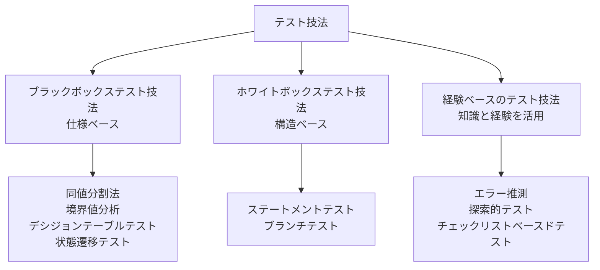

# lesson14: テスト技法の種類 — ブラックボックス・ホワイトボックス・経験ベース

## このレッスンで学ぶこと

- テスト技法がテスト分析とテスト設計をどのように支援するかを理解する
- テスト技法の3つのカテゴリーを区別できるようになる（K2）
- 各カテゴリーが何に基づいてテストを導出するかを説明できるようになる
- 第4章で扱う具体的な技法と対応するレッスンを把握する

## テスト技法の役割

テスト技法は、テスト分析（何をテストするか）とテスト設計（どのようにテストするか）でテスト担当者を支援します（テストプロセスの各活動は [lesson04](/lessons/lesson04/)）。

テスト技法を使う利点は、体系性にあります。思いつきでテストケースを増やすのではなく、比較的少ない数で十分なカバレッジを得られるテストケースのセットを、手順に沿って導き出せます。

具体的には、テスト技法は次の作業に役立ちます。

- テスト条件を定義する
- カバレッジアイテムを識別する
- テストデータを識別する

::: info 関連する標準
テスト技法とその手段については、標準 ISO/IEC/IEEE 29119-4 がさらに詳しい情報を提供しています。
:::

## テスト技法の3カテゴリー

シラバスは、テスト技法をブラックボックステスト技法・ホワイトボックステスト技法・経験ベースのテスト技法の3つのカテゴリーに分類しています。区別のポイントは「何に基づいてテストを導出するか」です。

| カテゴリー | 別名 | テストの導出元 |
|------|------|------|
| ブラックボックステスト技法 | 仕様ベース技法 | 仕様に基づく振る舞いの分析 |
| ホワイトボックステスト技法 | 構造ベース技法 | テスト対象の内部構造や処理の分析 |
| 経験ベースのテスト技法 | （別名なし） | テスト担当者の知識と経験 |

### ブラックボックステスト技法

ブラックボックステスト技法は、仕様ベース技法とも呼ばれます。テスト対象の内部構造は参照せず、仕様に記述された振る舞いを分析してテストを導出します。

内部構造を見ないため、テストケースはソフトウェアの実装方法から独立します。実装を変更しても、求められる振る舞いが同じであれば、テストケースはそのまま使い続けられます。

シラバスが取り上げる具体的な技法は次の4つです。

- 同値分割法（[lesson15](/lessons/lesson15/)）
- 境界値分析（[lesson16](/lessons/lesson16/)）
- デシジョンテーブルテスト（[lesson17](/lessons/lesson17/)）
- 状態遷移テスト（[lesson18](/lessons/lesson18/)）

### ホワイトボックステスト技法

ホワイトボックステスト技法は、構造ベース技法とも呼ばれます。コードに代表される、テスト対象の内部構造や処理を分析してテストを導出します。

テストケースはソフトウェアの設計方法に依存します。そのため、テスト対象の設計や実装が終わってからでないと、テストケースを作成できません。

ステートメントテストとブランチテスト、そしてホワイトボックステストの価値は [lesson19](/lessons/lesson19/) で扱います。

### 経験ベースのテスト技法

経験ベースのテスト技法は、テストケースの設計と実装に、テスト担当者の知識と経験を効果的に活用します。

このカテゴリーの位置づけは、次の3点で押さえます。

- 技法の有効性は、テスト担当者のスキルに大きく依存する
- ブラックボックステスト技法やホワイトボックステスト技法では見逃してしまうような欠陥も検出できる
- したがって、ほかの2カテゴリーを置き換えるものではなく、補完するものである

エラー推測・探索的テスト・チェックリストベースドテストの3つの技法を [lesson20](/lessons/lesson20/) で扱います。

::: tip テストタイプの分類との関係
[lesson09](/lessons/lesson09/) で学んだブラックボックステストとホワイトボックステストは、テストタイプ（どの観点でテストするか）としての区別でした。このレッスンの3カテゴリーは、テストを導出するためのテスト技法の分類です。同じ「ブラックボックス」「ホワイトボックス」という言葉でも、文脈によって指すものが異なる点に注意してください。
:::

## 第4章で扱う技法とレッスンの対応

第4章では、カテゴリーごとに具体的な技法を学びます。特に同値分割法・境界値分析・デシジョンテーブルテスト・状態遷移テストの4つは、K3（適用）として技法を「使える」ことが問われます。

| カテゴリー | 技法 | レッスン |
|------|------|------|
| ブラックボックステスト技法 | 同値分割法 | [lesson15](/lessons/lesson15/) |
| ブラックボックステスト技法 | 境界値分析 | [lesson16](/lessons/lesson16/) |
| ブラックボックステスト技法 | デシジョンテーブルテスト | [lesson17](/lessons/lesson17/) |
| ブラックボックステスト技法 | 状態遷移テスト | [lesson18](/lessons/lesson18/) |
| ホワイトボックステスト技法 | ステートメントテスト・ブランチテスト | [lesson19](/lessons/lesson19/) |
| 経験ベースのテスト技法 | エラー推測・探索的テスト・チェックリストベースドテスト | [lesson20](/lessons/lesson20/) |

::: info 協働的テストアプローチ
第4章では、テスト技法の3カテゴリーに加えて、協働的テストアプローチも扱います。ユーザーストーリーの共同作成・受け入れ基準・ATDD（受け入れテスト駆動開発）については [lesson21](/lessons/lesson21/) を参照してください。
:::

## 試験のポイント

- 4.1.1はK2で、3カテゴリーを「何に基づいてテストを導出するか」で区別できることが問われる（ブラックボックスは仕様に基づく振る舞い、ホワイトボックスは内部構造や処理、経験ベースは知識と経験）
- 別名との対応もひっかけどころ（ブラックボックスは仕様ベース技法、ホワイトボックスは構造ベース技法と呼ばれ、経験ベースに別名はない）
- ブラックボックステスト技法のテストケースは実装方法から独立し、ホワイトボックステスト技法のテストケースは設計方法に依存する（テスト対象の設計や実装が終わってからでないと作成できない）という対比を押さえる
- テストタイプとしてのブラックボックステスト・ホワイトボックステスト（[lesson09](/lessons/lesson09/)）と、テスト技法のカテゴリーとしての分類を混同しない
