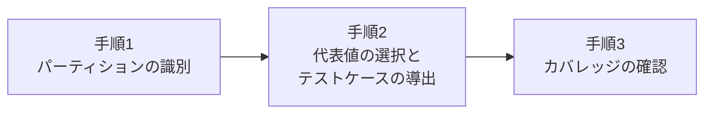

# lesson15: 同値分割法 — パーティションと代表値によるテスト設計

## このレッスンで学ぶこと

- 同値分割法の考え方と、同値パーティションが満たすべき条件を理解する
- 有効パーティションと無効パーティションを区別できるようになる
- 具体的な仕様から同値パーティションを識別し、テストケースを導出できるようになる
- 同値分割のカバレッジを具体的な数値で計算できるようになる
- 複数のパーティションセットがある場合のイーチチョイスカバレッジを理解する

## 同値分割法の考え方

同値分割法（equivalence partitioning、EP）は、ブラックボックステスト技法の1つです（テスト技法の分類は [lesson14](/lessons/lesson14/)）。

テスト対象に与えられる値は、多くの場合、数え切れないほどあります。[lesson03](/lessons/lesson03/) で見た通り、全数テストは不可能です。そこで同値分割法では、すべての値を試す代わりに「同じように処理されるはずの値のグループ」に分け、各グループから代表を1つ選んでテストします。

::: info 同値分割法の定義
同値分割法は、ある特定のパーティションのすべての要素がテスト対象によって同等に処理されることを想定して、データをパーティションに分割する技法です。この分割したグループを**同値パーティション**（同値クラス）と呼びます。
:::

この技法の背景には、次の理論があります。

- 同値パーティションから選んだ1つの値をテストして欠陥を検出したなら、同じパーティションの他の値をテストしても同じ欠陥が検出されるはず
- したがって、各パーティションに対してテストは1つあれば十分

### パーティションを識別できるデータ要素

同値パーティションは入力だけのものではありません。テスト対象に関連するあらゆるデータ要素について識別できます。

- 入力
- 出力
- 構成アイテム
- 内部値
- 時間関連の値
- インターフェースパラメーター

### パーティションが満たすべき条件

パーティションの分け方には決まりがあります。

| 条件 | 内容 |
|------|------|
| 重複しない | 1つの値が複数のパーティションに属してはならない |
| 空でない | 値を1つも含まないパーティションを作ってはならない |

一方で、パーティションの性質は自由です。連続でも離散でも、順序性があってもなくても、有限でも無限でもかまいません。

::: warning 分割は慎重に
単純なテスト対象であれば同値分割は簡単です。しかし実際には、テスト対象が異なる値をどのように扱うのかを理解することは難しい場合が多くあります。パーティションへの分割は慎重に行いましょう。
:::

## 有効パーティションと無効パーティション

パーティションは、包含する値が有効か無効かで区別します。

| 種類 | 包含する値 | 解釈の例 |
|------|-----------|---------|
| 有効パーティション | 有効な値 | テスト対象が処理すべき値。仕様書に処理が定義されている値 |
| 無効パーティション | 無効な値 | テスト対象が無視または拒絶すべき値。仕様書に処理が定義されていない値 |

何を有効・無効とみなすかの定義は、チームや組織によって異なる場合があります。

## ワーク例: 年齢入力欄からのテストケース導出

同値分割法は K3（適用）レベルの技法です。実際にテストケースを導出する流れを、具体的な仕様で確認しましょう。

::: info 対象の仕様
映画館のチケット販売システムに、年齢を入力する欄があります。

- 0〜17 歳: 子ども料金を適用する
- 18〜64 歳: 大人料金を適用する
- 65 歳以上: シニア料金を適用する
- 負の数や数値以外の入力: エラーメッセージを表示する
:::

導出は次の3つの手順で進めます。

### 手順1: 同値パーティションの識別

仕様を読み、「同じように処理される値のグループ」を漏れなく列挙します。有効パーティションだけでなく、無効パーティションも忘れずに識別します。

| パーティション | 範囲/条件 | 代表値 | 有効/無効 |
|------|------|------|------|
| P1 | 0〜17（子ども料金） | 10 | 有効 |
| P2 | 18〜64（大人料金） | 40 | 有効 |
| P3 | 65 以上（シニア料金） | 70 | 有効 |
| P4 | 負の数 | -10 | 無効 |
| P5 | 数値以外 | abc | 無効 |

P1〜P4 は数値の範囲による順序性のあるパーティション、P5 は順序性のないパーティションです。どの値も1つのパーティションだけに属し（重複しない）、どのパーティションにも値が存在します（空でない）。

### 手順2: 代表値の選択とテストケースの導出

各パーティションから代表値を1つ選びます。同値分割法の想定では、同じパーティション内ならどの値を選んでも効果は同じです。そのため、ここではパーティションの中ほどにある分かりやすい値を選んでいます。

選んだ代表値を入力とし、仕様から期待結果を対応づければテストケースになります。

| テストケース | 入力値 | 期待結果 | カバーするパーティション |
|------|------|------|------|
| TC1 | 10 | 子ども料金を適用する | P1 |
| TC2 | 40 | 大人料金を適用する | P2 |
| TC3 | 70 | シニア料金を適用する | P3 |
| TC4 | -10 | エラーメッセージを表示する | P4 |
| TC5 | abc | エラーメッセージを表示する | P5 |

### 手順3: カバレッジの確認

識別したパーティションは5つで、TC1〜TC5 は5つすべてを少なくとも1回カバーしています。

- TC1〜TC5 をすべて実行する場合: 5 ÷ 5 × 100 でカバレッジは 100%
- TC4・TC5 を省いて有効パーティションだけテストした場合: 3 ÷ 5 × 100 でカバレッジは 60%

::: tip 無効パーティションを忘れない
カバレッジ 100%の達成には、無効パーティションを含む、識別したすべてのパーティションをカバーする必要があります。正常系（有効パーティション）だけをテストしてもカバレッジは 100%になりません。
:::

## 同値分割のカバレッジ

同値分割法では、カバレッジアイテムは同値パーティションです。カバレッジは次のように測定し、パーセンテージで表します。

::: info カバレッジの計算式
少なくとも1つのテストケースでカバーしたパーティションの数 ÷ 識別したパーティションの総数 × 100（%）
:::

### イーチチョイスカバレッジ

多くのテスト対象は、複数の入力パラメーターを持つなど、複数のパーティションセットを含みます。この場合の最も単純なカバレッジ基準を**イーチチョイスカバレッジ**と呼びます。

- 各パーティションセットの各パーティションを、テストケースで少なくとも1回は通すことを要件とする
- パーティションの組み合わせは考慮しない

ワーク例の年齢（5つのパーティション）に加えて、会員区分（会員/非会員の2つのパーティション）というパーティションセットがあるとします。すべての組み合わせを試すと 5 × 2 で10件のテストケースが必要です。一方、イーチチョイスカバレッジなら、TC1〜TC5 の各テストケースに会員と非会員を割り振り、それぞれを少なくとも1回通せば達成できます。テストケースは5件のままで済みます。

## 境界値分析との併用

同値分割法は、パーティションを代表値1つで代表させる技法です。しかし、欠陥はパーティションの端、つまり境界の付近に潜みやすいことが知られています。

そのため、順序性のあるパーティションに対しては、パーティションの境界を確認する境界値分析と併用することが多くあります。境界値分析は [lesson16](/lessons/lesson16/) で扱います。

## キーワード

| 用語 | 説明 |
|------|------|
| 同値分割法（equivalence partitioning、EP） | すべての要素が同等に処理されることを想定してデータをパーティションに分割し、各パーティションから代表値を選んでテストするブラックボックステスト技法 |
| 同値パーティション（equivalence partition） | 同じように処理されると想定される値の集合。同値クラスとも呼ぶ。重複せず、空でない集合でなければならない |
| 有効パーティション（valid partition） | 有効な値を包含するパーティション。テスト対象が処理すべき値、仕様書に処理が定義されている値と解釈できる |
| 無効パーティション（invalid partition） | 無効な値を包含するパーティション。テスト対象が無視または拒絶すべき値、仕様書に処理が定義されていない値と解釈できる |
| カバレッジアイテム（coverage item） | カバレッジ測定の単位。同値分割法では同値パーティションがカバレッジアイテムになる |
| イーチチョイスカバレッジ（each choice coverage） | 複数のパーティションセットがある場合に、各セットの各パーティションを少なくとも1回テストケースで通すことを要件とする基準。組み合わせは考慮しない |

## 試験のポイント

- 4.2.1はK3のため、仕様からパーティションを識別してテストケースを導出し、カバレッジを計算する適用問題に備える
- 技法の想定は「同じパーティションの値は同等に処理される」であり、各パーティションに対してテストは1つあれば十分
- パーティションは入力だけでなく、出力・構成アイテム・内部値・時間関連の値・インターフェースパラメーターについても識別できる（「入力のみ」と限定する選択肢はひっかけ）
- パーティションが満たすべき条件は「重複しない」「空でない」の2つ
- 何を有効・無効とみなすかの定義は、チームや組織によって異なる場合がある
- カバレッジ計算の勘所は分母で、無効パーティションを含む「識別したパーティションの総数」で割る（有効パーティションだけをテストしても100%にならない）
- カバレッジは「カバーしたパーティション数 ÷ 識別したパーティションの総数 × 100」で計算する（例: 5つのうち3つなら60%）
- イーチチョイスカバレッジは各セットの各パーティションを少なくとも1回通せば達成でき、パーティションの組み合わせは考慮しない（5パーティションと2パーティションのセットでもテストケース5件で達成できる）
