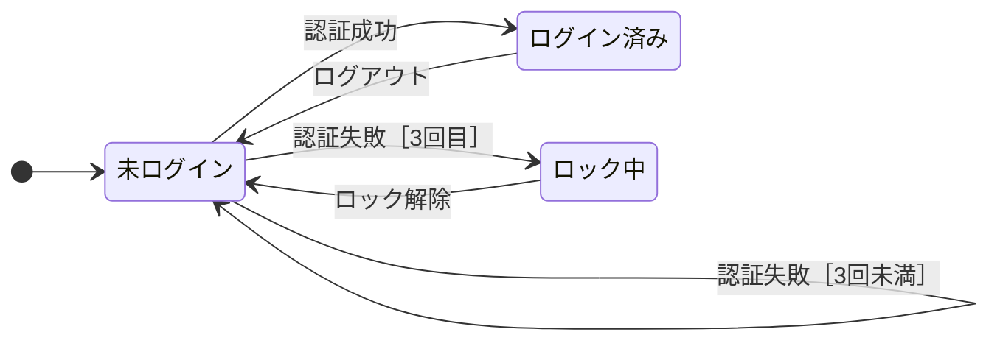

# lesson18: 状態遷移テスト — 状態とイベントの流れをモデル化する

## このレッスンで学ぶこと

- 状態・イベント・遷移・アクション・ガード条件で構成される状態遷移図を読み書きできるようになる
- 状態遷移表の構造と、無効な遷移が空のセルで表されることを理解する
- 具体的な仕様から状態遷移図と状態遷移表を作成し、テストケースを導出できるようになる
- 全状態カバレッジ・有効遷移カバレッジ・全遷移カバレッジを区別し、計算できるようになる

## 状態遷移テストの考え方

状態遷移テストは、ブラックボックステスト技法の1つです（技法の分類は [lesson14](/lessons/lesson14/) を参照）。

同じ操作をしても、システムの「今の状態」によって結果が変わることがあります。

- 音楽プレイヤーの再生ボタンは、停止中に押すと再生が始まるが、再生中に押しても何も起きない
- ATMは、暗証番号を確認する前と後で、引き出し操作を受け付けるかどうかが変わる
- ログイン画面は、アカウントがロックされていると正しいパスワードでも入れない

こうしたシステムでは、入力値の選び方だけを工夫しても十分にテストできません。操作の順序、つまり状態の移り変わりを追いかける必要があります。

状態遷移テストでは、システムが取り得る状態と、状態間の有効な移り変わり（遷移）をモデルとして描き出します。そのモデルが状態遷移図と状態遷移表です。テストケースはこのモデルから導出します。

::: tip デシジョンテーブルテストとの使い分け
条件の組み合わせで結果が決まる仕様にはデシジョンテーブルテスト（[lesson17](/lessons/lesson17/)）が適しています。一方、状態とイベントの流れで振る舞いが決まるシステムには状態遷移テストが適しています。
:::

## 状態遷移図の構成要素

状態遷移図は、次の要素でシステムの振る舞いをモデル化します。

| 構成要素 | 説明 |
|------|------|
| 状態（state） | システムが取り得る状況。例: 未ログイン、ロック中 |
| イベント（event） | 遷移のきっかけとなる出来事。例: ログアウト |
| 遷移（transition） | ある状態から別の状態への移り変わり |
| ガード条件（guard condition） | イベントが遷移を引き起こすかどうかを限定する条件 |
| アクション（action） | 遷移によってソフトウェアが起こす動作。例: エラーの表示 |

遷移の性質として、次の3点を押さえます。

- 遷移はイベントによって開始され、ガード条件によって限定されることがある
- 遷移は瞬時に起きることを想定する
- 遷移によってソフトウェアがアクションを起こす場合がある

### 遷移のラベルの構文

図の中の遷移には、一般に次の構文でラベルを付けます。

```
イベント［ガード条件］／アクション
```

たとえば「認証失敗［失敗3回未満］／エラーを表示」は、「認証失敗イベントが起きたとき、失敗が3回未満であれば遷移し、エラーを表示する」と読みます。

ガード条件とアクションは、存在しない場合やテスト担当者にとって無関係な場合には省略できます。「ログアウト」のようにイベント名だけのラベルも正しい表記です。

## 状態遷移表

**状態遷移表**（状態表）は、状態遷移図に相当するモデルです。同じ振る舞いを、図ではなく表の形で表します。

| 表の要素 | 表すもの |
|------|------|
| 行 | 状態 |
| 列 | イベント（ガード条件があれば添える） |
| セル | 遷移。遷移先の状態と、定義されていればアクションを書く |

状態遷移図と対照的なのは、**無効な遷移**を明示的に示す点です。無効な遷移とは、その状態ではそのイベントによる遷移が定義されていない（起こりえない、または許可されない）組み合わせのことで、表では空のセルで表します。

状態遷移図には有効な遷移しか描かれないため、無効な遷移は図からは読み取りにくくなります。表の形にすると、すべての状態とイベントの組み合わせを強制的に確認することになり、無効な遷移が見えるようになります。

## ワーク：ログイン画面の状態遷移テスト

具体的な仕様を1つ取り上げて、状態遷移図と状態遷移表の作成からテストケースの導出までを通して練習します。

::: info 題材とするログイン機能の仕様
- 利用者は最初、未ログインの状態から始まる
- 未ログインで認証に成功すると、ログイン済みになりマイページを表示する
- 未ログインで認証に失敗すると、失敗が3回未満の間はエラーを表示して未ログインのままとする
- 認証の失敗が3回に達すると、ロック中になり通知メールを送る
- ログイン済みでログアウトすると、未ログインに戻る
- ロック中に管理者がロックを解除すると、未ログインに戻る
:::

### ステップ1：状態とイベントの抽出

仕様の文章から、状態とイベントを抜き出します。

状態は3つです。

- 未ログイン
- ログイン済み
- ロック中

イベントは4つです。

- 認証成功
- 認証失敗
- ログアウト
- ロック解除

「認証失敗」イベントは、失敗回数のガード条件によって遷移先が分かれます。3回未満なら未ログインのまま、3回目ならロック中に遷移します。

### ステップ2：状態遷移図の作成

抽出した状態とイベントを図にします。図のラベルは読みやすさのためイベントとガード条件だけを示し、アクションを含む完全なラベル（「イベント［ガード条件］／アクション」）はこのあとの状態遷移表で確認します。



図の読み方を2つ確認します。

- 「認証失敗［3回未満］」の遷移は、未ログインから未ログインへ戻る自己遷移です。状態は変わりませんが、エラーを表示するアクション（完全なラベルは状態遷移表に記載）が発生するため、遷移として数えます
- 「ログアウト」と「ロック解除」にはガード条件もアクションもないため、状態遷移表でもイベント名だけのラベルになります

### ステップ3：状態遷移表の作成

次に、同じ振る舞いを状態遷移表にします。行に状態、列にイベント（ガード条件付き）を置き、セルに遷移先とアクションを書きます。無効な遷移は「—」で表します（空のセルと同じ意味です）。

| 状態＼イベント | 認証成功 | 認証失敗［3回未満］ | 認証失敗［3回目］ | ログアウト | ロック解除 |
|------|------|------|------|------|------|
| 未ログイン | ログイン済み／マイページを表示 | 未ログイン／エラーを表示 | ロック中／通知メールを送る | — | — |
| ログイン済み | — | — | — | 未ログイン | — |
| ロック中 | — | — | — | — | 未ログイン |

この表から、遷移の数を数えられます。

- 有効な遷移: 5つ（値の入ったセル）
- 無効な遷移: 10個（3状態 × 5列の15セルのうち、空のセル）

「ログイン済みの状態でロック解除イベントが起きる」のような無効な遷移は、状態遷移図には現れません。表にして初めて、テストすべき組み合わせとして見えてきます。

### ステップ4：テストケースの導出

状態遷移図や状態遷移表に基づくテストケースは、通常、一連のイベントとして表現します。イベントを順に発生させ、結果として起きる一連の状態変化（および必要であればアクション）を確認します。

1つのテストケースで、状態間の複数の遷移をカバーできます。次のテストケースTC1は、6手順で有効な遷移5つをすべて通ります。

| 手順 | イベント | 遷移 | 確認するアクション |
|------|------|------|------|
| 1 | 認証成功 | 未ログイン → ログイン済み | マイページを表示 |
| 2 | ログアウト | ログイン済み → 未ログイン | なし |
| 3 | 認証失敗（1回目） | 未ログイン → 未ログイン | エラーを表示 |
| 4 | 認証失敗（2回目） | 未ログイン → 未ログイン | エラーを表示 |
| 5 | 認証失敗（3回目） | 未ログイン → ロック中 | 通知メールを送る |
| 6 | ロック解除 | ロック中 → 未ログイン | なし |

手順3と手順4は同じ遷移（自己遷移）を通っているため、カバーした有効な遷移は5種類です。このTC1を、続くカバレッジの計算で使います。

## カバレッジの3水準

状態遷移テストには多くのカバレッジ基準がありますが、シラバスは次の3つを説明しています。

### 全状態カバレッジ

**全状態カバレッジ**では、カバレッジアイテムは状態です。100%にするには、テストケースがすべての状態を通過することを保証しなければなりません。

カバレッジは「通過した状態の数 ÷ 状態の総数 × 100」で計算し、パーセンテージで表します。

ワークの例で考えます。「認証失敗 × 3回 → ロック解除 → 認証成功」というテストは、未ログイン・ロック中・ログイン済みの3状態すべてを通過するため、全状態カバレッジは3 ÷ 3 × 100で100%です。

ただしこのテストは、ログアウトの遷移を1度も通っていません（有効な遷移では4 ÷ 5で80%）。このように、全状態カバレッジはすべての遷移を通さなくても達成できることが一般的です。

### 有効遷移カバレッジ

**有効遷移カバレッジ**（0スイッチカバレッジとも呼ぶ）では、カバレッジアイテムは単一の有効な遷移です。100%にするには、テストケースがすべての有効な遷移を通さなければなりません。

カバレッジは「通した有効な遷移の数 ÷ 有効な遷移の総数 × 100」で計算します。

ワークのTC1は有効な遷移5つをすべて通るため、有効遷移カバレッジは5 ÷ 5 × 100で100%です。有効遷移カバレッジは、最も広く使われているカバレッジ基準です。

### 全遷移カバレッジ

**全遷移カバレッジ**では、カバレッジアイテムは状態遷移表に示されるすべての遷移、つまり有効な遷移と無効な遷移の両方です。100%にするには、すべての有効な遷移を通過し、さらに無効な遷移の実行を試みなければなりません。

無効な遷移のテストでは、たとえば「ログイン済みの状態でロック解除イベントを発生させる」ことを試み、仕様にない遷移をシステムが起こさないことを確認します。

::: warning 無効な遷移は1テストケースに1つ
1つのテストケースでテストする無効な遷移は1つだけにします。こうすることで、欠陥のマスキング（ある欠陥が別の欠陥の検出を妨げてしまうこと）を避けられます。
:::

カバレッジは「通した有効および無効な遷移の数 ÷ 有効および無効な遷移の総数 × 100」で計算します。ワークの例ではカバレッジアイテムが15個（有効5 + 無効10）あるため、TC1に加えて無効な遷移を7つ試した時点では、12 ÷ 15 × 100で80%です。100%には無効な遷移10個すべての実行を試みる必要があります。

全遷移カバレッジは、ミッションクリティカルおよびセーフティクリティカルソフトウェアの最低要件とすべきとされています。

### 3水準の強さの関係

3つのカバレッジ基準には、達成したときに何を保証するかという強さの順序があります。

| カバレッジ | カバレッジアイテム | 100%で保証される他の水準 |
|------|------|------|
| 全状態カバレッジ | 状態 | なし |
| 有効遷移カバレッジ | 有効な遷移 | 全状態カバレッジ |
| 全遷移カバレッジ | 有効な遷移と無効な遷移 | 全状態カバレッジと有効遷移カバレッジ |

- 全状態カバレッジは、すべての遷移を通さなくても達成できることが一般的であるため、有効遷移カバレッジよりも弱い基準です
- 有効遷移カバレッジを完全に達成すると、全状態カバレッジの完全な達成も保証されます
- 全遷移カバレッジを達成すると、全状態カバレッジと有効遷移カバレッジの両方を保証します

## キーワード

| 用語 | 説明 |
|------|------|
| 状態遷移テスト（state transition testing） | 状態遷移図や状態遷移表でシステムの振る舞いをモデル化し、テストケースを導出するブラックボックステスト技法 |
| ガード条件（guard condition） | イベントが遷移を引き起こすかどうかを限定する条件。省略できる |
| 状態遷移表（state table） | 行に状態、列にイベントを置き、セルで遷移を表すモデル。状態遷移図に相当する |
| 無効な遷移（invalid transition） | その状態ではそのイベントによる遷移が定義されていない組み合わせ。状態遷移表では空のセルで表す |
| 全状態カバレッジ（all states coverage） | 通過した状態の数を状態の総数で割った値。カバレッジアイテムは状態 |
| 有効遷移カバレッジ（valid transitions coverage） | 通した有効な遷移の数を有効な遷移の総数で割った値。0スイッチカバレッジとも呼ぶ |
| 全遷移カバレッジ（all transitions coverage） | 通した有効および無効な遷移の数を、有効および無効な遷移の総数で割った値 |

## 試験のポイント

- 4.2.4はK3のため、状態遷移図や状態遷移表からテストケースを導出し、カバレッジを計算する適用問題に備える
- 遷移のラベルは「イベント［ガード条件］／アクション」の構文で、ガード条件とアクションは省略できる
- 状態遷移表は行が状態、列がイベントで、無効な遷移を空のセルで明示的に示す（図には有効な遷移しか現れないという対比が問われる）
- カバレッジ計算は分母の取り違えが定番のひっかけで、全状態は状態の総数、有効遷移は有効な遷移の総数、全遷移は有効と無効の遷移の合計で割る（例題では順に3・5・15で、無効な遷移は状態遷移表の空のセルから数え、自己遷移も1つの有効な遷移と数える）
- 強さの順序を押さえる（有効遷移カバレッジ100%は全状態カバレッジ100%を保証するが逆は成り立たず、全遷移カバレッジ100%には無効な遷移の実行も試みる）
- 無効な遷移は1つのテストケースで1つだけテストし、欠陥のマスキング（ある欠陥が別の欠陥の検出を妨げること）を避ける
