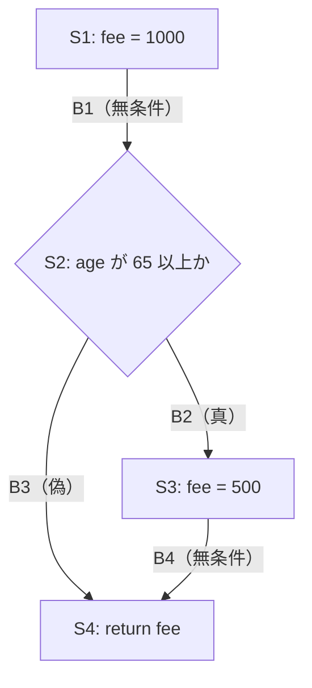

# lesson19: ホワイトボックステスト — ステートメントとブランチでコードを網羅する

## このレッスンで学ぶこと

- コードの内部構造からテストケースを導出するホワイトボックステスト技法の位置づけを理解する
- ステートメントテストとステートメントカバレッジの計算方法を説明できるようになる
- ブランチテストとブランチカバレッジの計算方法を説明できるようになる
- ブランチカバレッジがステートメントカバレッジを包含する関係を説明できるようになる
- ホワイトボックステストがブラックボックステストにない価値を持つ理由を理解する

## ホワイトボックステスト技法の位置づけ

ホワイトボックステスト技法は、テスト対象の内部構造を基にテストケースを導出する技法です（技法の分類は [lesson14](/lessons/lesson14/) を参照）。

シラバスは、知名度とわかりやすさの観点から、コードに関連する次の2つの技法に焦点を当てています。

- ステートメントテスト
- ブランチテスト

どちらもコードそのものを対象とするため、開発担当者が担うコンポーネントテスト（[lesson08](/lessons/lesson08/)）と特に相性のよい技法です。テストタイプとしてのホワイトボックステストは [lesson09](/lessons/lesson09/) で扱っています。

::: info シラバスの範囲外の技法
セーフティクリティカルな環境などでは、より徹底したコードカバレッジを実現する厳密な技法も使われます。APIテストのような高いテストレベルで使うホワイトボックステスト技法や、コードに関係ないカバレッジ（ニューラルネットワークテストのニューロンカバレッジなど）もあります。これらはシラバスの範囲外です。
:::

## ステートメントテストとステートメントカバレッジ

ステートメントテストのカバレッジアイテムは、**実行可能なステートメント**です。ステートメントとは、代入・判定・戻り値の返却のような、実行される文のことです。

ステートメントテストの狙いは、許容できるレベルのカバレッジに達するまで、コード内のステートメントを通すテストケースを設計することです。

::: info ステートメントカバレッジの計算
「テストにより通過したステートメント数 ÷ 実行可能なステートメントの総数 × 100」で計算し、パーセンテージで表します。
:::

ステートメントカバレッジが100%になると、コード内のすべての実行可能なステートメントを少なくとも1回は通過したことになります。欠陥のあるステートメントも必ず1回は実行されるため、欠陥の存在を示す故障が発生する可能性があります。

### ステートメントカバレッジ100%の限界

100%を達成しても、次の2点は保証されません。

- ステートメントを実行しても、欠陥が必ず検出されるわけではない。例えば、分母が0のときにだけ不合格になるゼロ除算のような、データに依存する欠陥は検出されないことがある
- 判定ロジックをすべてテストしたことにはならない。例えば、コード内のすべてのブランチを通過していない可能性がある

2点目が、ブランチテストが必要になる理由です。

## ブランチテストとブランチカバレッジ

ブランチとは、制御フローグラフの2つのノード間の**制御の遷移**のことです。ソースコードのステートメントが実行されうる順序を示します。

制御の遷移には2種類あります。

| 種類 | 説明 | 例 |
|------|------|-----|
| 無条件のブランチ | 直列に並んだコードをそのまま進む遷移 | 代入文から次の文への遷移 |
| 条件付きのブランチ | 判定の結果によって行き先が分かれる遷移 | if...then 判定の真偽、switch/case ステートメントの各結果、ループの継続または終了 |

ブランチテストのカバレッジアイテムはブランチです。狙いは、許容できるレベルのカバレッジに達するまで、コード内のブランチを通過するテストケースを設計することです。

::: info ブランチカバレッジの計算
「テストケースによって通したブランチの数 ÷ ブランチの総数 × 100」で計算し、パーセンテージで表します。
:::

ブランチカバレッジが100%になると、無条件・条件付きを問わず、コード内のすべてのブランチをテストケースで通したことになります。

### ブランチカバレッジ100%の限界

ブランチカバレッジが100%でも、すべての欠陥が検出されるわけではありません。例えば、分岐の特定の組み合わせ（特定のパス）の実行を必要とする欠陥は、検出されない可能性があります。

## 2つのカバレッジの包含関係

ブランチカバレッジは、ステートメントカバレッジを**包含**します。

- ブランチカバレッジ100%を達成した一連のテストケースは、ステートメントカバレッジも100%達成する
- 逆は成立しない（ステートメントカバレッジが100%でも、ブランチカバレッジが100%とは限らない）

理由はこう考えると整理できます。すべてのブランチを通れば、その途中にあるステートメントも必ずすべて通ります。一方、すべてのステートメントを通っても、「通ってもステートメントを実行しないブランチ」が残ることがあります。典型例は else のない if の偽側です。

この違いを、次のワークで実際に計算して確かめます。

## ワーク：カバレッジの計算

else のない if 文を含む、シニア割引の料金計算を題材にします。

```js
function calcFee(age) {
  let fee = 1000;   // S1: 基本料金を設定
  if (age >= 65) {  // S2: 年齢を判定
    fee = 500;      // S3: シニア割引を適用
  }
  return fee;       // S4: 料金を返す
}
```

この例では、実行可能なステートメントを S1〜S4 の4つと数えます。制御フローグラフは次の通りで、ノード間の矢印がブランチです。



ブランチは B1〜B4 の4つです。B2 と B3 が条件付きのブランチ、B1 と B4 が無条件のブランチです。

### テストケース1つで測る

テストケース TC1（age = 70、期待結果 500）を実行すると、S1 → S2 → S3 → S4 の順に進みます。

| カバレッジ | 通過した数 | 総数 | 計算 | 結果 |
|---|---|---|---|---|
| ステートメントカバレッジ | 4（S1〜S4） | 4 | 4 ÷ 4 × 100 | 100% |
| ブランチカバレッジ | 3（B1・B2・B4） | 4 | 3 ÷ 4 × 100 | 75% |

TC1 だけで、ステートメントカバレッジは100%に達します。しかし、判定が偽になるケースを試していないため B3 を通っておらず、ブランチカバレッジは75%にとどまります。

これが「ステートメントカバレッジ100%でも、ブランチカバレッジ100%とは限らない」の具体例です。判定条件そのものに欠陥があっても、偽側を試さないテストだけでは見逃す可能性があります。

### テストケースを追加して100%にする

判定が偽になるテストケース TC2（age = 40、期待結果 1000）を追加すると、S1 → S2 → S4 と進み、B3 を通ります。

| カバレッジ | 通過した数 | 総数 | 計算 | 結果 |
|---|---|---|---|---|
| ステートメントカバレッジ | 4（S1〜S4） | 4 | 4 ÷ 4 × 100 | 100% |
| ブランチカバレッジ | 4（B1〜B4） | 4 | 4 ÷ 4 × 100 | 100% |

TC1 と TC2 の2つで、すべてのブランチを通しました。このときステートメントカバレッジも100%になっており、「ブランチカバレッジ100%はステートメントカバレッジ100%を保証する」という包含関係をこの例で確認できます。

::: tip ブランチの数え方
ブランチの総数は、制御フローグラフの描き方（ノードのまとめ方）によって変わることがあります。計算問題では、問題文に示された図や数え方に従ってください。数え方が変わっても、「else のない if では偽側の遷移を通すテストケースを忘れやすい」という点は変わりません。
:::

## ホワイトボックステストの価値

ホワイトボックステスト技法に共通する基本的な強みは、テスト時に**ソフトウェアの実装そのものを考慮する**ことです。これにより、仕様が曖昧・古い・不完全であっても、欠陥を検出しやすくなります。

### コードカバレッジの客観的な測定

ブラックボックステストだけを実施しても、実際のコードカバレッジは測定できません。ホワイトボックステストは次の情報を提供します。

- カバレッジを客観的に測定するための情報
- テストを追加で作成してカバレッジを向上させ、コードの信頼性を高めるために必要な情報

カバレッジを測定すると、どのテストでも実行されていないコードが数値と箇所で見えるため、テストの不足や、仕様に現れないコードの挙動に気づくきっかけになります。

### 静的テストへの応用

ホワイトボックステスト技法は、動的テストだけでなく静的テスト（[lesson11](/lessons/lesson11/)）にも使用できます。例えば、コードのドライラン（コードを実行せずに机上で動きを追う作業）に利用できます。

制御フローグラフでモデル化できる疑似コードのように、まだ実行可能な状態にないコードのレビューにも適しています。

### 弱点

ソフトウェアが1つまたは複数の要件を実装していない場合、ホワイトボックステストでは、その欠落を欠陥として検出できない可能性があります。コードに存在しない処理は、コードの構造からは導出できないためです。

この弱点は、仕様を基にテストケースを導出するブラックボックステスト技法（[lesson14](/lessons/lesson14/)）と組み合わせて補います。

## キーワード

| 用語 | 説明 |
|------|------|
| ステートメントテスト（statement testing） | 実行可能なステートメントをカバレッジアイテムとし、ステートメントを通すテストケースを設計するホワイトボックステスト技法 |
| ステートメントカバレッジ（statement coverage） | 通過したステートメント数を実行可能なステートメントの総数で割った値。パーセンテージで表す |
| ブランチ（branch） | 制御フローグラフの2つのノード間の制御の遷移。無条件のものと条件付きのものがある |
| ブランチテスト（branch testing） | ブランチをカバレッジアイテムとし、ブランチを通過するテストケースを設計するホワイトボックステスト技法 |
| ブランチカバレッジ（branch coverage） | 通したブランチの数をブランチの総数で割った値。パーセンテージで表す。100%でステートメントカバレッジ100%も保証する |
| 制御フローグラフ（control flow graph） | ステートメントが実行されうる順序を、ノードとノード間の遷移で表した図 |
| ドライラン（dry run） | コードを実行せずに机上で動きを追う作業。ホワイトボックステスト技法を静的テストに使う例 |

## 試験のポイント

- 4.3.1と4.3.2はK2（説明）のため、2つのカバレッジの定義と計算方法を確実に押さえる
- ステートメントカバレッジは「通過したステートメント数 ÷ 実行可能なステートメントの総数 × 100」で計算する
- ブランチカバレッジは「通したブランチの数 ÷ ブランチの総数 × 100」で計算する
- ブランチには無条件（直列のコード）と条件付き（if の真偽、switch/case、ループの継続・終了）がある
- 包含関係が最頻出（ブランチカバレッジ100%ならステートメントカバレッジも100%だが、逆は成立しない）
- else のない if は、1つのテストケースでステートメント100%でも偽側のブランチが残る典型例
- カバレッジ100%でもすべての欠陥検出は保証されない（データに依存する欠陥や特定のパスを要する欠陥は残りうる）
- ホワイトボックステストの価値は、実装そのものを考慮した欠陥検出と、コードカバレッジの客観的な測定
- 弱点として、実装されていない要件の欠落は検出できない可能性がある
