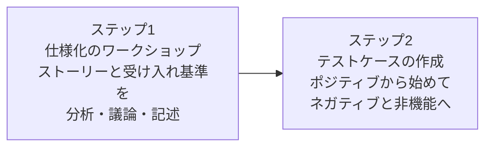

# lesson21: 協働的テストアプローチ — ユーザーストーリー・受け入れ基準・ATDD

## このレッスンで学ぶこと

- 協働的テストアプローチが欠陥の検出だけでなく回避に焦点を当てることを理解する
- ユーザーストーリーの3つのCと、共同執筆で考慮する3つの視点を説明できるようになる
- よいユーザーストーリーの基準であるINVESTを想起できるようになる
- 受け入れ基準の使いみちと、書き方の形式（シナリオ指向・ルール指向）を分類できるようになる
- 受け入れテスト駆動開発（ATDD）を使って、受け入れ基準からテストケースを導出できるようになる

## 協働による欠陥の回避

[lesson14](/lessons/lesson14/) で分類したブラックボックス・ホワイトボックス・経験ベースの各テスト技法には、欠陥の検出に関して特定の目的があります。

一方、このレッスンで扱う協働的（コラボレーションベースの）テストアプローチは、視点が異なります。

- 欠陥を見つけることに加えて、コラボレーションとコミュニケーションによって**欠陥を回避する**ことにも焦点を当てる
- ビジネス・開発・テストの関係者が作業成果物を一緒に作ることで、認識のずれによる欠陥を作り込む前に取り除く

作業成果物を早い段階で評価して品質を高めるという方向性は、静的テスト（[lesson11](/lessons/lesson11/)）の価値とも重なります。

## ユーザーストーリーの共同執筆

**ユーザーストーリー**は、システムやソフトウェアのユーザーや購入者にとって価値のある機能を表したものです。

最も一般的な形式では、次の3つの要素を1文に収め、その後に受け入れ基準を続けます。

> [役割]として、[達成するゴール]を達成したい。それは[役割にもたらされるビジネス価値]を実現するためだ。

英語圏では「As a [役割], I want [ゴール], so that [ビジネス価値]」という定型で知られる形式です。

### 3つのC

ユーザーストーリーには3つの重要な側面があり、合わせて**3つのC**と呼びます。

| 側面 | 内容 |
|------|------|
| カード（Card） | ユーザーストーリーを記述する媒体。インデックスカードや電子ボード上のエントリーなど |
| 会話（Conversation） | ソフトウェアがどのように使用されるかの説明。文書でも口頭でもよい |
| 確認（Confirmation） | 受け入れ基準。ストーリーが完成したと確認するためのよりどころ |

### 共同執筆と3つの視点

ユーザーストーリーは、特定の誰かが1人で書くのではなく共同で執筆します。

- 共同執筆には、ブレーンストーミングやマインドマップなどの技法を使える
- コラボレーションによって、ビジネス・開発・テストの3つの視点を考慮できる
- チームは「提供すべきもの」に対する共通のビジョンを得られる

::: info 3つの視点をそろえる進め方
ビジネス代表者・開発担当者・テスト担当者の3者で話し合う進め方は、一般に「3 Amigos（スリーアミーゴス）」とも呼ばれます。呼び名にかかわらず、3つの視点がそろうことで、認識のずれを実装前に解消できる点が重要です。
:::

### INVESTによる評価

優れたユーザーストーリーが満たすべき基準として、頭文字をとった**INVEST**があります。

| 基準 | 意味 |
|------|------|
| Independent | 独立性がある |
| Negotiable | 交渉可能である |
| Valuable | 価値がある |
| Estimable | 見積り可能である |
| Small | 小さい |
| Testable | テスト可能である |

### テスト担当者の貢献

テスト担当者は、テスト可能性の視点でユーザーストーリーの品質に貢献します。

ステークホルダーがユーザーストーリーをテストする方法を分からない場合、それは次のいずれかのサインである可能性があります。

- ユーザーストーリーが十分に明確ではない
- ステークホルダーにとって価値のあるものが反映されていない
- ステークホルダーがテストで助けを必要としているだけである

## 受け入れ基準

**受け入れ基準**とは、ユーザーストーリーの実装をステークホルダーが受け入れるために満たさなければならない条件です。

- 受け入れ基準は、テストケースで確認すべき**テスト条件**とみなせる
- 受け入れ基準は、通常、3つのCの「会話」の結果として生まれる

### 受け入れ基準の使いみち

受け入れ基準は次のように使います。

- ユーザーストーリーのスコープの定義
- ステークホルダー間の合意形成
- ポジティブシナリオとネガティブシナリオの両方に対する説明
- ユーザーストーリーの受け入れテストのベースの提供
- 正確な計画と見積りへの貢献

ユーザーストーリーに着手できる状態かを判断する開始基準（準備完了の定義）については、[lesson23](/lessons/lesson23/) で扱います。

### 書き方の2つの形式

受け入れ基準の書き方はいくつかありますが、次の2つの形式が最も一般的です。

| 形式 | 書き方 | 例 |
|------|------|-----|
| シナリオ指向 | 前提・操作・結果の流れで振る舞いを記述する | BDD（[lesson06](/lessons/lesson06/)）で使用するGiven/When/Then形式 |
| ルール指向 | 満たすべきルールを列挙する | 箇条書きの検証リスト、入出力マッピングの表形式 |

ほとんどの受け入れ基準はこの2形式のどちらかで文書化できます。ただし、十分に定義されていて曖昧さがなければ、チームが独自の形式を使ってもかまいません。

## ATDDによるテストケース導出

**ATDD**（受け入れテスト駆動開発）は、コードを書く前にテストケースを定義するテストファーストアプローチの1つです（[lesson06](/lessons/lesson06/)）。

- テストケースは、ユーザーストーリーを実装する**前に**作成する
- テストケースは、顧客・開発担当者・テスト担当者など、さまざまな視点を持つチームメンバーが作成する
- テストケースは手動で実行することも、自動で実行することもある

進め方は次の2つのステップで構成されます。

### ステップ1: 仕様化のワークショップ

最初のステップは仕様化のワークショップです。

- チームメンバーでユーザーストーリーを分析し、議論し、記述する
- 受け入れ基準がまだ定義されていなければ、ここで記述する
- ユーザーストーリーの不完全さ・曖昧さ・欠陥は、このプロセス中に解決する

### ステップ2: テストケースの作成

次のステップはテストケースの作成です。チーム全体で行うことも、テスト担当者が個別に行うこともできます。

- テストケースは受け入れ基準に基づいて作成する
- テストケースは、ソフトウェアがどのように動作するかの**実例**とみなせる（実例とテストケースは同じものを指すため、用語として互換的に使われる）
- テスト設計には、[lesson14](/lessons/lesson14/) で分類したテスト技法を適用できる

作成の順序には典型的な流れがあります。

1. 最初は**ポジティブテスト**（正常系）。例外やエラー条件のない正しい動作を確認する、期待通りに進んだ場合の一連の活動を構成する
2. ポジティブテストが終わったら**ネガティブテスト**（異常系）を実施する
3. 最後に、非機能の品質特性（性能効率性・使用性など）もカバーする

### テストケースが満たすべき条件

作成するテストケースには、表現と範囲のルールがあります。

| 観点 | ルール |
|------|------|
| 表現 | ステークホルダーが理解できるように書く。事前条件（あれば）・入力・事後条件を含む自然言語の文章にする |
| 範囲 | ユーザーストーリーの特性をすべてカバーする。ただしストーリーを越えない |
| 重複 | 2つのテストケースが同じ特性を記述しない |

## ワーク例: クーポン適用ストーリーからのテストケース導出

ATDDはK3（適用）レベルです。1つのユーザーストーリーからテストケースを導出する流れを、具体例で確認しましょう。

::: info 対象のユーザーストーリー
買い物客として、注文時にクーポンコードで割引を受けたい。それは支払金額を抑えるためだ。

受け入れ基準（シナリオ指向、Given/When/Then形式）:

| 基準 | Given（前提） | When（操作） | Then（期待する結果） |
|------|------|------|------|
| AC1 | 有効なクーポンコード「SAVE10」が発行されている | 注文確定前の画面でコードを入力する | 支払金額に10%の割引が適用される |
| AC2 | クーポンコード「OLD10」の有効期限が切れている | 注文確定前の画面でコードを入力する | 割引は適用されず、期限切れを伝えるメッセージが表示される |
:::

### 手順1: ワークショップでの分析と補完

ビジネス代表者・開発担当者・テスト担当者でユーザーストーリーを議論し、不完全さと曖昧さを解決します。

- テスト担当者の指摘: 「発行されていないコードを入力した場合の動作が決まっていない」
- ビジネス代表者と合意し、受け入れ基準AC3を追加する
- 開発担当者の質問: 「複数クーポンの併用はどうするか」に対しては、このストーリーの範囲外（別のユーザーストーリーで扱う）と確認する

| 基準 | Given（前提） | When（操作） | Then（期待する結果） |
|------|------|------|------|
| AC3 | 入力するコードが発行されていない | 注文確定前の画面でコードを入力する | 割引は適用されず、コードが無効であることを伝えるメッセージが表示される |

### 手順2: ポジティブテストケースの導出

最初に、すべてが期待通りに進んだ場合のポジティブテスト（正常系）を作ります。事前条件・入力・事後条件を含む、ステークホルダーが読める文章で書きます。

| 項目 | TC1（ポジティブ） |
|------|------|
| 事前条件 | 有効なクーポンコード「SAVE10」（10%割引）が発行されている。買い物客のカートに1,000円の商品が入っている |
| 入力 | 注文確定前の画面で「SAVE10」を入力する |
| 事後条件 | 支払金額が900円と表示され、注文を確定できる |
| 対応する基準 | AC1 |

### 手順3: ネガティブテストケースの導出

ポジティブテストが終わったら、ネガティブテスト（異常系）を作ります。

| 項目 | TC2（ネガティブ） | TC3（ネガティブ） |
|------|------|------|
| 事前条件 | クーポンコード「OLD10」の有効期限が切れている。カートに1,000円の商品が入っている | コード「XYZ99」は発行されていない。カートに1,000円の商品が入っている |
| 入力 | 注文確定前の画面で「OLD10」を入力する | 注文確定前の画面で「XYZ99」を入力する |
| 事後条件 | 期限切れを伝えるメッセージが表示され、支払金額は1,000円のまま変わらない | コードが無効であることを伝えるメッセージが表示され、支払金額は1,000円のまま変わらない |
| 対応する基準 | AC2 | AC3 |

TC1〜TC3はAC1〜AC3をすべてカバーし、同じ特性を2つのテストケースで記述していません。クーポンの併用のような、ストーリーを越えるテストケースは作りません。

必要に応じて、非機能の品質特性も追加でカバーします（例: コード入力から割引反映までの応答時間）。

### 実装と実行可能な要件

導出したテストケースを先に用意した上で、アプリケーションの該当部分がテストを満たすように開発を進めます。この順序が、ATDDがテストファーストアプローチと呼ばれるゆえんです。

さらに、テスト自動化フレームワークがサポートする形式でテストケースをキャプチャしておくと、次の発展が可能です。

- フィーチャーの実装時に、開発担当者がサポートコードを記述してテストケースを自動化できる
- 自動化した受け入れテストは、**実行可能な要件**になる

## 試験のポイント

- 協働的テストアプローチの焦点は、欠陥の検出だけでなくコラボレーションとコミュニケーションによる欠陥の「回避」にある（検出を目的とするテスト技法との対比）
- ユーザーストーリーの3つのC（カード・会話・確認）とINVEST（独立性・交渉可能・価値がある・見積り可能・小さい・テスト可能）は頭文字と意味の対応を想起できるようにする（「確認は受け入れ基準」の対応が問われやすい）
- ATDDの適用はK3で、テストケースはユーザーストーリーの「実装前」に作成し、仕様化のワークショップ（不完全さや曖昧さの解決）からテストケースの作成へと進む
- テストケースの作成順序はポジティブテスト → ネガティブテスト → 非機能の品質特性で、範囲は「ストーリーの特性をすべてカバーする・ストーリーを越えない・2つのテストケースで同じ特性を記述しない」の3つのルールに従う
