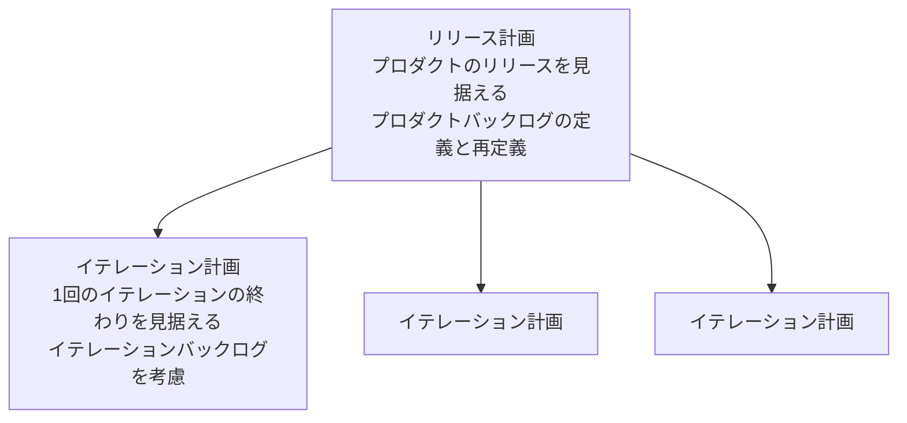

# lesson22: テスト計画 — テスト計画書の役割とアジャイルの計画づくり

## このレッスンで学ぶこと

- テスト計画書の目的を例を挙げて説明できるようになる
- 典型的なテスト計画書の内容を例を挙げて説明できるようになる
- テスト計画書を準備するプロセス自体がもつ価値を理解する
- リリース計画とイテレーション計画の違いを説明できるようになる
- イテレーションとリリース計画に対するテスト担当者の貢献を想起できるようになる

## テスト計画書の位置づけ

テストプロセスの最初の活動は、テスト目的を定義し、制約の中で目的を最も効果的に達成するアプローチを選択するテスト計画でした（[lesson04](/lessons/lesson04/)）。この活動の中心となる作業成果物が**テスト計画書**です。

::: info テスト計画書とは
テスト計画書は、テストプロジェクトの**目的・リソース・プロセス**を表すドキュメントです。
:::

「目的・リソース・プロセス」の3点セットで押さえましょう。何を達成したいのか（目的）、そのために何を使うのか（リソース）、どう進めるのか（プロセス）をひとまとめに表します。

## テスト計画書の目的

テスト計画書には、次の4つの役割があります。

| 役割 | 内容 |
|------|------|
| 手段とスケジュールの文書化 | テスト目的を達成するための手段やスケジュールを文書として残す |
| 基準の充足の保証 | 実施したテスト活動が、確立した基準を満たすことを保証するのに役立つ |
| コミュニケーション手段 | チームメンバーやステークホルダーとの伝達手段としての役割を担う |
| ポリシー・戦略の遵守の提示 | テストが既存のテストポリシーやテスト戦略を遵守することを示す。逸脱する場合はその理由を説明する |

::: tip 計画書は伝達手段でもある
テスト計画書は、テストチームの内部資料にとどまりません。「どうテストするか」をステークホルダーに伝えるコミュニケーション手段でもある、という点が問われやすいポイントです。
:::

### 計画するプロセス自体の価値

テスト計画には、できあがった計画書だけでなく、計画するプロセス自体にも価値があります。

- テスト計画は、テスト担当者の思考をガイドする
- リスク・スケジュール・人員・ツール・コスト・労力などに関する将来の課題に、テスト担当者が向かい合うよう促す
- テスト計画書を準備するプロセスは、テストプロジェクトの目的を達成するために必要な取り組みを検討する有効な方法である

計画は立てて終わりではありません。テストのモニタリングとコントロールでは実際の進捗をテスト計画と比較し、必要ならテストスケジュールやリソースを含む計画の修正につなげます（[lesson26](/lessons/lesson26/)）。

## 典型的なテスト計画書の内容

シラバスが挙げる典型的な内容は次の7項目です。それぞれの例と対応づけて覚えましょう。

| 項目 | 例 |
|------|-----|
| テストの概要 | スコープ、テスト対象、制約、テストベース |
| テストプロジェクトの前提と制約 | 前提とする条件、守るべき制約 |
| ステークホルダー | 役割、責務、テストとの関連性、採用、必要なトレーニング |
| コミュニケーション | コミュニケーションの形態や頻度、ドキュメントのテンプレート |
| リスクレジスター | プロダクトリスク、プロジェクトリスク |
| テストアプローチ | テストレベル、テストタイプ、テスト技法、テスト成果物、開始基準と終了基準、テストの独立性、収集すべきメトリクス、テストデータ要件、テスト環境要件、組織のテストポリシーやテスト戦略からの逸脱 |
| 予算とスケジュール | テストに使える予算、テスト活動のスケジュール |

関連する内容は、他のレッスンで詳しく扱います。

- 開始基準と終了基準は [lesson23](/lessons/lesson23/)
- リスクレジスターを含むリスクマネジメントは [lesson25](/lessons/lesson25/)
- テストレベルは [lesson08](/lessons/lesson08/)、テストタイプは [lesson09](/lessons/lesson09/)

::: info 関連する標準
テスト計画書とその内容の詳細は、標準 ISO/IEC/IEEE 29119-3 で確認できます。
:::

## イテレーションとリリース計画への貢献

イテレーティブな SDLC（[lesson06](/lessons/lesson06/)）では、典型的に**リリース計画**と**イテレーション計画**の2種類の計画を立てます。テスト担当者はどちらの計画にも参加し、テストの観点から価値を付加します。

| 観点 | リリース計画 | イテレーション計画 |
|------|------------|------------------|
| 見据える範囲 | プロダクトのリリース | 1回のイテレーションの終わり |
| 考慮するもの | プロダクトバックログ（定義と再定義） | イテレーションバックログ |
| 特徴 | 大きなユーザーストーリーを一連の小さなユーザーストーリーへ洗練することもある。すべてのイテレーションにおけるテストアプローチとテスト計画書のベースとなる | イテレーション内のタスクを具体化する |

### リリース計画でのテスト担当者の貢献

リリース計画に関わるテスト担当者は、次の貢献をします。

- テスト可能なユーザーストーリーと受け入れ基準を作成する（[lesson21](/lessons/lesson21/)）
- プロジェクトと品質のリスク分析に参加する（[lesson25](/lessons/lesson25/)）
- ユーザーストーリーに関連するテスト工数を見積もる（[lesson23](/lessons/lesson23/)）
- テストアプローチを決定する
- リリースのためのテストを計画する

### イテレーション計画でのテスト担当者の貢献

イテレーション計画に関わるテスト担当者は、次の貢献をします。

- ユーザーストーリーの詳細なリスク分析に参加する
- ユーザーストーリーの試験性（テストのしやすさ）を判断する
- ユーザーストーリーをタスク（特にテストタスク）に分解する
- すべてのテストタスクのテスト工数を見積もる
- テスト対象の機能的側面と非機能的側面を識別し、洗練する

::: tip 2つの計画への貢献の見分け方
リリース計画への貢献は「ユーザーストーリーと受け入れ基準の作成」「テストアプローチの決定」のようにリリース全体を方向づけるものです。イテレーション計画への貢献は「タスクへの分解」「試験性の判断」のように直近のイテレーションを具体化するものです。どちらの計画への貢献かを入れ替えた選択肢に注意しましょう。
:::

## 試験のポイント

- テスト計画書の定義は「目的・リソース・プロセス」の3点セットで押さえ、一部を「スケジュール」などに置き換えた選択肢に惑わされない
- 「価値があるのは完成した計画書だけ」はひっかけで、準備するプロセス自体が、目的達成に必要な取り組みを検討する有効な方法とされる
- 典型的なテスト計画書の内容7項目は本文の表で見分けられるようにし、開始基準と終了基準やメトリクスは独立した項目ではなく「テストアプローチ」に含まれる点に注意する
- リリース計画（プロダクトバックログを定義・再定義）とイテレーション計画（イテレーションバックログを考慮）を対で押さえ、すべてのイテレーションにおけるテストアプローチとテスト計画書のベースはリリース計画である点に注意する
