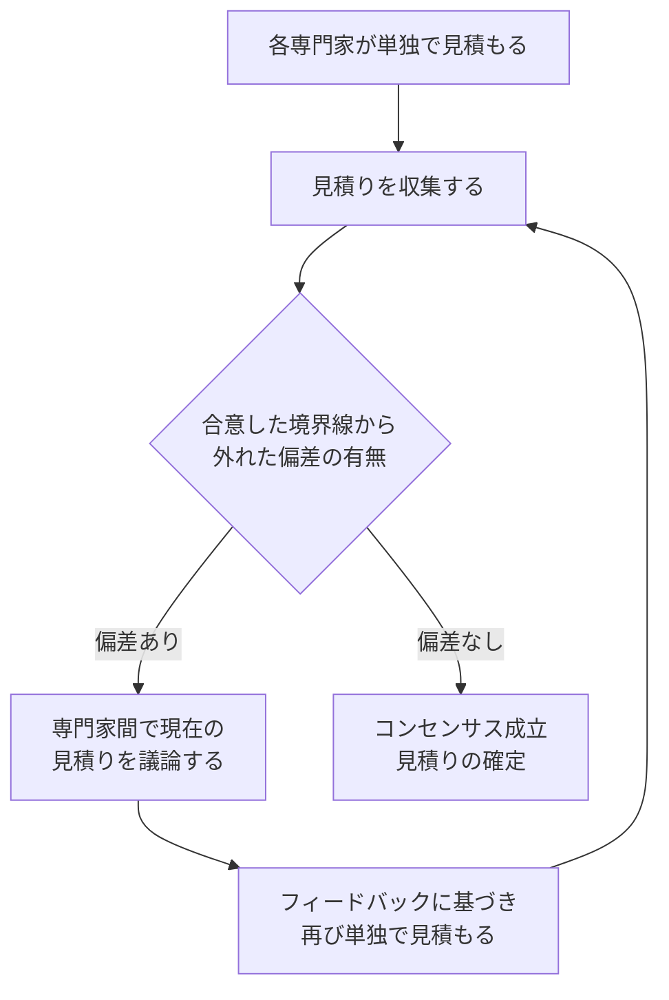

# lesson23: 開始基準・終了基準と見積り — テストの始めどき・やめどきと工数の予測

## このレッスンで学ぶこと

- 開始基準と終了基準の役割の違いを比較して説明できるようになる
- 典型的な開始基準と終了基準の例を挙げられるようになる
- 時間切れや予算切れによるテストの終了が許容される条件を理解する
- 4つの見積り技法をメトリクスベースと経験ベースに整理して区別できるようになる
- 見積り技法を用いて、必要なテスト工数を実際に算出できるようになる

## 開始基準と終了基準

テスト活動には「始めてよい条件」と「終えてよい条件」をあらかじめ定義しておきます。前者が**開始基準**、後者が**終了基準**です。どちらもテスト計画（[lesson22](/lessons/lesson22/)）で扱う重要な要素です。

| 観点 | 開始基準（entry criteria） | 終了基準（exit criteria） |
|------|--------------------------|--------------------------|
| 定義するもの | ある活動を行うための事前条件 | 活動の完了を宣言するために達成しなければならないこと |
| 問いかけ | この活動を始められる状態か | この活動を完了と宣言してよいか |
| 満たされない場合 | 活動がより困難になり、時間・コスト・リスクが増える | 活動を完了と宣言できない |
| アジャイルでの呼び方 | 準備完了（Ready）の定義 | 完了（done）の定義 |

開始基準と終了基準は、テストレベル（[lesson08](/lessons/lesson08/)）ごとに定義するべきものです。また、テスト対象によっても異なります。

### 典型的な開始基準

開始基準が満たされないまま活動を始めると、その活動は結果的により困難で、時間とコストがかかり、リスクの高いものになるおそれがあります。典型的な開始基準は次の3つに分類できます。

| 分類 | 例 |
|------|-----|
| リソースの可用性 | 人・ツール・環境・テストデータ・予算・時間がそろっている |
| テストウェアの可用性 | テストベース、試験性が保たれた要件、ユーザーストーリー、テストケースが利用できる |
| テスト対象の初期品質レベル | すべてのスモークテストに合格している |

### 典型的な終了基準

終了基準は「何を達成したら完了と宣言できるか」を定めます。典型的な終了基準は次の2つに分類できます。

| 分類 | 例 |
|------|-----|
| 徹底度の測定 | 達成されたカバレッジレベル、未解決欠陥の数、欠陥密度、不合格になったテストケースの数 |
| 完了基準 | 計画したテストを実行した、静的テストを実行した、発見したすべての欠陥をレポートした、すべてのリグレッションテストを自動化した |

徹底度の測定に使うメトリクスの詳細は [lesson26](/lessons/lesson26/) で扱います。

### 時間切れと予算切れによる終了

時間切れや予算切れも、終了基準として妥当とみなすことがあります。ただし無条件ではありません。

- 他の終了基準が満たされていなくても、テストを終了させることが許容される場合がある
- 前提は、これ以上のテストを行わずに本稼働させるリスクを、ステークホルダーがレビューして受け入れていること

::: warning 打ち切りではなくリスクの受け入れ
時間や予算が尽きたからといって、黙ってテストをやめてよいわけではありません。残存するリスクをステークホルダーがレビューし、受け入れたときに初めて、テストの終了が許容されます。リスクの考え方は [lesson25](/lessons/lesson25/) で扱います。
:::

### アジャイルソフトウェア開発での呼び方

アジャイルソフトウェア開発では、開始基準と終了基準に対応する呼び方があります。

- 終了基準は**完了（done）の定義**と呼ぶことが多く、リリース可能なアイテムかどうかを判断するための、チームの客観的なメトリクスを定義する
- ユーザーストーリーが開発またはテスト活動を開始するために満たすべき開始基準は、**準備完了（Ready）の定義**と呼ぶ

ユーザーストーリーと受け入れ基準の詳細は [lesson21](/lessons/lesson21/) を参照してください。

## テスト工数の見積り

テスト工数の見積りとは、テストプロジェクトの目的を達成するために必要なテスト関連作業の量を予測することです。見積りでは次の2点を押さえます。

- 見積りは多くの仮定に基づくため、常に見積り誤差の可能性があります。誤差の可能性があることを関係者に明示することが重要です。
- 小さなタスクの見積りは、通常、大きなタスクの見積りよりも正確です。そのため、大きなタスクは小さなタスクの集合に分解し、順番に見積もります。

## 4つの見積り技法の分類

シラバスは4つの見積り技法を挙げています。よりどころが「メトリクス（過去や現在のデータ）」か「専門家の経験」かで、2つの系統に整理できます。

| 系統 | 技法 | よりどころ |
|------|------|-----------|
| メトリクスベース | 比率に基づく見積り | 過去のプロジェクトから収集した比率 |
| メトリクスベース | 外挿 | 現在のプロジェクトの初期に収集したデータ |
| 経験ベース | ワイドバンドデルファイ | 専門家の経験と合意形成 |
| 経験ベース | 三点見積り | 専門家による3つの推定値 |

## 比率に基づく見積り

**比率に基づく見積り**は、メトリクスベースの技法です。

- 組織内の過去のプロジェクトから収集したデータをもとに、類似プロジェクトの「標準」比率を導き出す
- 標準比率を新規プロジェクトに適用して、テスト工数を見積もる
- 組織内のプロジェクトから得た比率（過去のデータなど）は、見積りに使う最もよい情報源とされる

### ワーク例: 比率からのテスト工数の算出

見積りはK3（適用）レベルの学習目標です。具体的な状況で、テスト工数を算出する流れを確認しましょう。

::: info 対象の状況
あなたの組織では、過去の類似プロジェクトの実績から、開発工数とテスト工数の比率が3:2だと分かっています。今回の新規プロジェクトでは、開発工数が90人日と予想されています。テスト工数を見積もってください。
:::

手順は次の通りです。

1. 過去のデータから標準比率を導く。開発工数とテスト工数の比率は3:2
2. 新規プロジェクトの予想開発工数に比率を適用する。テスト工数は 90 ÷ 3 × 2 で60人日と見積もる
3. 見積りには誤差の可能性があることを添えて、関係者に共有する

::: tip 比率の向きを取り違えない
3:2は「開発3に対してテスト2」を表します。開発工数を3で割って2を掛ける、と手順化しておくと計算を間違えません。開発工数600人日ならテスト工数は400人日、開発工数90人日ならテスト工数は60人日です。
:::

## 外挿

**外挿**もメトリクスベースの技法です。過去のプロジェクトではなく、現在のプロジェクトのデータを使う点が特徴です。

- 現在のプロジェクトのできるだけ早い時期から測定し、データを収集する
- 十分な観測値がそろったら、残りの作業に必要な工数をデータの外挿で概算する（通常は数学モデルを適用する）
- イテレーティブなSDLC（ソフトウェア開発ライフサイクル）に非常に適している

たとえば、過去3回のイテレーションのテスト工数が22人時・26人時・24人時だった場合、その平均である24人時を、次のイテレーションのテスト工数として外挿できます。

## ワイドバンドデルファイ

**ワイドバンドデルファイ**は、専門家が経験に基づいて推定する、繰り返し型の技法です。

ポイントは「単独の見積り」と「議論」を交互に繰り返すことです。

- 各専門家は、単独で工数を見積もる
- 収集した結果に、合意した境界線から外れた偏差がある場合、専門家は現在の見積りについて議論する
- 議論の後、各専門家はフィードバックに基づいて、再び単独で見積もる
- コンセンサスが得られるまでこのプロセスを繰り返す

### プランニングポーカー

**プランニングポーカー**は、アジャイルソフトウェア開発でよく使われる、ワイドバンドデルファイのバリエーションの1つです。通常、労力のサイズを表す数字が書かれたカードを使って見積もります。

## 三点見積り

**三点見積り**は、専門家が3つの推定値を作成するエキスパートベースの技法です。

| 推定値 | 意味 |
|------|------|
| a | 最も楽観的な推定値 |
| m | 最も可能性の高い推定値 |
| b | 最も悲観的な推定値 |

最終見積りEは、3つの推定値の加重算術平均です。最も一般的なバージョンでは次のように計算します。

::: info 三点見積りの計算式
- 最終見積り: `E = (a + 4m + b) / 6`
- 測定誤差（標準偏差）: `SD = (b - a) / 6`
:::

この技法の利点は、最終見積りだけでなく測定誤差も計算できることです。見積りを「幅」で伝えられます。

### ワーク例: 三点見積りによる工数の算出

::: info 対象の状況
ある機能のテスト工数について、専門家が次の3つの推定値（人日）を作成しました。最終見積りと測定誤差を計算してください。

- 最も楽観的な推定値: aは5人日
- 最も可能性の高い推定値: mは8人日
- 最も悲観的な推定値: bは17人日
:::

手順は次の通りです。

1. 最終見積りを計算する。Eは (5 + 4 × 8 + 17) ÷ 6、つまり 54 ÷ 6 で9人日
2. 測定誤差を計算する。SDは (17 - 5) ÷ 6 で2人日
3. 結果を幅で伝える。最終見積りは9±2人日、つまり7人日から11人日の範囲

::: tip 計算のチェックポイント
mだけを4倍すること、分母が6であることの2点を落とさなければ、計算自体は単純です。試験では、E（加重算術平均）を求める問題と、SD（測定誤差）まで求めて範囲で答える問題の両方に対応できるようにしておきましょう。
:::

## キーワード

| 用語 | 説明 |
|------|------|
| 開始基準（entry criteria） | ある活動を始めるための事前条件を定義したもの。満たされないと活動がより困難・長期・高コスト・高リスクになる |
| 終了基準（exit criteria） | 活動の完了を宣言するために何を達成しなければならないかを定義したもの |
| 完了（done）の定義 | アジャイルソフトウェア開発での終了基準の呼び方。リリース可能なアイテムに対するチームの客観的なメトリクスを定義する |
| 準備完了（Ready）の定義 | ユーザーストーリーが開発またはテスト活動を開始するために満たすべき開始基準の呼び方 |
| テスト工数の見積り | テストプロジェクトの目的を達成するために必要なテスト関連作業の量を予測すること |
| 比率に基づく見積り | 過去のプロジェクトから収集した標準比率を新規プロジェクトに適用する、メトリクスベースの見積り技法 |
| 外挿（extrapolation） | 現在のプロジェクトの早い時期に収集したデータから、残りの作業の工数を概算するメトリクスベースの見積り技法 |
| ワイドバンドデルファイ | 専門家が単独の見積りと議論を繰り返し、コンセンサスを得る経験ベースの見積り技法 |
| プランニングポーカー | ワイドバンドデルファイのバリエーション。アジャイルソフトウェア開発で、労力のサイズを表す数字のカードを使って見積もる |
| 三点見積り | 楽観値・最可能値・悲観値の3つの推定値から加重算術平均で最終見積りを求める、エキスパートベースの見積り技法 |

## 試験のポイント

- 開始基準は「活動のための事前条件」、終了基準は「完了を宣言するために達成すべきこと」として対応づける（K2で対比が問われる）
- 開始基準と終了基準はテストレベルごとに定義するべきで、テスト対象によって異なる
- 開始基準が満たされないまま始めた活動は、より困難で、時間・コスト・リスクが増える
- 典型的な開始基準は「リソースの可用性」「テストウェアの可用性」「テスト対象の初期品質レベル」の3分類で押さえる
- 典型的な終了基準は「徹底度の測定」と「完了基準」で、カバレッジや欠陥密度は徹底度の測定に入る
- 時間切れ・予算切れも、ステークホルダーがリスクをレビューして受け入れていれば妥当な終了基準とみなせる
- アジャイルでは終了基準を完了（done）の定義、ユーザーストーリーの開始基準を準備完了（Ready）の定義と呼ぶ
- 見積りは多くの仮定に基づくため常に誤差の可能性があり、関係者への明示が重要
- 大きなタスクは小さなタスクの集合に分解してから順番に見積もると正確になる
- 比率に基づく見積りと外挿はメトリクスベース、ワイドバンドデルファイと三点見積りは専門家の経験に基づく技法として分類する
- 比率3:2と開発工数600人日からテスト工数400人日を導くような計算はK3で問われる
- 三点見積りは `E = (a + 4m + b) / 6` と `SD = (b - a) / 6` で計算し、結果を範囲（E±SD）で答えられるようにする
