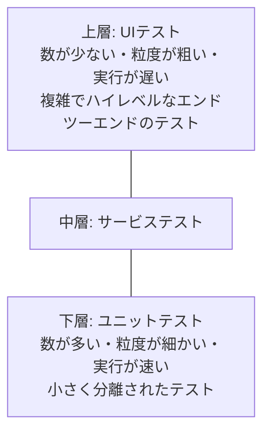

# lesson24: 優先順位付けとテストピラミッド — 実行順序の戦略と工数配分のモデル

## このレッスンで学ぶこと

- 代表的なテストケースの優先順位付け戦略を状況に応じて使い分けられるようになる（K3）
- 依存関係やリソースの可用性がテスト実行の順序に与える影響を理解する
- テストピラミッドの層構造と各レイヤーの特徴を想起できるようになる（K1）
- テストの四象限を構成する2つの視点と各象限の内容を要約できるようになる（K2）

## テストケースの優先順位付け

テストケースとテストプロシジャーを仕様化し、テストスイートにまとめたら、テスト実行の順番を決めるテスト実行スケジュールの中に配置できます（テスト実装の活動。[lesson04](/lessons/lesson04/)）。

すべてのテストを一度に実行できるとは限りません。時間が限られる中で価値の高い情報を早く得るには、どのテストケースを先に実行するかという優先順位付けが重要になります。優先順位付けの方針はテスト計画（[lesson22](/lessons/lesson22/)）とも関わります。

### 代表的な3つの戦略

テストケースの優先順位付けでは、さまざまな要因を考慮できます。最も一般的に使用される戦略は次の3つです。

| 戦略 | 実行順序の根拠 | 最初に実行するテストケース |
|------|------|------|
| リスクに基づく優先順位付け | リスク分析の結果（[lesson25](/lessons/lesson25/)） | 最も重要なリスクをカバーするテストケース |
| カバレッジベースの優先順位付け | カバレッジ（ステートメントカバレッジなど） | 最も高いカバレッジを達成するテストケース |
| 要件に基づく優先順位付け | テストケースから遡れる要件の優先度 | 最も重要な要件に関連するテストケース |

各戦略について、次の点も押さえておきましょう。

- 要件の優先度は、ステークホルダーが定義します
- カバレッジベースには**追加カバレッジの優先順位付け**という別の方法もあります。最初に最も高いカバレッジを達成するテストケースを実行し、2番目以降は「最も高い追加カバレッジを達成するテストケース」を順に選びます

::: tip 追加カバレッジの考え方
単純なカバレッジベースでは、カバレッジの高い順にテストケースを並べます。しかしカバー範囲が重複していると、2番目以降のテストで新しく分かることは多くありません。追加カバレッジの優先順位付けは「まだカバーしていない部分をどれだけ増やせるか」で次の1件を選ぶため、少ない実行数でカバレッジを効率よく積み上げられます。
:::

### 戦略の使い分け

優先順位付けは K3（適用）の学習目標です。状況からどの戦略が適切かを判断できるようにしておきましょう。

| 状況 | 適する戦略 |
|------|------|
| リスク分析が済んでおり、故障したときの影響が大きい決済機能から先に確かめたい | リスクに基づく優先順位付け |
| 実行できるテスト数が限られており、コードのステートメントをできるだけ広く網羅したい | カバレッジベースの優先順位付け |
| ステークホルダーが要件に優先度を付けており、重要度の高い要件の充足から先に確認したい | 要件に基づく優先順位付け |

### 依存関係とリソースによる制約

理想的には、テストケースは優先度に基づいて実行します。しかし、優先度だけでは順序を決められない場合があります。

- **依存関係**: テストケースやテストする機能に依存関係があると、優先度順の実行がうまくいかないことがあります。優先度の高いテストケースが優先度の低いテストケースに依存している場合、優先度の低いテストケースを先に実行しなければなりません
- **リソースの可用性**: テスト実行の順序では、必要なテストツール・テスト環境・特定の時間帯にしか参加できない人など、リソースが利用できるタイミングも考慮する必要があります

::: warning 優先度が高いものを常に最初に実行できるわけではない
「ログイン済み状態でしか実行できない高優先度の決済テスト」があるなら、優先度が低くてもログインのテストを先に実行します。試験でも「優先度の高いテストケースが低いものに依存する場合はどうするか」という形で問われやすいポイントです。
:::

## テストピラミッド

**テストピラミッド**は、テストによって粒度が異なる可能性があることを示すモデルです。レイヤー（層）がテストのグループを表し、さまざまなレベルのテスト自動化がさまざまなゴールを支援することを示して、テスト自動化とテスト工数の配分においてチームを支援します（テスト自動化は [lesson30](/lessons/lesson30/)）。

### 上層と下層の特徴

| 観点 | 下層のテスト | 上層のテスト |
|------|------|------|
| 粒度 | 細かい（機能の一部をチェック） | 粗い（大きな機能の一部をチェック） |
| 分離 | 分離されている | 分離が少ない |
| 実行速度 | 速い | 遅い |
| 妥当なカバレッジに必要な数 | 多くのテストが必要 | ほんの数個のテストのみ |

下層のテストは小さく、分離され、速く実行できます。1つのテストがチェックする範囲が狭いため、妥当なカバレッジを達成するには多くのテストが必要です。

最上位レイヤーは、複雑でハイレベルのエンドツーエンドテストを表します。下位レイヤーのテストより一般に遅い一方、妥当なカバレッジの達成に必要なテストは通常わずかです。

### レイヤーの数と名称

レイヤーの数や名称は、モデルによって異なる場合があります。

- オリジナルのテストピラミッドモデル（Cohn 2009）は「ユニットテスト」「サービステスト」「UIテスト」の3レイヤーを定義しています
- ユニット（コンポーネント）テスト、統合（コンポーネント統合）テスト、エンドツーエンドテストで構成する一般的なモデルもあります
- そのほかのテストレベル（[lesson08](/lessons/lesson08/)）を使うこともできます

::: tip ピラミッドが伝えること
形が示すのは「下層ほどテストの数が多く、上層ほど少ない」という構成です。速くて分離されたテストを土台として厚く持ち、遅いハイレベルのテストを絞ることで、自動化したテストを効率よく維持できます。
:::

## テストの四象限

**テストの四象限**は、Brian Marick が定義したモデルです。アジャイルソフトウェア開発における適切なテストタイプ・活動・テスト技法・作業成果物へ、テストレベルを分類します（テストレベルは [lesson08](/lessons/lesson08/)、テストタイプは [lesson09](/lessons/lesson09/)）。

### 2つの視点と4つの象限

このモデルでは、テストを2つの視点の組み合わせで捉えます。

- テストは**ビジネス向け**か**技術向け**か
- テストは**チームを支援する**（開発を導く）か、**プロダクトを批評する**（期待に反する動作を測定する）か

この組み合わせで、4つの象限が決まります。

| | チームを支援する | プロダクトを批評する |
|------|------|------|
| **ビジネス指向** | 第二象限 | 第三象限 |
| **テクノロジー指向** | 第一象限 | 第四象限 |

### 各象限の内容

| 象限 | 視点 | 含まれるテストの例 | 実施のしかた |
|------|------|------|------|
| 第一象限 | テクノロジー指向・チームを支援する | コンポーネントテスト、コンポーネント統合テスト | 自動化して CI プロセスに含めるべき |
| 第二象限 | ビジネス指向・チームを支援する | 機能テスト・実例・ユーザーストーリーテスト・ユーザーエクスペリエンスプロトタイプ・API テスト・シミュレーション | 受け入れ基準をチェックする。手動または自動のいずれでもよい |
| 第三象限 | ビジネス指向・プロダクトを批評する | 探索的テスト、使用性テスト、ユーザー受け入れテスト | ユーザー志向であり、多くの場合手動で行う |
| 第四象限 | テクノロジー指向・プロダクトを批評する | スモークテスト、非機能テスト（使用性テストは除く） | しばしば自動化する |

::: warning 使用性テストの位置
非機能テストは第四象限に入りますが、使用性テストだけは例外として第三象限に入ります。使用性テストはユーザー志向でビジネス側の関心事だからです。「非機能テストだから第四象限」と機械的に判断しないよう注意しましょう。
:::

### 四象限モデルの効果

テストの四象限は、次の点でテストマネジメントとチームを支援します。

- すべての適切なテストタイプとテストレベルが SDLC に含まれることを確実にする
- あるテストタイプが、他のテストレベルよりも特定のテストレベルに関連していることの理解を助ける
- 開発担当者・テスト担当者・ビジネス側の代表を含むすべてのステークホルダーに、テストのタイプを区別して説明する方法を提供する

## キーワード

| 用語 | 説明 |
|------|------|
| テストケースの優先順位付け | テスト実行スケジュールの中で、どのテストケースを先に実行するかを決めること |
| リスクに基づく優先順位付け | リスク分析の結果に基づき、最も重要なリスクをカバーするテストケースを最初に実行する戦略 |
| カバレッジベースの優先順位付け | 最も高いカバレッジを達成するテストケースを最初に実行する戦略 |
| 追加カバレッジの優先順位付け | カバレッジベースの別の方法。2番目以降は最も高い追加カバレッジを達成するテストケースを順に実行する |
| 要件に基づく優先順位付け | テストケースから遡れる要件の優先度に基づき、最も重要な要件に関連するテストケースを最初に実行する戦略。要件の優先度はステークホルダーが定義する |
| テストピラミッド（test pyramid） | テストの粒度が異なることを示すモデル。下層ほど粒度が細かく数が多く速い。テスト自動化と工数配分の検討を支援する |
| テストの四象限（testing quadrants） | Brian Marick が定義したモデル。ビジネス指向かテクノロジー指向か、チームを支援するかプロダクトを批評するかの組み合わせでテストを4つに分類する |

## 試験のポイント

- 優先順位付けの3戦略は「実行順序の根拠」で区別する（リスクはリスク分析の結果、カバレッジは達成カバレッジ、要件は要件の優先度）
- K3 なので、状況の記述からどの戦略を使っているか、その戦略なら何を最初に実行するかを判断できるようにする
- 追加カバレッジの優先順位付けでは、2番目以降のテストケースを「最も高い追加カバレッジを達成するもの」から順に選ぶ
- 優先度の高いテストケースが優先度の低いテストケースに依存する場合は、優先度の低い方を先に実行しなければならない
- テスト実行の順序はリソースの可用性（テストツール・テスト環境・人が使えるタイミング）も考慮する
- テストピラミッドは、レイヤーが高いほど粒度が粗く、分離が少なく、実行が遅い（下層は小さく・分離され・速く、多くのテストが必要）
- テストピラミッドのレイヤーの数や名称はモデルによって異なる（オリジナルはユニットテスト・サービステスト・UIテストの3層）
- 四象限の2軸は「ビジネス指向かテクノロジー指向か」と「チームを支援するかプロダクトを批評するか」の組み合わせ
- 第一象限（コンポーネントテスト・コンポーネント統合テスト）は自動化して CI に含めるべきとされる
- 使用性テストは非機能テストだが第四象限ではなく第三象限に含まれる
