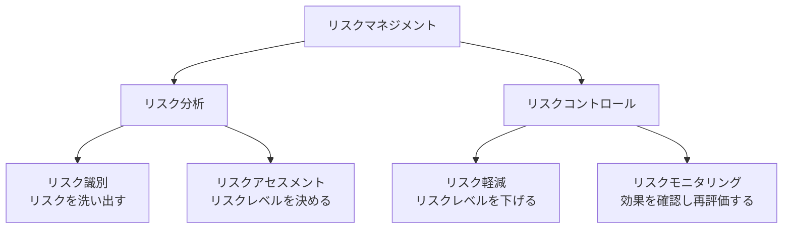

# lesson25: リスクベースドテスト — リスクレベルに応じたテスト労力の配分

## このレッスンで学ぶこと

- リスクの定義と、リスクレベルを決める2つの要素を識別できるようになる
- プロジェクトリスクとプロダクトリスクを例とともに区別できるようになる
- プロダクトリスク分析を構成するリスク識別とリスクアセスメントを説明できるようになる
- プロダクトリスク分析の結果がテストの範囲・深さ・優先順位にどう影響するかを説明できるようになる
- プロダクトリスクコントロールにおけるリスク軽減とリスクモニタリングを説明できるようになる

## リスクマネジメントとリスクベースドテスト

組織は多くの内的・外的な要因に直面しており、目的をいつ達成できるか、そもそも達成できるかは不確実です。リスクマネジメントは、この不確実さに向き合う活動です。組織が目的を達成する可能性を高め、プロダクトの品質を向上させ、ステークホルダーの信頼と信用を高めます。

主なリスクマネジメント活動は次の2つです。

- **リスク分析**は、リスク識別とリスクアセスメントで構成します
- **リスクコントロール**は、リスク軽減とリスクモニタリングで構成します

::: info リスクベースドテストとは
リスク分析とリスクコントロールに基づいて、テスト活動を選択し、優先順位を付け、マネジメントしていくテストアプローチを**リスクベースドテスト**と呼びます。
:::

リスクベースドテストは、テストの優先順位付け（[lesson24](/lessons/lesson24/)）を支える土台です。限られた時間と労力を、リスクの高いところへ重点的に配分します。欠陥は特定のコンポーネントに集中する傾向があるという「欠陥の偏在」の原則（[lesson03](/lessons/lesson03/)）とも整合します。

## リスクとリスクレベル

リスクとは、顕在化すると悪影響が生じる、潜在的な事象・ハザード・脅威・状況のことです。「将来起こりうる悪いこと」であり、すでに起きてしまった問題とは区別します。

### リスクを特徴づける2つの要素

リスクは、次の2つの要素によって特徴づけられます。

| 要素 | 意味 |
|------|------|
| **リスクの可能性**（likelihood） | リスクが顕在化する確率。0より大きく1より小さい（必ず起きるなら「リスク」ではなく確定した問題であり、絶対に起きないならリスクとして扱う必要がない） |
| **リスクの影響**（impact） | リスクが顕在化したときにもたらされる結果（損害） |

この2つの要素の組み合わせが、リスクの尺度である**リスクレベル**を表します。リスクレベルが高いほど、そのリスクへの処置はより重要になります。

### リスクマトリクス

リスクレベルは、リスクの可能性とリスクの影響を2軸にとった**リスクマトリクス**で表現できます。次の表は一例です。

| リスクの可能性 | 影響が小さい | 影響が中程度 | 影響が大きい |
|------|------|------|------|
| 高い | 中 | 高 | 高 |
| 中程度 | 低 | 中 | 高 |
| 低い | 低 | 低 | 中 |

::: tip リスクレベルの識別
「めったに起きないが、起きたら顧客の資産に損害が出る」なら、リスクの可能性は低くてもリスクの影響が大きいため、リスクレベルは無視できません。逆に「頻繁に起きるが、影響は画面の見た目のわずかな崩れ」なら、リスクレベルは相対的に低くなります。可能性と影響の両方を見てレベルを判断します。
:::

## プロジェクトリスクとプロダクトリスク

ソフトウェアテストでは、一般的に2つのタイプのリスクに関心を持ちます。**プロジェクトリスク**と**プロダクトリスク**です。

| 観点 | プロジェクトリスク | プロダクトリスク |
|------|------|------|
| 何に関わるか | プロジェクトのマネジメントや統制 | プロダクトの品質特性 |
| 例 | 納期遅れ、スキル不足、スコープクリープ | 機能の誤り、不十分な応答時間、セキュリティの脆弱性 |
| 顕在化したときの影響 | スケジュール・予算・スコープに影響し、プロジェクトの目的達成をおびやかす | ユーザーの不満足や収益・評判の損失などを引き起こす |

### プロジェクトリスクの例

プロジェクトリスクは、次の4つの切り口で整理できます。

| 切り口 | 例 |
|------|------|
| 組織的な問題 | 作業成果物の納期遅れ、不正確な見積り、コストダウン |
| 人の問題 | スキル不足、対立、コミュニケーションの問題、人手不足 |
| 技術的な問題 | スコープクリープ、ツールサポートの不備 |
| サプライヤーの問題 | 第三者による納品の失敗、サポート企業の倒産 |

### プロダクトリスクの例

プロダクトリスクは、プロダクトの品質特性（ISO 25010 品質モデルに記述があるもの）に関連します。例は次の通りです。

- 機能の不足や誤り、誤った計算、ランタイムエラー
- 貧弱なアーキテクチャー、非効率なアルゴリズム
- 不十分な応答時間、貧弱なユーザーエクスペリエンス
- セキュリティの脆弱性

### プロダクトリスクが顕在化した場合の負の結果

プロダクトリスクが顕在化すると、次のようなさまざまな負の結果をもたらす可能性があります。

- ユーザーの不満足
- 収益・信頼・評判の損失
- 第三者への損害賠償
- 高いメンテナンスコストや、ヘルプデスクへの負荷
- 刑事罰
- 極端な場合、身体的な損傷・重傷・死亡

::: tip 2つのリスクの見分け方
「プロジェクトの進め方に関わるならプロジェクトリスク、プロダクトそのものの品質に関わるならプロダクトリスク」と整理できます。品質特性とテストタイプの対応は [lesson09](/lessons/lesson09/) で扱っています。
:::

## プロダクトリスク分析

テストの観点から見たプロダクトリスク分析のゴールは、プロダクトリスクへの認識を提供することです。それにより、残存するプロダクトリスクのレベルを最小化する方法へ、テスト工数を集中させられます。理想的には、プロダクトリスク分析は SDLC の初期に始めます。

プロダクトリスク分析は、リスク識別とリスクアセスメントで構成します。

### リスク識別

リスクの包括的なリストを作成する活動です。ステークホルダーは、さまざまな手法やツールを使ってリスクを識別できます。

- ブレーンストーミング
- ワークショップ
- インタビュー
- 特性要因図

### リスクアセスメント

識別したリスクを評価する活動です。次のことを行います。

- 識別したリスクを分類する
- リスクの可能性・リスクの影響・リスクレベルを決定する
- リスクに優先順位を付ける
- 対処法を提案する

同じカテゴリーに属するリスクは同様のアプローチで軽減できることが多いため、カテゴリー分けは軽減策の割り当てに役立ちます。

リスクレベルの決め方には、定量的アプローチと定性的アプローチ、およびそれらの混合があります。

| アプローチ | リスクレベルの決め方 |
|------|------|
| 定量的アプローチ | リスクの可能性とリスクの影響の乗算として算出する |
| 定性的アプローチ | リスクマトリクスを使用して決定する |

### 分析結果のテストへの活用

プロダクトリスク分析は、テストの範囲と深さに影響を与えます。分析の結果は次のように使用します。

- 実施するテスト範囲を決定する
- 該当するテストレベル（[lesson08](/lessons/lesson08/)）を決定し、実施するテストタイプ（[lesson09](/lessons/lesson09/)）を提案する
- 採用するテスト技法（[lesson14](/lessons/lesson14/)）と達成すべきカバレッジを決定する
- 各タスクに必要なテスト工数を見積る（[lesson23](/lessons/lesson23/)）
- 重要な欠陥をできるだけ早く発見できるように、テストに優先順位を付ける（[lesson24](/lessons/lesson24/)）
- テストに加えて、リスクを低減する他の活動を採用できるかどうかを判断する

::: info テスト計画との関係
リスク分析の結果は、テスト計画（[lesson22](/lessons/lesson22/)）にも反映されます。テスト計画書にはリスクレジスター（リスクの可能性・リスクの影響・リスク軽減の情報とともにリスクを列挙したもの）を含めることが多くあります。
:::

## プロダクトリスクコントロール

プロダクトリスクコントロールは、識別し評価したプロダクトリスクに対応するすべての手段から成ります。リスク軽減とリスクモニタリングで構成します。

### リスクへの対応策

リスクを分析すると、いくつかの対応策が考えられます。

| 対応策 | 内容 |
|------|------|
| テストによるリスク軽減 | テストを実施してリスクレベルを低減する |
| リスク受け入れ | リスクをそのまま受け入れる |
| リスク移転 | リスクを第三者（保険など）に移す |
| コンティンジェンシー計画 | リスクが顕在化した場合に備えた対応計画を用意する |

### テストによるリスク軽減の行動

リスク軽減では、リスクアセスメントで提案された措置を実施し、リスクレベルを低減させます。テストによるプロダクトリスクの軽減のために取り得る行動は次の通りです。

- リスクタイプに適した経験やスキルのレベルを持つテスト担当者を選ぶ
- 適切なレベルのテストの独立性（[lesson05](/lessons/lesson05/)）を適用する
- レビューや静的解析（[lesson11](/lessons/lesson11/)）を実施する
- 適切なテスト技法とカバレッジレベルを適用する
- 影響を受ける品質特性に対応した、適切なテストタイプを適用する
- リグレッションテスト（[lesson09](/lessons/lesson09/)）を含む動的テストを実施する

これらの行動は、リスクレベルに応じたテスト労力の配分として整理できます。リスクの高い箇所ほど、強いカバレッジ基準の技法で徹底的にテストし、重要な欠陥を早く見つけられるように優先順位を上げ、リスクタイプに適した経験やスキルを持つ担当者を割り当てます。

### リスクモニタリング

リスクは、一度分析したら終わりではありません。リスクモニタリングの目的は次の3つです。

- リスク軽減措置が効果的であることを確認する
- リスクアセスメントを改善するために、さらなる情報を入手する
- 新たなリスクを識別する

テストの進捗とあわせてリスクの状況を追跡し、レポートで伝達する活動は、テストのモニタリングとコントロール（[lesson26](/lessons/lesson26/)）とつながっています。

## キーワード

| 用語 | 説明 |
|------|------|
| リスク（risk） | 顕在化すると悪影響が生じる、潜在的な事象・ハザード・脅威・状況 |
| リスクの可能性（likelihood） | リスクが顕在化する確率。0より大きく1より小さい |
| リスクの影響（impact） | リスクが顕在化したときにもたらされる結果（損害） |
| リスクレベル（risk level） | リスクの尺度。リスクの可能性とリスクの影響の2つの要素で表す |
| リスクマトリクス | リスクの可能性とリスクの影響を2軸にとり、リスクレベルを定性的に決定する表 |
| プロジェクトリスク（project risk） | プロジェクトのマネジメントや統制に関連するリスク。組織・人・技術・サプライヤーの問題など |
| プロダクトリスク（product risk） | プロダクトの品質特性に関連するリスク。機能の誤り、性能不足、セキュリティの脆弱性など |
| リスク識別（risk identification） | リスクの包括的なリストを作成する活動 |
| リスクアセスメント（risk assessment） | 識別したリスクを分類し、リスクの可能性・影響・レベルを決定し、優先順位を付け、対処法を提案する活動 |
| リスク軽減（risk mitigation） | 提案された措置を実施してリスクレベルを低減させる活動 |
| リスクモニタリング（risk monitoring） | 軽減措置の効果の確認、アセスメント改善のための情報の入手、新たなリスクの識別を行う活動 |
| リスクベースドテスト（risk-based testing） | リスク分析とリスクコントロールに基づいて、テスト活動を選択し、優先順位を付け、マネジメントするテストアプローチ |

## 試験のポイント

- リスクレベルはリスクの可能性（顕在化する確率）とリスクの影響（顕在化した結果の損害）の2つの要素で表す
- リスクの可能性は0より大きく1より小さい確率である
- プロジェクトリスクはプロジェクトのマネジメントや統制に、プロダクトリスクはプロダクトの品質特性に関連する（例の分類がK2で問われやすい）
- 納期遅れ・スキル不足・スコープクリープ・サプライヤーの倒産はプロジェクトリスク、機能の誤り・応答時間・セキュリティ脆弱性はプロダクトリスク
- リスク分析はリスク識別とリスクアセスメント、リスクコントロールはリスク軽減とリスクモニタリングで構成する（構成の対応づけに注意）
- リスクアセスメントの定量的アプローチは可能性と影響の乗算、定性的アプローチはリスクマトリクスを使う
- プロダクトリスク分析の結果は、テスト範囲・テストレベルとテストタイプ・技法とカバレッジ・工数見積り・優先順位付けに使用する
- テストによるリスク軽減の行動として、担当者の選定・テストの独立性・レビューと静的解析・技法とカバレッジ・テストタイプ・リグレッションテストを含む動的テストを挙げられるようにする
- リスクモニタリングの目的は、軽減措置の効果確認・アセスメント改善のための情報入手・新たなリスクの識別の3つ
