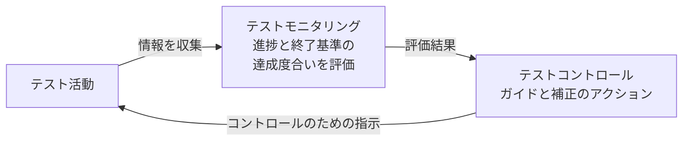

# lesson26: テストのモニタリングとコントロール — メトリクス・テストレポート・ステータスの伝達

## このレッスンで学ぶこと

- テストモニタリングとテストコントロールの関係を説明できるようになる
- テストで使用する代表的なメトリクスの種類を想起できるようになる
- テスト進捗レポートとテスト完了レポートの目的・内容・読み手の違いを要約できるようになる
- テストステータスを伝達するさまざまな手段を例示できるようになる

## テストモニタリングとテストコントロールの関係

テストのモニタリングとコントロールは、テストプロセス全体を通じて継続する活動です（[lesson04](/lessons/lesson04/)）。「測る」役割と「動かす」役割がセットになっています。

| 活動 | 関心の中心 |
|------|-----------|
| テストモニタリング | テストに関する情報を収集すること |
| テストコントロール | 収集した情報をもとに、コントロールのための指示を提供すること |

### テストモニタリング

テストモニタリングで収集した情報は、次の目的で使用します。

- テストの進捗を評価する
- テスト終了基準や、終了基準に関連するテストタスクを満たしているかを測定する（開始基準と終了基準は [lesson23](/lessons/lesson23/)）

「終了基準を満たしているか」の例として、プロダクトリスク・要件・受け入れ基準などで定めたカバレッジの達成があります。

### テストコントロール

テストコントロールは、テストモニタリングからの情報を使用します。最も効果的かつ効率的なテストを達成するためのガイドと、必要な補正のアクションを、コントロールのための指示という形で提供します。

コントロールのための指示には、次のような例があります。

- 識別していたリスクが実際に問題となった場合に、テストの優先度を見直す（リスクは [lesson25](/lessons/lesson25/)）
- 再作業が発生した場合に、テストアイテムが開始基準と終了基準を満たすかを再評価する
- テスト環境の提供の遅れに対応するために、テストスケジュールを調整する
- 必要なときに必要な箇所へ、新しいリソースを追加する

### テスト完了

シラバスの 5.3 節は、テスト完了もあわせて扱います。テスト完了は、完了したテスト活動のデータを収集し、経験・テストウェア・その他の関連情報を統合する活動です。

テスト完了活動は、次のようなプロジェクトのマイルストーンで発生します。

- テストレベルの完了（テストレベルは [lesson08](/lessons/lesson08/)）
- アジャイルイテレーションの終了
- テストプロジェクトの完了またはキャンセル
- ソフトウェアシステムのリリース
- メンテナンスリリースの完了（メンテナンステストは [lesson10](/lessons/lesson10/)）

## テストで使用するメトリクス

テストメトリクスは、次の3点を示すために収集します。

- 計画したスケジュールや予算に対する進捗状況
- テスト対象の現在の品質
- テスト目的やイテレーションゴールに対するテスト活動の有効性

テストモニタリングでは、テストコントロールとテスト完了をサポートするために、さまざまなメトリクスを収集します。代表的なテストメトリクスは次の通りです。

| メトリクスの種類 | 例 |
|------|-----|
| プロジェクト進捗メトリクス | タスクの完了状況、リソースの使用量、テスト工数 |
| テスト進捗メトリクス | テストケースの実装進捗、テスト環境の準備進捗、実行済みと未実行のテストケース数、合格と不合格の数、テスト実行時間 |
| プロダクト品質メトリクス | 可用性、応答時間、平均故障までの時間 |
| 欠陥メトリクス | 発見した欠陥と修正した欠陥の数や優先度、欠陥密度、欠陥検出率（欠陥マネジメントは [lesson28](/lessons/lesson28/)） |
| リスクメトリクス | 残存リスクレベル（[lesson25](/lessons/lesson25/)） |
| カバレッジメトリクス | 要件カバレッジ、コードカバレッジ（コードカバレッジは [lesson19](/lessons/lesson19/)） |
| コストメトリクス | テストのコスト、品質に対する組織的なコスト |

::: tip メトリクスの押さえ方
このカテゴリー分けは K1（記憶）で問われます。「合格と不合格の数はテスト進捗メトリクス」「欠陥密度は欠陥メトリクス」「要件カバレッジはカバレッジメトリクス」のように、例と種類を対応づけて覚えます。
:::

## テストレポート

テストレポート作業は、テスト中およびテスト後のテスト情報を要約し、伝達する作業です。シラバスは2種類のレポートを取り上げています。

| 観点 | テスト進捗レポート | テスト完了レポート |
|------|------------------|------------------|
| 作成するタイミング | テストのモニタリングとコントロールの間、定期的に（毎日・毎週など） | テスト完了時（終了基準を満たしたときが理想） |
| 目的 | ステークホルダーへの情報提供と、テストの継続的なコントロールの支援 | テストの特定の段階（テストレベル・テストサイクル・イテレーションなど）の要約と、その後のテストのための情報提供 |
| もとにする情報 | テストモニタリングで収集した情報 | テスト進捗レポートとその他のデータ |

### テスト進捗レポートの内容

テスト進捗レポートは、テスト計画書からの逸脱や状況の変化に対応するための情報源です。テストスケジュール・リソース・テスト計画の修正が必要な場合に、判断に十分な情報を提供しなければなりません。

典型的な内容は次の通りです。

- テスト期間
- テストの進捗状況（テストスケジュールの前倒しや遅れなど、顕著な逸脱を含む）
- テストの阻害要因とその回避策
- テストメトリクス
- テスト期間中に新たに発生したリスクと、変更されたリスク
- 次の期間で計画しているテスト

### テスト完了レポートの内容

テスト完了レポートは、プロジェクト・テストレベル・テストタイプが完了し、終了基準を満たしたときに作成するのが理想です。典型的な内容は次の通りです。

- テストの概要
- 当初のテスト計画書（テスト目的と終了基準）に基づく、テストとプロダクト品質の評価
- テスト計画書からの逸脱（テストスケジュール・期間・工数などの計画との差異）
- テストの阻害要因と回避策
- テスト進捗レポートに基づくテストメトリクス
- 未解決のリスクと、修正しなかった欠陥
- テストに関連する、学習した教訓

::: tip 2つのレポートの見分け方
「次の期間で計画しているテスト」があれば進捗レポート、「学習した教訓」や「未解決のリスク・修正しなかった欠陥」の総括があれば完了レポートです。進行中の舵取りに使うのが進捗レポート、段階を締めくくるのが完了レポートと整理できます。
:::

### 読み手に合わせた調整

対象読者が異なれば、レポートに求める情報も異なります。求める情報の違いは、レポートの形式的な度合いや報告の頻度にも影響します。

- 同じチームの他のメンバーへのテスト進捗レポートは、頻繁で非形式的なものになることが多い
- 組織外や経営層など形式的な報告が求められる読み手には、形式や頻度を合わせて調整する

::: info 関連する標準
ISO/IEC/IEEE 29119-3 標準には、テスト進捗レポート（同標準ではテストステータスレポートと呼ばれます）とテスト完了レポートのテンプレートと例が含まれています。
:::

## テストステータスの伝達

テストステータスを伝える最適な手段は、状況によってさまざまです。次のような要因に左右されます。

- テストマネジメント上の懸念
- 組織のテスト戦略
- 規制標準
- 自己組織化チームの場合は、チーム自身（チーム全体アプローチは [lesson05](/lessons/lesson05/)）

伝達手段の選択肢には、次のようなものがあります。

| 手段 | 例 |
|------|-----|
| 口頭でのコミュニケーション | チームメンバーやその他のステークホルダーとの会話 |
| ダッシュボード | CI/CD ダッシュボード、タスクボード、バーンダウンチャート |
| 電子的なコミュニケーションチャネル | 電子メール、チャット |
| オンラインドキュメント | オンラインで共有するドキュメント |
| 正式なテストレポート | テスト進捗レポート、テスト完了レポート |

伝達手段については、次の点を押さえておきましょう。

- 選択肢は1つに絞る必要はなく、複数を組み合わせて使用できる
- 地理的な距離や時差のために対面のコミュニケーションが難しい分散型チームでは、より形式的なコミュニケーションが適している場合がある
- ステークホルダーによって関心のある情報は異なるため、コミュニケーションはそれに応じて調整する

## 試験のポイント

- テストモニタリングは「情報の収集と進捗・終了基準の測定」、テストコントロールは「情報に基づく指示と補正のアクション」として対応づけ、指示の例（優先度の見直し・スケジュール調整・リソース追加など）を選べるようにする
- 代表的なメトリクスの種類（プロジェクト進捗・テスト進捗・プロダクト品質・欠陥・リスク・カバレッジ・コスト）と例の対応づけは K1 で想起できるようにする
- テスト進捗レポート（定期的に作成し、次の期間で計画しているテストを含む）とテスト完了レポート（テスト完了時に作成し、学習した教訓や未解決のリスクを含む）を区別する
