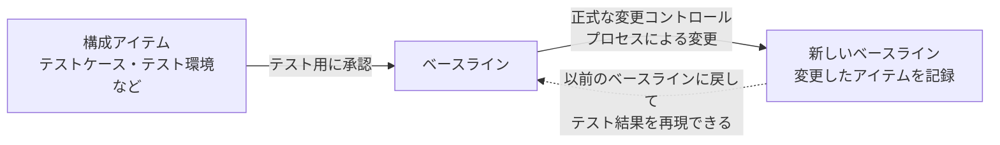

# lesson27: 構成管理 — テストの再現性とトレーサビリティを支える仕組み

## このレッスンで学ぶこと

- 構成管理（CM）がテストにおいて何を管理する仕組みかを理解する
- 構成アイテムとベースラインの意味を説明できるようになる
- 構成管理がテストをどのように支援するかを要約できるようになる
- 構成管理と DevOps パイプラインの関係を理解する

## 構成管理とは

テストの活動では、多くの作業成果物が作られます。

- テスト計画書、テスト戦略
- テスト条件、テストケース、テストスクリプト
- テスト結果記録、テストレポート

こうしたテストウェア（[lesson04](/lessons/lesson04/)）は、放っておくと「どれが最新版か」「どのテスト対象に対応するものか」が分からなくなります。その状態では、テスト結果の信頼も再現もできません。

**構成管理**（configuration management、CM）は、こうした作業成果物を**構成アイテム**として識別、コントロール、トラッキングするための規律を提供します。

テスト環境のような複雑な構成アイテムについては、CM は構成アイテムそのものに加えて、アイテム間の関係やバージョンも記録します。

## 構成アイテムとベースライン

構成アイテムがテスト用に承認されると、それは**ベースライン**となります。ベースラインには次の性質があります。

- 正式な変更コントロールプロセスを通じてのみ変更できる
- 変更して新しいベースラインを作成すると、変更した構成アイテムの記録が残る
- この記録によって、以前のベースラインに戻して以前のテスト結果を再現できる

::: tip なぜ再現できることが重要か
故障を報告しても、「どのバージョンのテスト対象を、どのバージョンのテストケースでテストしたか」が特定できなければ、開発担当者はその故障を再現できません。以前の状態に戻せることは、テスト結果の信頼性の土台になります。運用中のシステムに変更を加えるメンテナンステスト（[lesson10](/lessons/lesson10/)）のように、過去のバージョンを扱う場面でも役立ちます。
:::

## 構成管理によるテストの支援

テストを適切にサポートするために、CM は次のことを保証します。ここが学習目標（K2 で要約）の中心です。

- テストアイテム（テスト対象の個々の部分）を含む、すべての構成アイテムを一意に識別できる
- 構成アイテムをバージョンコントロールし、変更を追跡できる
- 構成アイテムを他の構成アイテムと関連付けて、テストプロセス全体を通してトレーサビリティ（[lesson04](/lessons/lesson04/)）を維持できる
- 識別したすべてのドキュメントとソフトウェアアイテムが、テストドキュメントに明確に記載されている

つまり、CM があることで「どのテストベースから作ったどのテストケースを、どのバージョンのテスト対象に実行した結果か」を常に特定できるようになります。

## DevOpsパイプラインと構成管理

継続的インテグレーション、継続的デリバリー、継続的デプロイメントと、それらに関連するテストは、通常、自動化した DevOps パイプライン（[lesson07](/lessons/lesson07/)）の一部として実装します。そのパイプラインには、自動化した CM が含まれるのが通常です。

バージョン管理ツールや CI/CD ツールなど、テストウェアの管理を支援するツールの種類は [lesson29](/lessons/lesson29/) で扱います。

## 試験のポイント

- 学習目標は K2「構成管理がテストをどのように支援するかを要約する」（FL-5.4.1）で、出題の中心は CM が保証すること（一意な識別、バージョンコントロールと変更の追跡、トレーサビリティの維持、テストドキュメントへの明記）の要約
- CM の対象はテスト対象（テストアイテム）だけでなく、テスト計画書やテスト結果記録などのテストウェア全般である点を落とさない
- 「承認後のベースラインも自由に変更できる」は誤りで、変更は正式な変更コントロールプロセスを通じてのみ行え、その価値は以前のベースラインに戻して以前のテスト結果を再現できること
