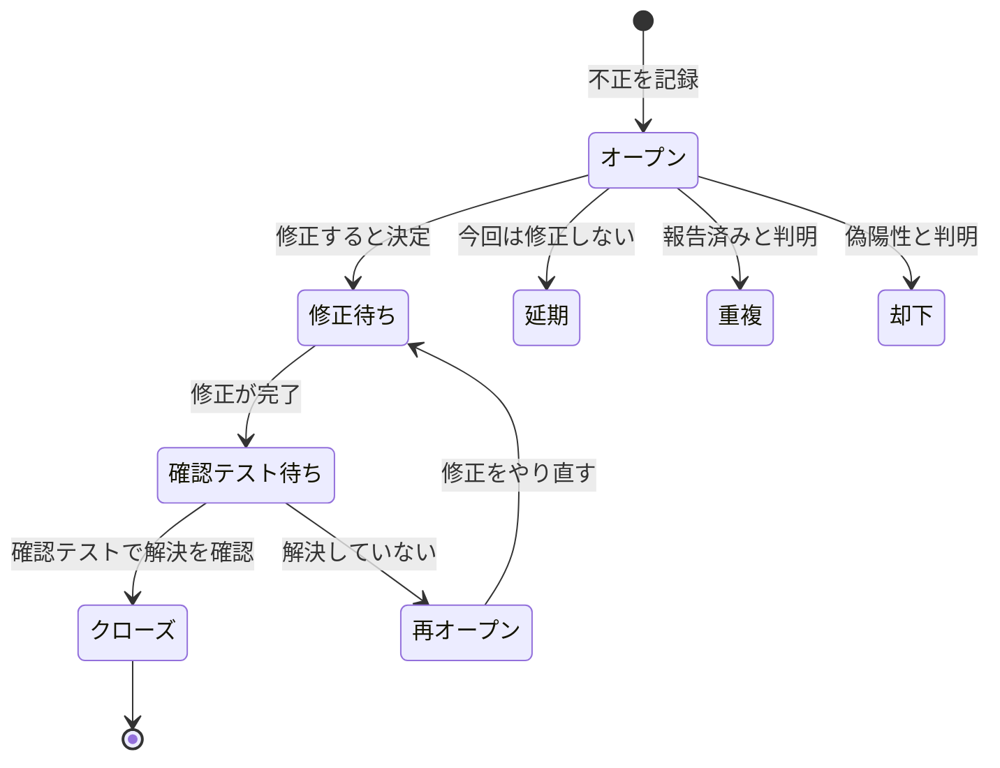

# lesson28: 欠陥マネジメント — 発見からクローズまでの追跡と欠陥レポート

## このレッスンで学ぶこと

- 欠陥マネジメントプロセスの目的と、最低限含まれる要素を理解する
- 報告された不正が本当の欠陥とは限らないことを説明できるようになる
- 欠陥のライフサイクル（ステータスの遷移）を説明できるようになる
- 欠陥レポートの目的と典型的な内容を識別できるようになる
- 具体的な故障をもとに、欠陥レポートを準備できるようになる

## 欠陥マネジメントプロセス

主要なテスト目的の1つは、欠陥を検出することです（[lesson01](/lessons/lesson01/)）。検出した欠陥を放置せず解決まで導くために、確立した欠陥マネジメントプロセスが不可欠です。

欠陥マネジメントプロセスには、最低限次の2つが含まれます。

- 個々の不正を発見から終結まで処理するためのワークフロー
- 不正を分類するためのルール

このプロセスは、関係するすべてのステークホルダーが遵守する必要があります。

### 報告されるのは不正

テストで見つけて報告するものは、厳密には**不正**（anomaly）と呼びます。期待とのずれとして報告された事象が、解析の結果どう判明するかはさまざまだからです。

- 本当の欠陥（[lesson02](/lessons/lesson02/)）だと判明する場合
- 偽陽性（実際には欠陥が存在しないのに、欠陥として報告されたもの）だと判明する場合
- 変更要求など、欠陥以外の何かだと判明する場合

不正は SDLC のどのフェーズでも報告される可能性があり、報告の形式は SDLC に依存します。

### ワークフローの活動

不正を発見から終結まで処理するワークフローは、通常次の活動で構成されます。

1. 報告された不正を記録する
2. 解析する
3. 分類する
4. 修正または現状維持などの適切な対応を決定する
5. 欠陥レポートをクローズする

## 欠陥のライフサイクル

欠陥レポートには状態（ステータス）を持たせ、対応の進み具合を追跡します。この状態の移り変わりが欠陥のライフサイクルです。シラバスは状態の例として次を挙げています。

| 状態 | 意味 |
|------|------|
| オープン | 不正が報告され、解析や対応の決定を待っている |
| 修正待ち | 修正すると決定し、修正の完了を待っている |
| 確認テスト待ち | 修正が完了し、確認テストを待っている |
| クローズ | 問題の解決を確認し、終結した |
| 再オープン | 解決していないと判明し、再び対応が必要になった |
| 延期 | 欠陥ではあるが、今回は修正しないと決定した |
| 重複 | すでに報告済みの欠陥と同じだと判明した |
| 却下 | 偽陽性などで、修正の対象ではないと判断した |

状態の遷移を図で表すと次のようになります。

::: info 状態の名前は組織によって異なる
状態の名前や遷移のルールは、組織や欠陥マネジメントツールによって異なります。大切なのは、個々の不正を発見から終結まで状態で追跡するという考え方です。修正後の確認テストについては [lesson09](/lessons/lesson09/) を参照してください。
:::

## 静的テストの欠陥と動的テストの欠陥

欠陥は動的テストだけでなく、静的テスト（[lesson11](/lessons/lesson11/)）でも見つかります。見つかり方の違いが、欠陥レポートに書く内容の違いにつながります。

| 観点 | 動的テストの欠陥 | 静的テストの欠陥 |
|------|----------------|----------------|
| 見つかり方 | 故障として観測され、不正の分析を経て欠陥へたどり着く（[lesson04](/lessons/lesson04/)） | レビューや静的解析が作業成果物の欠陥を直接発見する |
| レポートの中心 | 故障の再現手順、期待結果と実際の結果 | 作業成果物の該当箇所と問題の内容 |

静的テスト（特に静的解析）で見つけた欠陥についても、動的テストの欠陥と同様の方法で処理することが望ましいとされています。

## 欠陥レポートの目的

代表的な欠陥レポートには、次の目的があります。

- 報告された欠陥の処理と解決に責任を持つ人へ、問題を解決するための十分な情報を提供する
- 作業成果物の品質を追跡する手段を提供する（品質の追跡に使うメトリクスは [lesson26](/lessons/lesson26/)）
- 開発プロセスとテストプロセスを改善するためのアイデアを提供する

「修正のための情報」だけが目的ではない点に注意してください。品質の追跡やプロセス改善のインプットとしても使われます。

## 欠陥レポートの典型的な内容

動的テスト中に記録される欠陥レポートには、通常次の内容を含みます。

| 項目 | 内容 |
|------|------|
| 一意な識別子 | レポートを特定するための ID |
| タイトル | 報告する不正の概要を簡潔にまとめたもの |
| 日付・組織・起票者 | 不正を観測した日付、発行組織、起票者（役割を含む） |
| テスト対象とテスト環境 | どのテスト対象を、どの環境でテストしていたか |
| 欠陥のコンテキスト | 実行中のテストケースやテスト活動、SDLC フェーズ、使用中のテスト技法・チェックリスト・テストデータなどの関連情報 |
| 故障の説明 | 不正を検出したステップと、再現および解決を可能にする情報（テスト結果記録、データベースダンプ、スクリーンショット、録画など） |
| 期待結果と実際の結果 | 期待した振る舞いと、実際に観測した振る舞い |
| 重要度 | ステークホルダーの利益や要件に対する欠陥の影響の度合い |
| 優先度 | 修正する優先度 |
| 欠陥の状態 | 例: オープン、延期、重複、修正待ち、確認テスト待ちなど |
| 参考文献 | 関連するテストケースへの言及など |

::: info ツールと標準
欠陥マネジメントツールを使用する場合、識別子・日付・起票者・初期状態などの一部のデータは自動的に含まれることがあります。欠陥レポートのドキュメントテンプレートと記入例は ISO/IEC/IEEE 29119-3 標準で確認できます。この標準では、欠陥レポートをインシデントレポートと呼びます。
:::

### 重要度と優先度

重要度と優先度は混同しやすい項目です。「影響の大きさ」と「修正の緊急度」という別の観点として区別します。

| 観点 | 重要度（severity） | 優先度（priority） |
|------|-------------------|-------------------|
| 表すもの | ステークホルダーの利益や要件に対する欠陥の影響の度合い | 修正する緊急度 |
| 問いかけ | この欠陥はどれくらい深刻か | どれくらい早く修正すべきか |

::: tip 重要度と優先度は独立に決まる
影響が大きい欠陥ほど早く直すとは限りません。ほとんど使われない機能の深刻な故障は「重要度は高いが優先度は低い」となることがあります。逆に、トップページの目立つ誤字は影響が軽微でも「優先度は高い」となることがあります。
:::

なお、シラバス V4.0 の日本語版は severity を「重要度」と訳しています。資料やツールによっては「重大度」と表記されることもあります。

## 欠陥レポートの例

FL-5.5.1 は K3（適用）の学習目標です。故障の情報から欠陥レポートを実際に準備できるようにしておきましょう。

題材として、通販サイトの注文確定機能のシステムテストを考えます。要件は「商品合計が 10,000 円以上の注文は送料を無料にする」です。境界値分析（[lesson16](/lessons/lesson16/)）で設計したテストケースを実行したところ、商品合計がちょうど 10,000 円のときに故障を観測しました。この故障の欠陥レポートの例が次です。

| 項目 | 記入例 |
|------|--------|
| 一意な識別子 | DR-2026-0153 |
| タイトル | 商品合計がちょうど 10,000 円のとき送料無料が適用されない |
| 日付・組織・起票者 | 2026-07-01 ／ 品質保証部 ／ 山本一郎（テスト担当者） |
| テスト対象とテスト環境 | 注文確定機能（通販サイト v2.3.0-rc1）／ ステージング環境、Chrome 138、テストデータセット S-42 |
| 欠陥のコンテキスト | システムテストのテスト実行中。境界値分析で設計したテストケース TC-ORDER-012 を実行 |
| 故障の説明（再現手順） | (1) テストユーザーでログインする → (2) 単価 2,500 円の商品をカートに 4 点入れる（商品合計 10,000 円）→ (3) 注文確認画面に進み、送料と支払総額を確認する。添付: 注文確認画面のスクリーンショット、アプリケーションログ |
| 期待結果 | 送料 0 円と表示され、支払総額は 10,000 円になる |
| 実際の結果 | 送料 550 円が加算され、支払総額が 10,550 円になる |
| 重要度 | 高（誤った金額の請求につながり、購入者と売上への影響が大きい） |
| 優先度 | 高（次回リリースまでに修正する） |
| 欠陥の状態 | オープン |
| 参考文献 | テストケース TC-ORDER-012、要件 REQ-PAY-031 |

::: tip 書くときの実践ポイント
- 再現手順は、第三者がそのまま実行して再現できる粒度で書く
- 期待結果と実際の結果を必ず対で書く（「正しく動かない」だけでは解決に必要な情報にならない）
- 観測した事実と自分の推測を区別して書く
:::

## キーワード

| 用語 | 説明 |
|------|------|
| 欠陥レポート（defect report） | 報告された不正（欠陥）の情報をまとめ、解決までの追跡に使うドキュメント。ISO/IEC/IEEE 29119-3 ではインシデントレポートと呼ぶ |
| 不正（anomaly） | 期待とのずれとして報告された事象。本当の欠陥のことも、偽陽性や変更要求のこともある |
| 偽陽性（false positive） | 実際には欠陥が存在しないのに、欠陥として報告されたもの |
| 重要度（severity） | ステークホルダーの利益や要件に対する欠陥の影響の度合い |
| 優先度（priority） | 欠陥を修正する緊急度 |

## 試験のポイント

- 「報告されたものはすべて欠陥」はひっかけで、報告されるのは不正であり、偽陽性や変更要求だと判明することもある（不正は SDLC のどのフェーズでも報告される可能性がある）
- 欠陥マネジメントプロセスに「最低限」含まれるのは、ワークフロー（記録 → 解析 → 分類 → 対応の決定 → クローズ）と分類のルールの2つ
- 「欠陥マネジメントは動的テストの欠陥だけが対象」は誤りで、静的テスト（特に静的解析）で見つけた欠陥も同様の方法で処理することが望ましい
- 欠陥レポートの目的は「解決のための十分な情報提供」だけでなく「作業成果物の品質を追跡する手段」「プロセス改善のアイデア提供」を含む3つ
- 重要度（影響の度合い）と優先度（修正の緊急度）は独立に決まり、「重要度が高ければ必ず優先度も高い」とは限らない
- FL-5.5.1 は K3 なので、故障の情報をもとに欠陥レポートの項目を実際に埋められるようにしておく（再現手順と、期待結果・実際の結果の対が中心）
