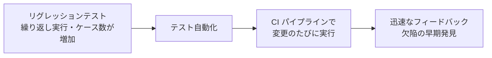

# lesson30: テスト自動化の利点とリスク — ツールの導入だけでは成功しない

## このレッスンで学ぶこと

- テスト自動化の潜在的な利点を想起できるようになる
- テスト自動化の潜在的なリスクを想起できるようになる
- ツール導入を成功させるために必要な労力（導入・メンテナンス・トレーニング）を理解する
- リグレッションテストや CI とテスト自動化の関係を整理する

## ツール導入と成功の関係

テストツール（[lesson29](/lessons/lesson29/)）を取得するだけでは、成功は保証されません。新しいツールから現実的かつ持続的な利益を得るには、相応の労力が必要です。

- ツールの導入
- メンテナンス
- トレーニング

さらに、テスト自動化には**分析と軽減が必要なリスク**も存在します。利点だけを見て導入を決めるのではなく、利点とリスクの両方を把握しておくことが出発点になります。

::: info このレッスンのゴール
学習目標は K1（記憶）です。利点とリスクのそれぞれの一覧を「想起できる」ことがゴールになります。試験では、一覧にある項目とない項目を見分けられれば十分です。
:::

## テスト自動化の潜在的な利点

シラバスは、テスト自動化の潜在的な利点として次の6つを挙げています。

| 利点 | 例 |
|------|-----|
| 反復する手動作業を削減し、時間を節約できる | リグレッションテストの実行、同じテストデータの再入力、期待結果と実際の結果の比較、コーディング標準との適合確認 |
| 一貫性と再実行性が向上し、単純なヒューマンエラーを防止できる | テストを一貫して要件から導出する、テストデータを体系的な方法で作成する、テストを同じ順序・同じ頻度で実行する |
| 評価の客観性が向上し、人間が導き出すには複雑すぎる尺度を提供できる | カバレッジなどの測定 |
| テストに関する情報へのアクセスが容易になり、テストマネジメントとテスト報告を支援する | 統計、グラフ、テスト進捗・欠陥率・テスト実行期間に関する集計データ |
| テスト実行時間を短縮できる | 欠陥の早期発見、迅速なフィードバック、市場投入までの時間の短縮 |
| テスト担当者が新しいテストを設計する時間を増やせる | より深く、より効果的なテストの設計 |

::: tip 利点の押さえ方
「作業の削減」「一貫性」「客観性」「情報アクセス」「時間短縮」「設計時間の確保」の6つの切り口で覚えると想起しやすくなります。自動化が肩代わりするのは反復作業であり、浮いた時間をテスト担当者の知的活動に回せる点がポイントです。
:::

なお、性能テストのように手動で行うことが困難または不可能なテストは、非機能テストツールが実行を可能にします。ツールの種類ごとの支援内容は [lesson29](/lessons/lesson29/) で扱います。

## テスト自動化の潜在的なリスク

シラバスは、テスト自動化の潜在的なリスクとして次の8つを挙げています。

| リスク | 例・補足 |
|--------|---------|
| テストツールの利点に非現実的な期待をする | ツールの機能や使いやすさへの過大な期待 |
| 導入や保守に必要な時間・コスト・労力の見積りが正確でない | ツールの導入、テストスクリプトの保守、既存の手動テストプロセスの変更にかかる労力の過小評価 |
| 手動テストがより適切である場合にテストツールを使用する | すべてのテストが自動化に向くわけではない |
| ツールに過剰な依存をする | 人の批判的思考の必要性を無視するなど |
| ツールベンダーに問題が起きる可能性がある | 廃業、別のベンダーへのツールの売却、不十分なサポート（問い合わせへの対応・アップグレード・欠陥修正） |
| オープンソースソフトウェアが停滞する可能性がある | 放置されると、それ以降のアップデートが利用できなくなる。逆に、内部コンポーネントが頻繁なアップデートを必要とする場合もある |
| 自動化ツールが開発プラットフォームと互換性がない | 開発環境と組み合わせて動作しない |
| 不適切なツールを選択する | 規制要件や安全基準に適合していないツールを選んでしまう |

::: warning 自動化しても保守は続く
自動テストは「作って終わり」ではありません。テスト対象が変わればテストスクリプトの保守が必要になり、その労力は見積りを誤りやすい代表例としてリスクに挙げられています。導入時のコストだけでなく、継続的な保守コストまで含めて判断します。
:::

## リグレッションテスト・CI との関係

テスト自動化の効果が表れやすい代表例が、リグレッションテスト（[lesson09](/lessons/lesson09/)）です。

- リグレッションテストスイートは何度も繰り返し実行する
- テストケースの数はイテレーションやリリースを重ねるごとに増えていく

この「繰り返し」と「増加」という性質は、反復する手動作業の削減という自動化の利点とかみ合います。

DevOps（[lesson07](/lessons/lesson07/)）で CI（継続的インテグレーション）を使用する場合は、自動化したリグレッションテストを CI に含めることがよい実践です。変更のたびにテストが実行され、迅速なフィードバックが得られます。

また、テストピラミッド（[lesson24](/lessons/lesson24/)）は自動テストの配分を考えるモデルです。下の階層ほどテストの粒度が細かく実行時間が短いため、自動化したテストを厚く配置します。

## キーワード

| 用語 | 説明 |
|------|------|
| テスト自動化（test automation） | ツールを使用してテスト活動を実行または支援すること。利点とリスクの両方を分析したうえで導入する |
| テストスクリプト | 自動テストの実行手順を記述したもの。テスト対象の変更に合わせた保守が必要になる |
| CI（継続的インテグレーション） | 変更を頻繁に統合し、自動ビルド・自動テストで確認する実践。自動化したリグレッションテストを含めるとよい（[lesson07](/lessons/lesson07/)） |

## 試験のポイント

- FL-6.2.1 は K1（記憶）なので、利点6つとリスク8つの一覧にある項目とない項目を漏れなく見分けられるようにする（個々の項目は本文の一覧で確認する）
- 「ツールを取得すれば成功する」はひっかけで、導入・メンテナンス・トレーニングの労力が必要になる
- 「手動では困難・不可能なテストの実行」は非機能テストツールによる支援（[lesson29](/lessons/lesson29/)）であり、テスト自動化の利点6つの一覧とは別枠として区別する
- リグレッションテストは繰り返し実行しケース数も増えるため自動化の有力な候補であり、CI に含めることがよい実践（[lesson09](/lessons/lesson09/)、[lesson07](/lessons/lesson07/)）
